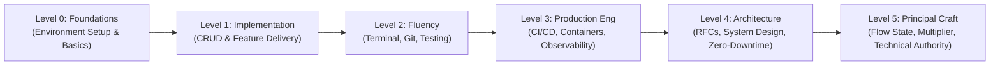

<div align="center">

# Aura
### The Open-Source Developer Handbook and Engineering Standard

**From Initial Environment Setup to Production-Grade Architecture and Engineering Leadership.**

[](./LICENSE)
[](./CONTRIBUTING.md)
[](./RULES.md)
[](#the-7-core-tracks)

<p align="center">
  <a href="#the-philosophy-of-developer-aura">Philosophy</a> &bull;
  <a href="#the-7-core-tracks">Curriculum Tracks</a> &bull;
  <a href="#the-developer-progression-matrix">Progression Matrix</a> &bull;
  <a href="#how-to-contribute">How to Contribute</a> &bull;
  <a href="#repository-rules-and-standards">Rules</a>
</p>

---

</div>

## The Philosophy of Developer Aura

Developer Aura is the convergence of technical competence, workflow efficiency, architectural discipline, and engineering leadership.

It encompasses the entire lifecycle of an engineer's growth:

- **Workflow Efficiency**: Keyboard-driven navigation, modern terminal multiplexing, curated dotfiles, and zero unnecessary friction.
- **Production Engineering**: High-confidence automated CI/CD, multi-stage containerization, zero-downtime releases, and hardened security postures.
- **Craftsmanship**: Clean, self-documenting code, strict type safety, test-driven reliability, and pragmatic design patterns.
- **Leadership and Collaboration**: Rigorous and constructive code reviews, structured technical RFCs, and open-source contribution.

This handbook is designed for public collaboration. It establishes authoritative standards and practical guides from initial workstation configuration to complex distributed systems engineering.

---

## The 7 Core Tracks

```text
Aura/
└── docs/
    ├── 01-foundations-and-setup/             # IDEs, Terminals, Shells, Dotfiles, Toolchains
    ├── 02-git-and-github-craft/              # Version Control, Clean History, PR Etiquette, Signing
    ├── 03-code-craft-and-architecture/       # Clean Code, SOLID, TDD, Design Patterns, Types
    ├── 04-fullstack-and-api-engineering/     # API Standards, Performance, DB Indexing, Auth
    ├── 05-devops-cicd-and-cloud/             # Containers, Pipelines, IaC, Zero-Downtime Releases
    ├── 06-observability-security-reliability/# Security Standards, Telemetry, Incident Response
    ├── 07-dev-aura-and-soft-skills/          # Technical Writing, RFCs, Code Reviews, Career Growth
    └── templates/                            # Standard Blueprints for New Contributions
```

---

### [Track 01: Foundations & Setup](./docs/01-foundations-and-setup/README.md)
> *Foundational development environments, editors, typography, shell configurations, and toolchains.*
- [x] [IDE & Editor Mastery: VS Code, Cursor, and Typography](./docs/01-foundations-and-setup/ide-and-editor-mastery.md)
- [x] [Terminal & Shell Configuration: Starship, Zsh, and Modern CLI Utilities](./docs/01-foundations-and-setup/terminal-and-shell-alchemy.md)
- [x] [Operating System & Toolchain Setup: macOS, Linux, and Windows WSL2](./docs/01-foundations-and-setup/os-and-toolchain-setup.md)
- [ ] `[TODO: Open for Contribution]` Dotfiles Synchronization with GNU Stow
- [ ] `[TODO: Open for Contribution]` GPU-Accelerated Terminal Setup (Ghostty / WezTerm)

### [Track 02: Git & GitHub Craft](./docs/02-git-and-github-craft/README.md)
> *Version control discipline, linear commit histories, PR etiquette, and cryptographic verification.*
- [x] [Git Workflows & Branching Strategies](./docs/02-git-and-github-craft/git-workflow-and-branching.md)
- [x] [Conventional Commits & History Management via Interactive Rebase](./docs/02-git-and-github-craft/conventional-commits-and-history.md)
- [x] [Pull Request Etiquette & GitHub CLI (`gh`) Workflows](./docs/02-git-and-github-craft/pr-etiquette-and-code-reviews.md)
- [x] [Git Security, SSH Keys, and Cryptographic Commit Signing](./docs/02-git-and-github-craft/git-security-and-gpg.md)
- [ ] `[TODO: Open for Contribution]` Advanced Git Operations (`git bisect`, `git reflog`, `git worktree`)

### [Track 03: Code Craft & Architecture](./docs/03-code-craft-and-architecture/README.md)
> *Maintainable software design, SOLID principles, testing pyramids, and strong type contracts.*
- [x] [Clean Code & SOLID Principles in Practice](./docs/03-code-craft-and-architecture/clean-code-and-solid.md)
- [x] [The Testing Pyramid & Test-Driven Development (TDD)](./docs/03-code-craft-and-architecture/testing-pyramid-and-tdd.md)
- [x] [Production Design Patterns (Strategy, Repository, Middleware)](./docs/03-code-craft-and-architecture/design-patterns-in-practice.md)
- [x] [Type Safety, Runtime Schema Validation, and API Contracts](./docs/03-code-craft-and-architecture/type-safety-and-contracts.md)
- [ ] `[TODO: Open for Contribution]` Hexagonal Architecture and Clean Boundaries

### [Track 04: Fullstack & API Engineering](./docs/04-fullstack-and-api-engineering/README.md)
> *Predictable REST/RPC API architecture, database query optimization, and frontend performance.*
- [x] [Production API Design Standards & Error Envelopes](./docs/04-fullstack-and-api-engineering/backend-and-api-design.md)
- [x] [Frontend Performance & State Architecture](./docs/04-fullstack-and-api-engineering/frontend-performance-and-state.md)
- [x] [Database Indexing, Query Optimization, and EXPLAIN ANALYZE](./docs/04-fullstack-and-api-engineering/database-mastery-and-indexing.md)
- [x] [Authentication Architecture, OAuth2, and Token Rotation](./docs/04-fullstack-and-api-engineering/auth-and-session-management.md)
- [ ] `[TODO: Open for Contribution]` Distributed Caching Topologies and Redis Patterns

### [Track 05: DevOps, CI/CD & Cloud](./docs/05-devops-cicd-and-cloud/README.md)
> *Automated build pipelines, minimal containerization, infrastructure as code, and deployment strategies.*
- [x] [Docker & Multi-Stage Production Containerization](./docs/05-devops-cicd-and-cloud/docker-and-containerization.md)
- [x] [Production CI/CD Pipelines with GitHub Actions](./docs/05-devops-cicd-and-cloud/cicd-pipelines-and-automation.md)
- [x] [Infrastructure as Code with Terraform and OpenTofu](./docs/05-devops-cicd-and-cloud/infrastructure-as-code.md)
- [x] [Zero-Downtime Deployment Strategies (Blue-Green, Canary)](./docs/05-devops-cicd-and-cloud/zero-downtime-deployments.md)
- [ ] `[TODO: Open for Contribution]` Kubernetes Production Deployment Essentials

### [Track 06: Observability, Security & Reliability](./docs/06-observability-security-reliability/README.md)
> *OWASP security mitigation, distributed telemetry, performance profiling, and incident response.*
- [x] [Application Hardening & OWASP Security Playbook](./docs/06-observability-security-reliability/security-and-owasp-playbook.md)
- [x] [Observability: Structured Logging, Metrics, and OpenTelemetry](./docs/06-observability-security-reliability/observability-metrics-tracing.md)
- [x] [Incident Management & Blameless Postmortems](./docs/06-observability-security-reliability/incident-response-and-postmortems.md)
- [x] [Performance Profiling & Memory Leak Diagnostics](./docs/06-observability-security-reliability/performance-profiling.md)
- [ ] `[TODO: Open for Contribution]` Chaos Engineering and Fault Injection

### [Track 07: Dev Aura & Soft Skills](./docs/07-dev-aura-and-soft-skills/README.md)
> *Technical RFC writing, constructive code reviews, open-source citizenship, and high-agency engineering.*
- [x] [Technical Writing, Architecture Decision Records, and RFCs](./docs/07-dev-aura-and-soft-skills/technical-writing-and-rfcs.md)
- [x] [The Standard of Constructive Code Reviews](./docs/07-dev-aura-and-soft-skills/the-art-of-code-review.md)
- [x] [Open Source Citizenship & Collaboration Etiquette](./docs/07-dev-aura-and-soft-skills/open-source-citizenship.md)
- [x] [Engineering Career Velocity, Flow State, and Presence](./docs/07-dev-aura-and-soft-skills/career-progression-and-mindset.md)
- [ ] `[TODO: Open for Contribution]` System Design Communication and Whiteboarding

---

## The Developer Progression Matrix



---

## How to Contribute

We invite developers worldwide to contribute missing guides, refine existing best practices, and share production-tested configurations.

1. **Select or Propose a Topic**: Choose an open topic marked `[TODO: Open for Contribution]` or propose a new guide via an Issue.
2. **Consult Repository Rules**: Review [`RULES.md`](./RULES.md) for quality criteria, conventional commit standards, and PR requirements.
3. **Follow Standard Templates**: Base new contributions on [`docs/templates/GUIDE_TEMPLATE.md`](./docs/templates/GUIDE_TEMPLATE.md).
4. **Submit a Pull Request**: Submit your PR adhering to [`CONTRIBUTING.md`](./CONTRIBUTING.md).

---

## Repository Rules & Standards

To ensure Aura remains an authoritative, high-signal knowledge base, all contributions must meet strict quality standards:

- **Empirical Content**: Snippets, commands, and configurations must be tested and verified.
- **No Uncurated Generative Content**: Content must provide actionable architectural depth and real-world nuance.
- **Atomic Pull Requests**: One topic or guide per pull request.
- **Conventional Commits**: Commit messages must follow the Conventional Commits specification.

Read the complete requirements in [RULES.md](./RULES.md).

---

## Contributors

Thank you to all contributors who maintain and expand this engineering standard.

<p align="center">
  <a href="https://github.com/MasterZ1311/Aura/graphs/contributors">
    
  </a>
</p>

---

<div align="center">
  <sub>Open-source engineering standard. Distributed under the <a href="./LICENSE">MIT License</a>.</sub>
</div>
