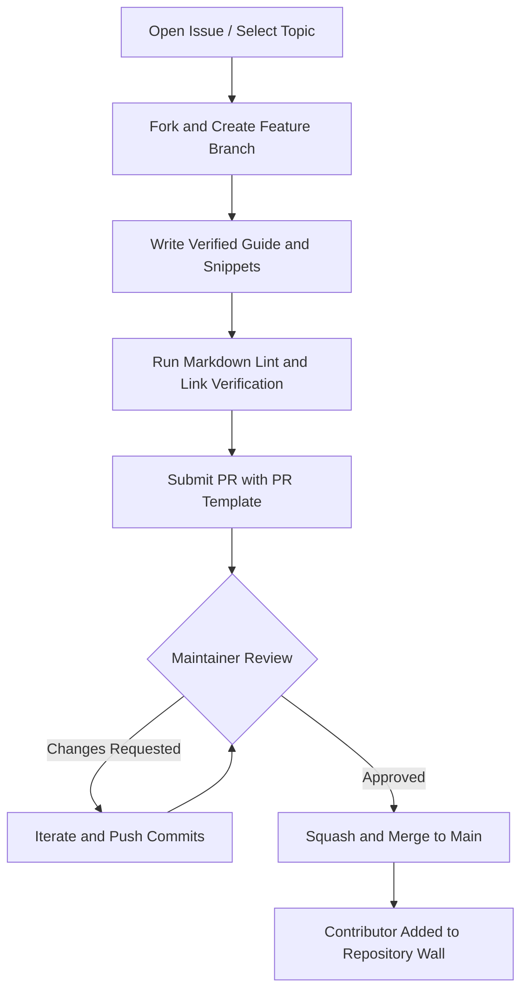

# Repository Rules & Engineering Standards

> **Welcome to Aura.** This repository is an open-source technical knowledge base and engineering manual. To maintain high-caliber quality, precision, and authority, all contributors must strictly adhere to the standards outlined below.

---

## Core Principles

1. **High Signal-to-Noise Ratio**: Every guide, code snippet, and configuration must be battle-tested, pragmatic, and immediately useful in production environments.
2. **Empirical and Verified Content**: Do not submit unedited, superficial generative AI summaries or speculative information. Submissions must contain concrete CLI commands, configurations, or verified code samples.
3. **Professional Clarity**: Explain concepts with clarity, technical rigor, and precision regardless of the reader's experience level.

---

## Contribution Rules

### 1. Atomic Pull Requests
- Keep PRs scoped to **one logical topic, guide, or fix**.
- Do not combine multiple unrelated changes (for example, updating VS Code configurations and editing a Docker guide) in a single pull request.
- Keep pull request diffs focused, readable, and easy to review.

### 2. Conventional Commit Messages
All commit messages must follow the [Conventional Commits](https://www.conventionalcommits.org/) specification:
- `feat(track)`: New guide, topic, or reference document added.
- `docs(track)`: Clarification, typo fix, or formatting update to an existing guide.
- `fix(track)`: Correction of an outdated command, broken link, or syntax error.
- `chore`: Repository maintenance, configuration, or workflow updates.

**Examples:**
```bash
git commit -m "feat(01-setup): add comprehensive Neovim Lua kickstart guide"
git commit -m "docs(05-devops): add zero-downtime blue-green deployment architecture"
git commit -m "fix(02-git): correct interactive rebase command syntax"
```

### 3. File & Directory Conventions
- **File Naming**: All files must use lowercase kebab-case (for example: `modern-cli-tools.md`, `testing-pyramid-and-tdd.md`).
- **Standard Hierarchy**: Follow the 7 core tracks inside `/docs/`. Do not introduce arbitrary top-level directories without an approved Issue discussion.
- **Templates**: When creating new guides or checklists, base them on the templates located in [`docs/templates/`](./docs/templates/).

### 4. Markdown & Formatting Standards
- **Clean Headings**: Use `#` for title (one per file), `##` for major sections, and `###` for sub-sections. Never skip heading levels.
- **Code Fences**: Always specify the language identifier for code blocks (for example: ````bash````, ````typescript````, ````yaml````, ````dockerfile````).
- **No Broken Links**: Relative links must point to existing files in the repository. Web links must use HTTPS and point to active, reliable sources.
- **Diagrams**: Use Mermaid diagrams (````mermaid````) or ASCII flows for architectural illustrations.

### 5. Verified Code and Commands
- Any shell command, script, or configuration (`.zshrc`, `Dockerfile`, `settings.json`, etc.) must be verified in a working environment prior to submission.
- Provide OS-specific instructions where relevant (macOS, Linux, Windows/WSL).

### 6. Attributions and Integrity
- Never submit proprietary, copyrighted, or plagiarized materials.
- When referencing external research, tools, or articles, provide explicit source links and credit original authors.

---

## Pull Request Lifecycle & Review Process



1. **Before Starting**: Check existing Issues or open a new one to avoid duplicate work.
2. **Submitting**: Complete the provided [Pull Request Template](.github/PULL_REQUEST_TEMPLATE.md) completely.
3. **Reviews**: Maintainers will review submissions for clarity, technical accuracy, tone, and formatting.
4. **Merging**: Maintainers use squash-and-merge to maintain a linear Git history.

---

## Criteria for Immediate Pull Request Rejection

- Automated bulk spam PRs (e.g., automated spacing adjustments across multiple files without substantive improvement).
- Promotional backlinks, affiliate links, or commercial product placements.
- Inappropriate, unprofessional, or disrespectful language.
- Commands that risk data loss without explicit safeguards or warnings (e.g., unqualified `rm -rf` or unguided destructive Git resets).

---

For step-by-step instructions on setting up your local repository fork and making your first contribution, read the [CONTRIBUTING.md](./CONTRIBUTING.md) guide.
