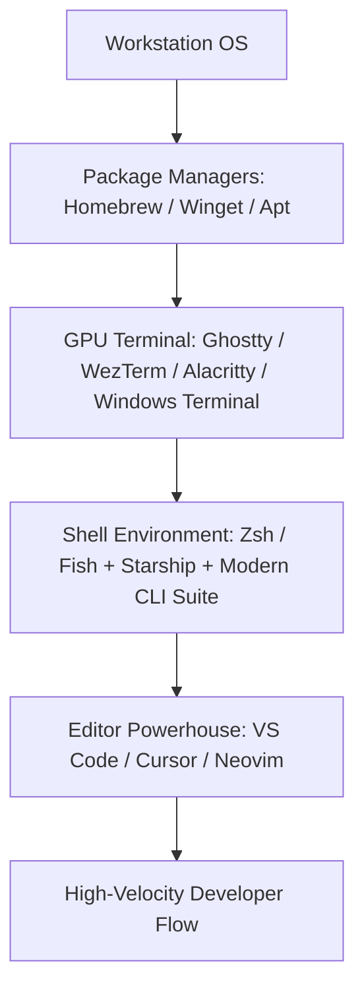

# Track 01: Foundations & Setup

> *"The development environment directly governs engineering velocity and focus."*

This track guides engineers through building a keyboard-driven, low-latency, and reproducible workstation.

---

## Track Curriculum & Progress

| Module / Topic | File | Status | Difficulty |
| :--- | :--- | :---: | :---: |
| **IDE & Editor Mastery** (VS Code, Cursor, Typography) | [`ide-and-editor-mastery.md`](./ide-and-editor-mastery.md) | Complete | Beginner to Intermediate |
| **Terminal & Shell Configuration** (Starship, Zsh, Modern CLI) | [`terminal-and-shell-alchemy.md`](./terminal-and-shell-alchemy.md) | Complete | Intermediate |
| **OS & Toolchain Setup** (macOS, Linux, Windows WSL2) | [`os-and-toolchain-setup.md`](./os-and-toolchain-setup.md) | Complete | Beginner |
| **Dotfiles Synchronization & Stow** | `dotfiles-and-stow.md` | `[TODO: Open for Contribution]` | Intermediate |
| **SSH Keys, Hardware Tokens & GPG Setup** | `ssh-and-security-keys.md` | `[TODO: Open for Contribution]` | Intermediate |
| **Keyboard Ergonomics & Keymapping** | `keyboard-and-shortcuts.md` | `[TODO: Open for Contribution]` | Advanced |

---

## Core Pillars of an Optimized Environment

1. **Low Latency**: Modern GPU-accelerated terminal emulators (Ghostty, WezTerm, Alacritty) and instant shell prompts.
2. **Keyboard Primacy**: Minimizing pointer dependence via fuzzy matching, jumping keys, and window management.
3. **Typography**: High-legibility monospace fonts (Geist Mono, JetBrains Mono, Fira Code) with proper letter-spacing.
4. **Reproducibility**: Version-controlled dotfiles for rapid machine provisioning.
5. **Modern CLI Utilities**: Upgraded POSIX utilities (`bat`, `eza`, `fd`, `ripgrep`, `zoxide`).

---

## Open Contribution Tasks

- [ ] Guide on setting up **Ghostty** and **WezTerm** configurations.
- [ ] Starter configuration guide for **GNU Stow** dotfile management.
- [ ] Comprehensive configuration guide for **Neovim LazyVim** starter kit.
