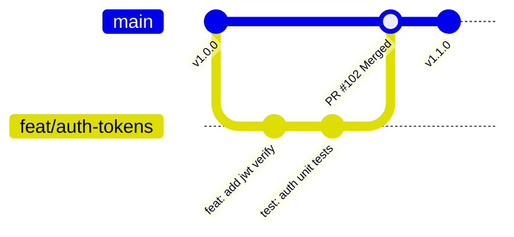

# Git Workflow & Branching Strategies

> **Difficulty**: Intermediate  
> **Target Outcome**: Understand Trunk-Based Development versus GitFlow and implement clean branch lifecycles.

---

## Trunk-Based Development vs GitFlow

In modern continuous deployment environments, **Trunk-Based Development** is standard practice.



| Strategy | Ideal Use Case | Operational Tradeoffs |
| :--- | :--- | :--- |
| **Trunk-Based (Standard)** | High-frequency deployments, microservices | Requires short-lived branches (<2 days) and feature flags |
| **GitFlow** | Scheduled release cycles (e.g. mobile App Store releases) | High merge conflict overhead; complex branching hierarchy |

---

## Standard Feature Branch Lifecycle

### 1. Branching from Latest `main`
```bash
git checkout main
git pull --rebase origin main
git checkout -b feat/user-profiles
```

### 2. Maintaining Branch Freshness via Rebase
Avoid merge commits (`"Merge branch 'main' into feat/..."`) while developing:
```bash
git fetch origin
git rebase origin/main
```

### 3. Cleaning Commits Prior to Pull Request
Squash intermediate checkpoint commits into clean semantic units:
```bash
git rebase -i HEAD~3
```

---

## Force Push Safety

- Avoid `git push --force` (can overwrite upstream team changes).
- Use `git push --force-with-lease` (safely halts if remote ref contains uninspected commits).

---

## Contributor Challenges
- [ ] Comparison table of Git Worktrees versus Git Stashing.
- [ ] Interactive walkthrough for resolving three-way merge conflicts.
