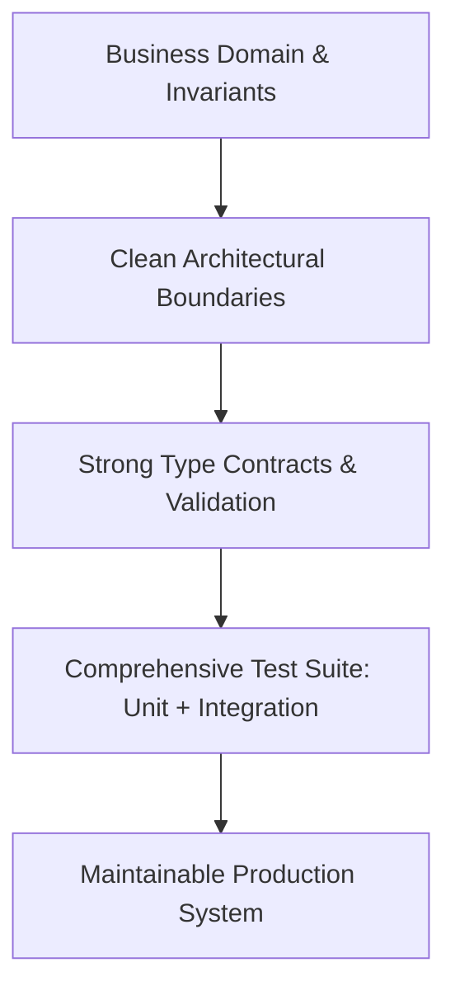

# Track 03: Code Craft & Architecture

> *"Any engineer can write code that a computer understands. Skilled engineers write code that humans can maintain and extend."*

This track focuses on clean code principles, SOLID design, testing pyramids, and strong type safety contracts.

---

## Track Curriculum & Progress

| Module / Topic | File | Status | Difficulty |
| :--- | :--- | :---: | :---: |
| **Clean Code & SOLID Principles** | [`clean-code-and-solid.md`](./clean-code-and-solid.md) | Complete | Intermediate |
| **Testing Pyramid & TDD Strategy** | [`testing-pyramid-and-tdd.md`](./testing-pyramid-and-tdd.md) | Complete | Intermediate |
| **Production Design Patterns** | [`design-patterns-in-practice.md`](./design-patterns-in-practice.md) | Complete | Advanced |
| **Type Safety, Zod & API Contracts** | [`type-safety-and-contracts.md`](./type-safety-and-contracts.md) | Complete | Intermediate |
| **Domain-Driven Design (DDD) Fundamentals** | `domain-driven-design.md` | `[TODO: Open for Contribution]` | Advanced |
| **Microservices vs Modular Monoliths** | `monolith-vs-microservices.md` | `[TODO: Open for Contribution]` | Advanced |

---

## Architectural Hierarchy

---

## Open Contribution Tasks

- [ ] Practical guide on Hexagonal Architecture (Ports and Adapters).
- [ ] Comparison of Event-Driven versus Request-Response architecture.
- [ ] Refactoring legacy monolithic methods into decoupled services.
