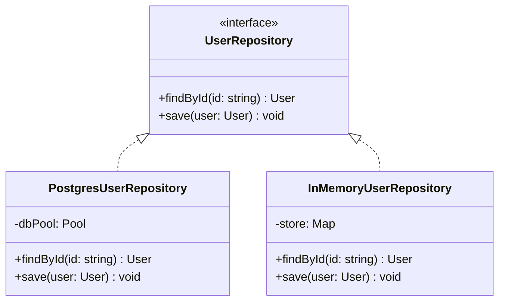

# Production Design Patterns

> **Difficulty**: Advanced  
> **Target Outcome**: Apply structural and behavioral patterns pragmatically to solve real engineering problems.

---

## High-Value Production Patterns

### 1. Strategy Pattern
Enables interchangeable implementations (e.g. payment processors, storage adapters) without altering consuming code.

```typescript
interface PaymentStrategy {
  processPayment(amount: number): Promise<{ success: boolean; txId: string }>;
}

class StripePaymentStrategy implements PaymentStrategy {
  async processPayment(amount: number) {
    return { success: true, txId: 'ch_stripe_123' };
  }
}

class PayPalPaymentStrategy implements PaymentStrategy {
  async processPayment(amount: number) {
    return { success: true, txId: 'PAYPAL-987' };
  }
}

class CheckoutService {
  constructor(private strategy: PaymentStrategy) {}

  async checkout(amount: number) {
    return this.strategy.processPayment(amount);
  }
}
```

---

### 2. Repository Pattern
Decouples domain business logic from specific persistence mechanisms (SQL, NoSQL, in-memory caches).



---

### 3. Middleware Pipeline Pattern
Sequentially chains orthogonal concerns: Authentication -> Rate Limiting -> Input Validation -> Handler Execution -> Metric Logging.

---

## Contributor Challenges
- [ ] Functional Options pattern in Go versus Builder Pattern.
- [ ] Pub-Sub pattern with Redis and EventEmitter implementations.
