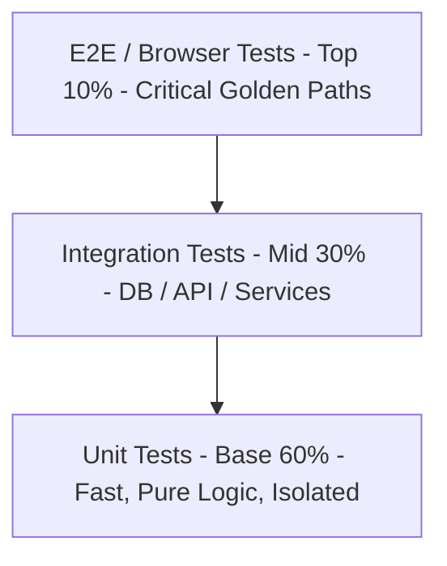

# Testing Pyramid & Test-Driven Development (TDD)

> **Difficulty**: Intermediate  
> **Target Outcome**: Build resilient test suites using the Testing Pyramid and Red-Green-Refactor cycles.

---

## The Testing Pyramid



1. **Unit Tests (60%)**: Test isolated functions, state transitions, and business logic invariants. Execution time must remain under milliseconds.
2. **Integration Tests (30%)**: Verify interactions across database repositories, HTTP handlers, and cache layers.
3. **End-to-End Tests (10%)**: Validate core user workflows (e.g., Registration -> Checkout -> Confirmation) using Playwright or Cypress.

---

## Test-Driven Development Cycle

1. **Red**: Write a failing test specifying the desired behavior.
2. **Green**: Write the minimal code required to pass the test.
3. **Refactor**: Improve design, readability, and performance while keeping tests green.

### Code Sample (Vitest / Jest):
```typescript
import { describe, it, expect } from 'vitest';
import { calculateDiscount } from './discount';

describe('calculateDiscount', () => {
  it('applies 20% discount for VIP tier users on orders over $100', () => {
    const result = calculateDiscount({
      userTier: 'VIP',
      orderTotal: 150
    });

    expect(result.discountAmount).toBe(30);
    expect(result.finalTotal).toBe(120);
  });

  it('does not apply discount if order total is under $100', () => {
    const result = calculateDiscount({
      userTier: 'VIP',
      orderTotal: 80
    });

    expect(result.discountAmount).toBe(0);
    expect(result.finalTotal).toBe(80);
  });
});
```

---

## Contributor Challenges
- [ ] Guide on using **Testcontainers** for real PostgreSQL and Redis integration testing.
- [ ] API Contract testing guide using **Pact**.
