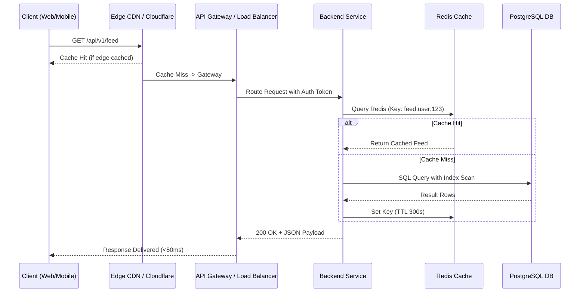

# Track 04: Fullstack & API Engineering

> *"Designing responsive, resilient fullstack systems requires architectural discipline across the client, network, and storage tiers."*

This track explores high-performance frontend engineering, REST/RPC API design, database query optimization, and secure authentication architecture.

---

## Track Curriculum & Progress

| Module / Topic | File | Status | Difficulty |
| :--- | :--- | :---: | :---: |
| **Production API Design & Best Practices** | [`backend-and-api-design.md`](./backend-and-api-design.md) | Complete | Intermediate |
| **Frontend Performance & State Architecture** | [`frontend-performance-and-state.md`](./frontend-performance-and-state.md) | Complete | Intermediate |
| **Database Mastery, Indexing & EXPLAIN** | [`database-mastery-and-indexing.md`](./database-mastery-and-indexing.md) | Complete | Advanced |
| **Auth, OAuth2 & Session Architecture** | [`auth-and-session-management.md`](./auth-and-session-management.md) | Complete | Advanced |
| **Realtime Systems (WebSockets, SSE, WebRTC)** | `realtime-systems.md` | `[TODO: Open for Contribution]` | Advanced |
| **Message Queues & Background Workers** | `queues-and-background-jobs.md` | `[TODO: Open for Contribution]` | Advanced |

---

## Production Request Lifecycle

---

## Open Contribution Tasks

- [ ] Guide on Redis caching patterns (Cache-Aside, Write-Through, Stampede mitigation).
- [ ] Scaling WebSocket connections with Redis Pub/Sub backplane.
- [ ] Production background job orchestration using BullMQ / Celery.
