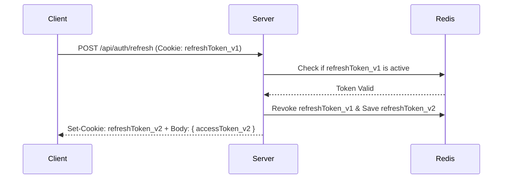

# Authentication Architecture, OAuth2 & Session Management

> **Difficulty**: Advanced  
> **Target Outcome**: Implement secure authentication, session management, and OAuth2 token lifecycles.

---

## Sessions vs JWT Tokens

| Evaluation Dimension | HttpOnly Cookie Sessions | Stateless JWTs |
| :--- | :--- | :--- |
| **Revocation** | Instant (delete session record in Redis/DB) | Requires token blacklist or awaiting expiration |
| **Payload Size** | Minimal (~32-byte session identifier) | Larger (encoded claims and signatures ~1KB) |
| **Standard Usage** | Monoliths, SSR web apps, SaaS dashboards | Microservices, third-party API clients, mobile apps |

---

## Token Rotation Architecture

When utilizing JWTs for SPAs or mobile clients:
1. **Access Token (Short-lived)**: 10-15 minutes, stored in memory.
2. **Refresh Token (Long-lived)**: 7-30 days, stored in `HttpOnly, Secure, SameSite=Strict` cookie.
3. **Rotation Policy**: Each refresh token issuance invalidates previous refresh tokens.

---

## Contributor Challenges
- [ ] PKCE (Proof Key for Code Exchange) flow for Single Page Applications.
- [ ] Passkey / WebAuthn implementation guide.
