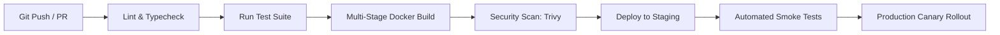

# Track 05: DevOps, CI/CD & Cloud

> *"Reliability is built through automation. Immutable infrastructure and automated delivery pipelines eliminate human operational errors."*

This track covers containerization, GitHub Actions CI/CD automation, Infrastructure as Code, Kubernetes fundamentals, and zero-downtime deployment strategies.

---

## Track Curriculum & Progress

| Module / Topic | File | Status | Difficulty |
| :--- | :--- | :---: | :---: |
| **Docker & Containerization Best Practices** | [`docker-and-containerization.md`](./docker-and-containerization.md) | Complete | Intermediate |
| **Production CI/CD with GitHub Actions** | [`cicd-pipelines-and-automation.md`](./cicd-pipelines-and-automation.md) | Complete | Intermediate |
| **Infrastructure as Code (Terraform / OpenTofu)** | [`infrastructure-as-code.md`](./infrastructure-as-code.md) | Complete | Advanced |
| **Zero-Downtime Deployment Strategies** | [`zero-downtime-deployments.md`](./zero-downtime-deployments.md) | Complete | Advanced |
| **Kubernetes (K8s) Production Essentials** | `kubernetes-essentials.md` | `[TODO: Open for Contribution]` | Advanced |
| **Cloud Cost Optimization & FinOps** | `cloud-finops-optimization.md` | `[TODO: Open for Contribution]` | Intermediate |

---

## Continuous Delivery Pipeline

---

## Open Contribution Tasks

- [ ] Starter guide on Kubernetes Helm charts for deploying web services.
- [ ] Docker Compose multi-service local environment setup (Node, Postgres, Redis, Meilisearch).
- [ ] AWS / GCP cloud cost alert configurations.
