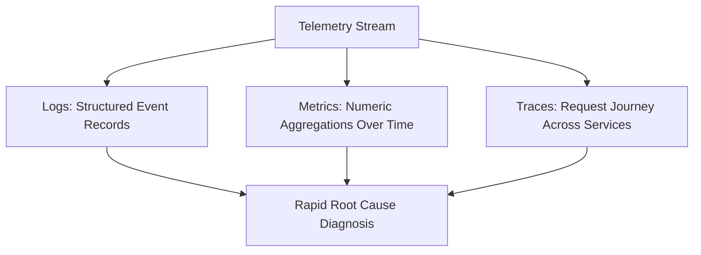

# Track 06: Observability, Security & Reliability

> *"Observability and security are foundational to engineering resilience. Production systems must be auditable, observable, and hardened by design."*

This track focuses on application security, distributed tracing, high-cardinality metrics, structured logging, performance profiling, and blameless incident management.

---

## Track Curriculum & Progress

| Module / Topic | File | Status | Difficulty |
| :--- | :--- | :---: | :---: |
| **Application Hardening & OWASP Playbook** | [`security-and-owasp-playbook.md`](./security-and-owasp-playbook.md) | Complete | Intermediate |
| **Observability: Metrics, Logs & Tracing** | [`observability-metrics-tracing.md`](./observability-metrics-tracing.md) | Complete | Advanced |
| **Incident Response & Blameless Postmortems** | [`incident-response-and-postmortems.md`](./incident-response-and-postmortems.md) | Complete | Intermediate |
| **Performance Profiling & Flamegraphs** | [`performance-profiling.md`](./performance-profiling.md) | Complete | Advanced |
| **Chaos Engineering & Resilience Testing** | `chaos-engineering.md` | `[TODO: Open for Contribution]` | Advanced |
| **Secrets Management & Vault Architecture** | `secrets-and-vault.md` | `[TODO: Open for Contribution]` | Advanced |

---

## The Three Pillars of Observability

---

## Open Contribution Tasks

- [ ] Guide on configuring Grafana dashboards for Node.js / Go runtimes.
- [ ] Rate limiting implementations (Token Bucket, Sliding Window) with Redis.
- [ ] Running chaos experiments using Chaos Mesh.
