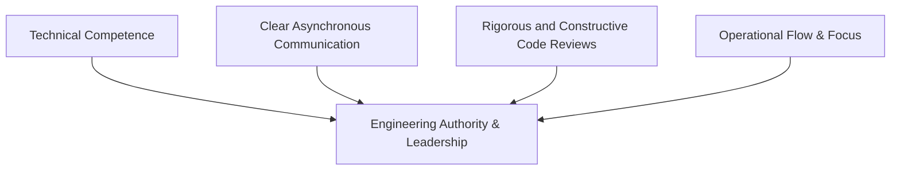

# Track 07: Dev Aura & Soft Skills

> *"Technical expertise is amplified through clear communication, structured RFCs, constructive code reviews, and mentorship."*

This track focuses on the human dimension of software engineering: technical documentation, architecture proposals, constructive review craftsmanship, open-source citizenship, and high-agency engineering mindset.

---

## Track Curriculum & Progress

| Module / Topic | File | Status | Difficulty |
| :--- | :--- | :---: | :---: |
| **Technical Writing, ADRs & RFCs** | [`technical-writing-and-rfcs.md`](./technical-writing-and-rfcs.md) | Complete | Intermediate |
| **The Standard of Constructive Code Reviews** | [`the-art-of-code-review.md`](./the-art-of-code-review.md) | Complete | Intermediate |
| **Open Source Citizenship & Etiquette** | [`open-source-citizenship.md`](./open-source-citizenship.md) | Complete | Beginner to Intermediate |
| **Career Progression, Flow State & Presence** | [`career-progression-and-mindset.md`](./career-progression-and-mindset.md) | Complete | All Levels |
| **Technical Leadership & Organizational Influence** | `tech-leadership-and-influence.md` | `[TODO: Open for Contribution]` | Advanced |
| **System Design Communication & Whiteboarding** | `system-design-whiteboarding.md` | `[TODO: Open for Contribution]` | Advanced |

---

## Pillars of Engineering Presence

---

## Open Contribution Tasks

- [ ] Architecture Decision Record (ADR) template and working reference.
- [ ] Guide on conducting effective engineering 1-on-1s and mentorship.
- [ ] Framework for protecting uninterrupted deep work schedules.
