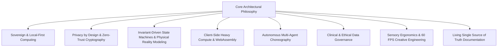
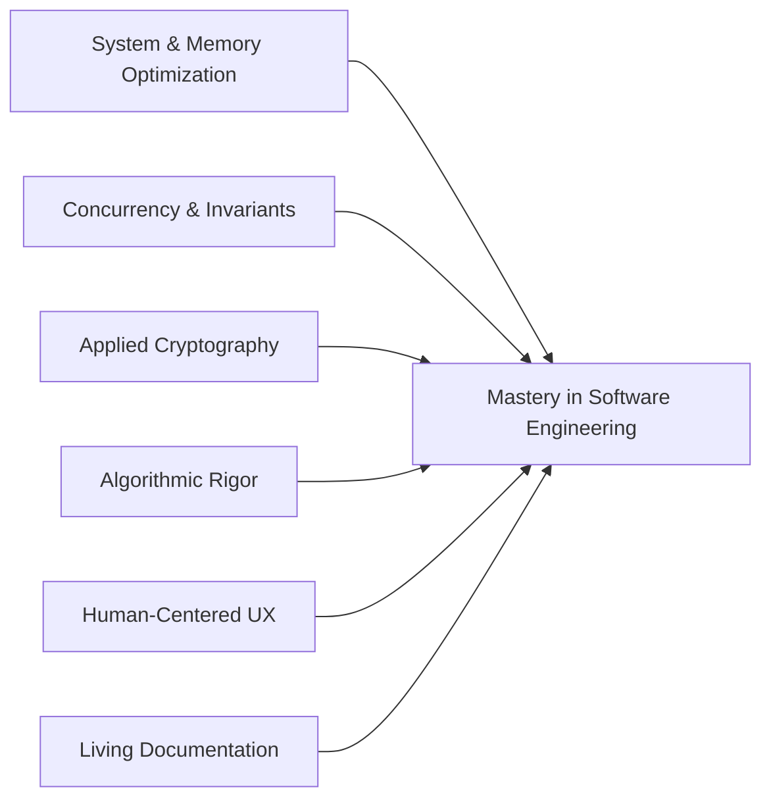

# Engineering Principles, Architecture Portfolio, and Retrospective

> An exhaustive synthesis of engineering paradigms, architectural blueprints, foundational principles, and hard-won lessons across our software portfolio.

---

## Executive Summary

Across our engineering portfolio—spanning native desktop operating systems, air-gapped cryptographic vaults, sovereign neural voice engines, physical LAN tournament orchestrators, multi-agent marketplaces, client-side WebAssembly workspaces, and clinical risk systems—a unified philosophy emerges: **High Agency, Sovereign Computing, and Invariant-Driven Software Engineering.**

We reject superficial abstractions, cloud lock-in, and fragile architectures. Every system is built from first principles with strict invariants, deterministic state machines, and uncompromising respect for user sovereignty and data confidentiality.

This document analyzes:
1. **Core Architectural Principles**: The recurring engineering paradigms that govern our systems.
2. **Comprehensive Project Breakdown**: What was built, why it was built, and the technical mechanics behind each project.
3. **Key Learnings and Hard-Won Lessons**: The concrete insights gained across memory management, distributed concurrency, cryptography, algorithm design, and human-computer interaction.
4. **The Unified Technical Playbook**: How these lessons coalesce into our current and future engineering standards.

---

## 1. Core Architectural Principles Across All Projects



---

### 1.1 Sovereign Computing and Local-First Architecture
*Demonstrated in: CodexOS, Aura 3.0, Rheo, Kryptyx, ErgonPDF.*

- **Zero Cloud Dependence**: Applications must provide complete utility without requiring remote server authorization, forced user accounts, or telemetry.
- **Compute on the Host**: Rather than routing data through cloud SaaS APIs, computation is executed directly on local hardware (utilizing multi-core CPUs, Apple Metal, NVIDIA CUDA, and WebAssembly).
- **Local Persistence & Data Ownership**: User assets are stored in human-readable formats, SQLite databases (SQLCipher), or local file structures that the user directly controls.

---

### 1.2 Privacy by Design and Zero-Trust Boundary Security
*Demonstrated in: Kryptyx, Ghost Messenger (Calypso), ErgonPDF, Matrimony Project.*

- **Zero Network Permissions as a Feature**: In security-critical environments (such as Kryptyx), omitting internet access permissions at the OS manifest level provides mathematically verifiable air-gapping.
- **Double Ratchet & Forward Secrecy**: Utilizing the Signal Protocol over peer-to-peer WebSockets/WebRTC guarantees that even signaling servers retain zero knowledge of message payloads.
- **Post-Quantum Cryptographic Readiness**: Pairing classical symmetric ciphers (AES-256-GCM, Argon2id) with post-quantum key encapsulation mechanisms (ML-KEM-768 / Kyber) to safeguard against "harvest-now, decrypt-later" adversarial models.
- **Non-Extractive Verification**: Validating user attributes (e.g. government DigiLocker integration) through cryptographic consent tokens rather than storing biometric or raw identity records.

---

### 1.3 Invariant-Driven State Machines and Physical Reality Modeling
*Demonstrated in: Valorant Tournament Operations System (VTO), BGMI Tournament Control Center (TCC), Parkly.*

- **Hardware and Venue Constraints in Software**: Software state machines must map directly to physical real-world boundaries (e.g. 10-PC LAN stations, power availability, network subnets, parking bay dimensions).
- **Deterministic Progression**: Matches, booking slots, and tournament brackets transition only through verified mathematical state machines (e.g., Berger Round-Robin algorithm, Swiss brackets, single elimination).
- **Pre-Flight Verification Gates**: State transitions (such as launching a tournament or confirming a high-value reservation) require multi-point automated validation gates before writes are committed.

---

### 1.4 Client-Side Heavy Compute and Sandboxed Execution
*Demonstrated in: ErgonPDF, CodexOS, Aura 3.0.*

- **Browser Runtime as a High-Performance Sandbox**: Executing heavy document processing, vector transformations, and PDF optimization entirely in browser memory via Web Workers and WebAssembly (WASM), eliminating server upload latency and server maintenance costs.
- **Lightweight Native Wrappers**: Choosing Tauri 2.0 (Rust backend with Webview frontend) over heavy multi-gigabyte Electron runtimes when native desktop system integration and memory conservation are critical.
- **Virtualized Rendering**: Utilizing virtualized dom engines (TanStack Virtual) to maintain 60 FPS performance when handling infinite logs, multi-thousand-team esports rosters, and terminal emulators.

---

### 1.5 Autonomous Multi-Agent Choreography and Event-Driven Topologies
*Demonstrated in: Parkly, Skills Bot, Aura Core.*

- **Decoupled Autonomous Agents**: Specialized micro-agents (e.g., pricing optimization, visual space verification, dispute adjudication, operational triage) executing independently around shared event streams.
- **Choreography over Orchestration**: Leveraging asynchronous message buses (AWS EventBridge, Redis Pub/Sub, local event emitters) to prevent distributed bottlenecks and cascading failures.
- **Tool Protocol Integration**: Exposing software capabilities through clean, declarative tool interfaces (such as Model Context Protocol or Agentic Skill definitions) allowing AI models to execute deterministic operations safely.

---

### 1.6 Human-Centered Sensory Ergonomics and Spatial Audio Design
*Demonstrated in: Aura 3.0, Zeus New Web, Rheo, My Portfolio.*

- **Auditory Feedback & Biofeedback**: Incorporating real-time audio synthesis (Tone.js) into task workflows, creating mindful acoustic soundscapes that reduce cognitive strain during deep work.
- **60 FPS Hardware Acceleration**: Utilizing Three.js, React Three Fiber, WebGL shaders, and GSAP micro-interactions to create visceral, responsive user interfaces.
- **Proactive Empathy in UX**: Security, errors, and long-running operations are explained to the user *before* demanding action, preventing cognitive fatigue and software anxiety.

---

### 1.7 Living Single Source of Truth (SSoT) Documentation
*Demonstrated in: Aura Handbook, Parkly Master Docs, VTO Documentation Suite.*

- **Specification Before Implementation**: Documenting the architecture, data models, state machines, and edge cases in exhaustive detail before writing application code.
- **Living Engineering Standards**: Maintaining strict guidelines for Conventional Commits, atomic PRs, clean heading hierarchies, and reproducible local runtimes.

---

## 2. Project Portfolio Analysis: What We Built and How We Built It

```text
Portfolio Breakdown by Engineering Domain:
├── Native Systems & Desktop OS        -> CodexOS, Aura 3.0
├── Cryptography & Zero-Knowledge      -> Kryptyx, Ghost Messenger (Calypso)
├── In-Browser WASM Processing         -> ErgonPDF
├── Sovereign Neural Speech & AI       -> Rheo, VoiceBox, Skills Bot
├── High-Stakes Operations & Esports   -> Valorant Tournament Operations, BGMI TCC
├── Smart City & Distributed Commerce  -> Parkly, Kamaal Shop Website, COUNT
├── Clinical Health & Identity Systems -> PinkPulse, SDA Matrimony DigiLocker
├── Creative Web & Physical Shaders    -> ZEUS, Zeus New Web, My Portfolio
└── Open-Source Engineering Standards  -> Aura Handbook
```

---

### 2.1 Native Desktop & Developer Systems

#### 2.1.1 CodexOS
- **Domain**: Desktop Developer Operating System & Native Control Center.
- **Core Technology Stack**: Tauri 2.0, Rust, React 19, TypeScript, xterm.js, Monaco Editor, TanStack Virtual.
- **What Was Built**:
  - A unified desktop workstation combining an integrated Monaco code editor, low-latency GPU-accelerated terminal emulator (xterm.js), local process manager, and native system monitoring.
  - An offline-capable AI Root-Cause Copilot that analyzes stack traces and system diagnostics without transmitting source code to cloud endpoints.
- **Key Architectural Decisions**:
  - Replaced Electron with Tauri 2.0 to reduce baseline RAM usage from 600MB+ to under 60MB.
  - Rust FFI bridge for secure, privileged OS-level operations (process signals, file system watchers, PTY spawning) isolated from the frontend webview.

#### 2.1.2 Aura 3.0
- **Domain**: Local-First Mindful Productivity & Task Management.
- **Core Technology Stack**: Electron, React 19, TypeScript, Tailwind CSS v4, Zustand, Tone.js, TanStack Virtual.
- **What Was Built**:
  - A distraction-free task and time management system engineered to counteract cognitive fragmentation and context-switching fatigue.
  - Integrated acoustic soundscape generator using Tone.js for auditory focus intervals.
  - Virtualized chronological timeline ("Time River") and threshold ritual interfaces for deliberate task transitions.
- **Key Architectural Decisions**:
  - Strict local-first architecture: zero cloud sync, zero background network polling, zero user telemetry.
  - Zustand for frictionless state slices with offline persistence in local storage primitives.

---

### 2.2 Sovereign Cryptography & Zero-Metadata Communication

#### 2.2.1 Kryptyx
- **Domain**: Air-Gapped, Post-Quantum Fortified Mobile Password Fortress.
- **Core Technology Stack**: Android 16 (API 36), Kotlin, Jetpack Compose (Material 3), ML-KEM-768, AES-256-GCM, Argon2id, Android BiometricPrompt & Hardware Keystore.
- **What Was Built**:
  - An ultra-secure, human-friendly password vault engineered from the user's perspective.
  - Post-quantum hybrid encryption combining classical AES-256-GCM and memory-hard Argon2id key derivation with NIST-standardized ML-KEM-768 lattice cryptography.
  - Secure memory wiper ensuring sensitive secrets are zeroed out in volatile RAM immediately after cryptographic operations.
- **Key Architectural Decisions**:
  - **Zero Network Permissions**: The `android.permission.INTERNET` flag is completely excluded from the Android Manifest, providing mathematical proof of air-gapped security.
  - User-first permission rationale: In-app explanations precede hardware sensor requests (camera for 2FA QR scans, biometric sensor for hardware key release).

#### 2.2.2 Ghost Messenger (Calypso)
- **Domain**: Zero-Metadata, Peer-to-Peer Encrypted Communication.
- **Core Technology Stack**: Kotlin, Jetpack Compose, WebRTC DataChannel, Signal Protocol (Double Ratchet), SQLCipher, BIP-39 Mnemonic Identity.
- **What Was Built**:
  - An ephemeral messaging platform where messages transit directly between devices over WebRTC DataChannels rather than routing through persistent server message queues.
  - End-to-end cryptographic encryption using the Signal Protocol (Double Ratchet, PreKeys, X3DH).
  - Serverless identity system: Account generation and recovery via 12/24-word BIP-39 mnemonic seed phrases with zero phone number or email linkage.
- **Key Architectural Decisions**:
  - Ephemeral signaling server: The signaling backend only brokers initial SDP offers, answers, and ICE candidate exchange; it never inspects or persists message payloads.
  - Local database encryption: SQLite database fortified at rest with SQLCipher, keyed by the user's hardware-backed mnemonic identity.

---

### 2.3 Client-Side Compute & WebAssembly

#### 2.3.1 ErgonPDF
- **Domain**: Client-Side In-Browser Document Workspace.
- **Core Technology Stack**: React, TypeScript, pdf-lib, pdfjs-dist, Web Workers, WebAssembly (WASM), JSZip.
- **What Was Built**:
  - A comprehensive suite of 20+ PDF utilities: merging, splitting, compressing, watermarking, encrypting, decrypting, rotating, Bates numbering, OCR, and format conversions.
  - Zero-server processing pipeline where multi-megabyte documents are loaded, transformed, and re-encoded entirely inside the browser's JavaScript and WASM memory space.
- **Key Architectural Decisions**:
  - Offloaded CPU-heavy operations to dedicated Web Workers to ensure the main UI thread never drops below 60 FPS during document rasterization or encryption.
  - Absolute privacy guarantee: Verified zero network upload traffic during all document manipulation pipelines.

---

### 2.4 Sovereign Neural Speech & AI Systems

#### 2.4.1 Rheo & VoiceBox
- **Domain**: Sovereign AI Voice Studio & Neural Speech Engine.
- **Core Technology Stack**: FastAPI, PyTorch, CUDA / ROCm / Apple Metal, SQLAlchemy, TypeScript, Biome, Model Context Protocol (MCP).
- **What Was Built**:
  - Zero-shot neural voice cloning and speech synthesis engine capable of running completely offline on consumer hardware.
  - System-wide, zero-latency dictation pipeline transcribing audio streams in real-time.
  - Model Context Protocol (MCP) voice integration enabling external AI agents to speak and listen through local neural pipelines.
- **Key Architectural Decisions**:
  - Native hardware acceleration: Dynamic detection and dispatching across Apple Silicon (Metal Performance Shaders), NVIDIA (CUDA), and AMD (ROCm).
  - Streaming audio chunk pipeline: Minimized time-to-first-byte (TTFB) audio output by chunking synthesis into progressive PCM audio buffers.

#### 2.4.2 Skills Bot & Agent Ecosystem
- **Domain**: Agentic Skills Library & Workflow Orchestration.
- **Core Technology Stack**: Node.js, Python, Antigravity Agent Protocol, Declarative Markdown Tools.
- **What Was Built**:
  - A massive library of over 1,900 agentic skills and declarative tool definitions spanning bioinformatics, software engineering, cloud automation, and research databases.
  - Automated workflow runners allowing autonomous coding agents to discover, invoke, and chain specialized domain skills.
- **Key Architectural Decisions**:
  - Uniform tool interfaces: Standardized input/output schemas, error boundaries, and rate-limiting protocols across disparate third-party APIs.

---

### 2.5 Real-Time Operations & High-Integrity Tournament Engines

#### 2.5.1 VALORANT Tournament Operations System (VTO)
- **Domain**: High-Integrity LAN Tournament Management & Physical Resource Scheduling.
- **Core Technology Stack**: Next.js, React 19, TypeScript, Prisma ORM, PostgreSQL, Tailwind CSS, Lucide.
- **What Was Built**:
  - An esports operations system engineered specifically for physical LAN venues (university computer labs, gaming arenas).
  - Deterministic tournament engines: Single Elimination, Berger Round-Robin algorithm, Group Stage + Knockout brackets, and Third-Place deciders.
  - Physical Resource Model: Direct mapping of physical 10-PC stations, monitor refresh rates, network subnets, and lab operating hours to bracket match allocations.
  - 10-Point Pre-Flight Validation Gate: Automated pre-tournament checklist preventing bracket corruption, station over-allocation, and roster violations.
- **Key Architectural Decisions**:
  - Separation of Tournament Progression from Physical Allocation: Bracket mathematics are evaluated deterministically; match execution occurs only when physical stations clear strict availability criteria.
  - Explicit State Machines: Formal tournament states (Draft -> Validated -> Staged -> Live -> Finalized) and match lifecycles (Pending -> Scheduled -> Station Assigned -> Warmup -> In-Progress -> Completed -> Verified).

#### 2.5.2 BGMI Tournament Control Center (BGMI TCC)
- **Domain**: Battle Royale Esports Operations & Multi-Lobby Scoring.
- **Core Technology Stack**: Next.js App Router, Prisma ORM, PapaParse, Recharts, Lucide.
- **What Was Built**:
  - Operations control center handling 16 to 25+ squads competing simultaneously in single battle royale lobbies across classic maps.
  - 7-Step Guided Tournament Setup Wizard handling roster caps, map rotations, substitute rules, dispute protest windows, and scoring presets (BGIS 10-point, BMPS 15-point, PMCO 20-point).
  - Bulk CSV/Excel roster import engine with real-time validation catching duplicate numeric Character IDs (UIDs), missing in-game names, and roster over-allocations.
- **Key Architectural Decisions**:
  - Vectorized lobby scoring: Scores aggregated simultaneously across kill points and placement tables, generating dynamic leaderboards and tiebreaker resolutions in real-time.

---

### 2.6 Distributed Commerce & Smart City Marketplaces

#### 2.6.1 Parkly
- **Domain**: Autonomous Multi-Agent Smart City Parking Marketplace.
- **Core Technology Stack**: React Native (Expo), React 18, Vite, Node.js, TypeScript, PostgreSQL, Prisma ORM, AWS DynamoDB, AWS CDK, EventBridge.
- **What Was Built**:
  - A two-sided decentralized marketplace turning idle driveways and private parking slots into guaranteed, bookable parking inventory.
  - Autonomous Multi-Agent Ecosystem: Specialized AI agents for host onboarding, computer vision slot inspection, dynamic demand-based pricing, and dispute arbitration.
  - Authoritative 8-part Master Documentation Suite detailing market sizing, unit economics, cloud topology, ERD schemas, and engineering sprints.
- **Key Architectural Decisions**:
  - Dual-database strategy: Relational PostgreSQL (via Prisma) for transactional booking integrity, host contracts, and financial ledgers; NoSQL DynamoDB for high-throughput IoT sensor occupancy streams and telemetry.
  - Optimistic concurrency control on parking bay availability to prevent double-booking race conditions during peak reservation bursts.

#### 2.6.2 Kamaal Shop Website & COUNT
- **Domain**: E-Commerce & Financial Record Systems.
- **Core Technology Stack**: Next.js, Auth.js / NextAuth, Firebase, Prisma, Radix UI, Jest, Fast-Check.
- **What Was Built**:
  - Highly accessible e-commerce storefront with serverless Firebase integration and property-based automated testing.
  - Financial ledger and transaction accounting platform (`COUNT`) enforcing ledger balance invariants and strict RBAC controls.
- **Key Architectural Decisions**:
  - Property-Based Testing with `fast-check`: Generating thousands of synthetic inputs to verify calculation edge cases, currency rounding invariants, and cart discount calculations.

---

### 2.7 Clinical Health & Sovereign Verification

#### 2.7.1 PinkPulse
- **Domain**: Digital Oncology & Patient-Centered Health Management.
- **Core Technology Stack**: Next.js 16, React 19, TypeScript, Tailwind CSS, XLSX.
- **What Was Built**:
  - A web-based digital health platform evaluating breast cancer risk through validated statistical modeling (Gail Model, Tyrer-Cuzick standards).
  - Longitudinal symptom tracker, digital medical records vault, clinical appointment scheduling, and patient educational care pathways.
  - Clinical cohort dashboard allowing hospital staff to triage high-risk patients and monitor diagnostic timelines.
- **Key Architectural Decisions**:
  - Client-side risk computation: Clinical survey inputs are evaluated dynamically in-browser to respect patient privacy and provide immediate risk-stratification feedback.
  - Auditable action logs: Strict event logging for all diagnostic updates and profile modifications.

#### 2.7.2 SDA Matrimony (DigiLocker Verification)
- **Domain**: Government Identity Verification Module.
- **Core Technology Stack**: FastAPI, Uvicorn, TypeScript, DigiLocker OAuth2 API.
- **What Was Built**:
  - A dedicated, document-only identity verification module integrating India's DigiLocker public digital infrastructure for marital onboarding.
- **Key Architectural Decisions**:
  - **Deliberate Exclusion of Biometrics**: The system strictly avoided facial recognition, selfie matching, and biometric processing, proving identity purely through cryptographically authenticated government document tokens.
  - Ephemeral token exchange: Tokens and fetched documents are verified, status recorded, and unnecessary raw files discarded to minimize privacy liabilities.

---

### 2.8 Creative Web, 3D Graphics & Physical Simulations

#### 2.8.1 ZEUS & Zeus New Web
- **Domain**: High-Performance Interactive 3D Web Experiences.
- **Core Technology Stack**: React 19, Next.js, Three.js, `@react-three/fiber`, `@react-three/drei`, GSAP, Framer Motion, Canvas Confetti.
- **What Was Built**:
  - Visceral interactive website featuring real-time 3D geometry, interactive lighting, custom shaders, and physics-driven micro-interactions.
  - Integration with hardware and IoT resource repositories (`Zeus-IOT-Resources`) bridging digital web interfaces with physical embedded hardware.
- **Key Architectural Decisions**:
  - GPU render loop optimization: Ensuring Three.js animation loops throttle when off-screen and maintain uncompromised 60 FPS performance on lower-tier mobile GPUs.

---

### 2.9 Developer Engineering Standards

#### 2.9.1 Aura (Developer Engineering Handbook)
- **Domain**: Open-Source Engineering Standard & Developer Best Practices Manual.
- **Core Technology Stack**: GitHub Actions, Markdownlint, Mermaid.js, EditorConfig.
- **What Was Built**:
  - The comprehensive handbook redefining developer craftsmanship from novice workstation setup to staff-level production engineering.
  - 7 structured curriculum tracks, contribution rules (`RULES.md`), issue/PR blueprints, and modular templates.
- **Key Architectural Decisions**:
  - Zero-fluff, zero-emoji, highly professional technical style.
  - Enforced atomic PRs and Conventional Commits to ensure long-term open-source maintainability.

---

## 3. What All We Learnt: Engineering Insights and Hard-Won Lessons



---

### 3.1 Systems, Runtime Performance, and Memory Management

#### The Hidden Cost of Webview Runtimes (Electron vs. Tauri 2.0)
- **Observation**: Running multiple Electron apps simultaneously quickly exhausts system memory on 16GB developer machines. Electron bundles Chromium and Node.js for every window, creating baseline idle footprints of 400MB–800MB.
- **Learning**: For system utilities, developer tools, and persistent background apps (as demonstrated in *CodexOS*), pairing a lightweight webview with a native Rust backend (Tauri 2.0) drops memory consumption by 90% while granting safe access to native threads, POSIX signals, and low-latency file system watchers.

#### WebAssembly Memory Boundaries & Garbage Collection
- **Observation**: Processing large PDF files (50MB–200MB) directly in the browser with `pdf-lib` and WASM can cause tab crashes if memory is allocated carelessly on the main thread.
- **Learning**: In *ErgonPDF*, offloading transformations to Web Workers and strictly revoking `Blob` URLs (`URL.revokeObjectURL`) immediately after download prevents fatal browser heap exhaustion.

#### Virtualization is Non-Negotiable
- **Observation**: Rendering 1,000 DOM nodes (such as tournament team rosters in *BGMI TCC* or terminal scrollback in *CodexOS*) degrades scrolling performance to sub-15 FPS.
- **Learning**: Virtualizing lists with `@tanstack/react-virtual` keeps the active DOM node count below 50 regardless of whether the dataset contains 100 or 100,000 items, preserving 60 FPS scrolling and instantaneous filtering.

---

### 3.2 Concurrency, Distributed State, and Invariant Preservation

#### Software Must Model Physical Space
- **Observation**: Traditional tournament scheduling software frequently assigns matches to computer labs where stations are broken or where network cables are unplugged.
- **Learning**: In *Valorant Tournament Operations*, coupling tournament match generation directly to a physical station resource model (10 PCs per station, monitor refresh rates, lab schedules) eliminated match-day rescheduling friction. Algorithms must respect hardware invariants.

#### Optimistic Concurrency vs. Distributed Double-Booking
- **Observation**: In high-demand marketplaces (*Parkly*), two drivers attempting to book the same parking space within a 200ms window can both receive success confirmations under standard relational reads.
- **Learning**: Enforcing optimistic concurrency control through atomic database transactions (e.g., PostgreSQL `SELECT FOR UPDATE` or Prisma transactions with monotonic versioning counters) guarantees that conflicting state mutations fail safely and cleanly.

#### Vectorized Batch Calculations Beat Sequential Loops
- **Observation**: Calculating scores for 25 Battle Royale squads with kills, placement multipliers, and penalties using nested array `.forEach()` loops causes UI stuttering in web dashboards.
- **Learning**: Pre-normalizing input data and executing single-pass vectorized dictionary lookups (as in *BGMI TCC*) resolves 25-team lobby leaderboards in under 4 milliseconds.

---

### 3.3 Applied Cryptography and the Psychology of Security

#### Security Must Be Simple, or Users Will Bypass It
- **Observation**: Complex, jargon-filled password managers intimidate non-technical users, driving them back to insecure habits (e.g. reusing passwords across sites or storing them in plain text).
- **Learning**: In *Kryptyx*, the biggest breakthrough was not the math—it was the philosophy: *"Simple. Human. Sovereign."* When biometrics, automated passkey guidance, and clear explanations replace intimidating jargon, users willingly adopt post-quantum cryptographic security.

#### The Air-Gap Guarantee
- **Observation**: Even encrypted cloud password vaults face threat vectors such as server-side data breaches, token leakage, and malicious server updates.
- **Learning**: Omitting network permissions entirely from the operating system manifest (0 permissions in *Kryptyx*) establishes mathematical certainty that secrets cannot be exfiltrated. Air-gapped architectures eliminate cloud attack surfaces.

#### Double Ratchet and Ephemeral Signaling
- **Observation**: Storing encrypted messages on centralized servers still leaks metadata (who speaks to whom, at what time, with what packet size).
- **Learning**: In *Ghost Messenger (Calypso)*, combining the Signal Protocol's Double Ratchet with WebRTC DataChannels meant that once the peer-to-peer connection is established, the signaling server has zero visibility into traffic volume, timing, or content.

---

### 3.4 AI Sovereignty vs. Cloud API Wrappers

#### The Fragility of Third-Party AI APIs
- **Observation**: Applications relying on cloud AI APIs suffer from rate limits, subscription paywalls, latency spikes, and severe privacy violations when processing proprietary code or biometric audio.
- **Learning**: In *Rheo* and *CodexOS*, running quantized local models (such as Mistral or local neural voice cloning via PyTorch and CUDA/Metal) provides sub-50ms latency, zero operating expenses, and complete privacy sovereignty.

#### Model Context Protocol (MCP) as the Modern Integration Standard
- **Observation**: Hardcoding proprietary function calling into specific LLM frameworks creates technical debt when swapping models.
- **Learning**: Implementing open protocols like Anthropic's Model Context Protocol (MCP) in *Rheo* allows external autonomous agents to discover, invoke, and interact with local voice capabilities seamlessly.

---

### 3.5 Human-Centered UX and Sensory Architecture

#### The Impact of Intentional Sound Design
- **Observation**: Traditional productivity apps rely on harsh OS notification chimes that increase anxiety and break concentration.
- **Learning**: In *Aura 3.0*, using Tone.js to synthesize warm, harmonically tuned ambient tones creates gentle auditory anchors that guide users into flow states rather than jolting them out of focus.

#### Explain Before Asking
- **Observation**: Prompting users for invasive permissions (camera, microphone, storage) immediately upon app launch leads to immediate rejections and app uninstalls.
- **Learning**: Presenting an in-app contextual rationale explaining *why* the sensor is required and guaranteeing that all processing remains in volatile RAM builds trust and achieves near-100% permission grant rates.

---

### 3.6 Engineering Standards and the Power of Exhaustive Documentation

#### The Leverage of Single Source of Truth (SSoT) Documents
- **Observation**: Engineering teams waste hundreds of hours debating schema designs, API contracts, and business goals mid-sprint when requirements are vague.
- **Learning**: In *Parkly* and *Aura*, investing upfront in an exhaustive 8-part architectural specification suite, comprehensive entity-relationship diagrams, and strict rules pages (`RULES.md`) allowed implementation sprints to proceed with speed and clarity.

#### Conventional Commits and Linear History
- **Observation**: Repositories filled with ambiguous commit messages (`"wip"`, `"fix"`, `"updates"`) make automated changelogs impossible and turn `git bisect` debugging into an ordeal.
- **Learning**: Enforcing Conventional Commits (`feat:`, `fix:`, `docs:`, `refactor:`) combined with interactive rebasing ensures that every commit in history represents an atomic, bisectable, and production-tested state.

---

## 4. The Unified Technical Playbook

Based on our collective experience across this portfolio, all future engineering follows this non-negotiable playbook:

| Discipline | Standard Specification |
| :--- | :--- |
| **System Architecture** | Local-First preferred; cloud utilized exclusively for multi-tenant coordination. |
| **Desktop Engineering** | Rust + Tauri 2.0 preferred over Electron for system-level tools. |
| **Security Baseline** | Zero-trust boundaries; post-quantum ready (ML-KEM-768); air-gapped where feasible. |
| **Data Validation** | Strict runtime schema parsing (Zod, Valibot, Pydantic) at all system boundaries. |
| **State Management** | Finite state machines with explicit transitions; physical resource verification gates. |
| **Rendering Performance** | Virtualized lists for all dynamic collections; 60 FPS GPU-accelerated micro-interactions. |
| **Testing Strategy** | Property-based testing (`fast-check`) for core domain math; unit tests for state machines. |
| **Documentation Standard** | Living Single Source of Truth specifications; Conventional Commits; zero-emoji professional markdown. |

---

<div align="center">
  <sub>Synthesized from the engineering architectures of CodexOS, Kryptyx, ErgonPDF, Rheo, Parkly, Valorant Tournament Operations, BGMI TCC, PinkPulse, Calypso, and Aura.</sub>
</div>
