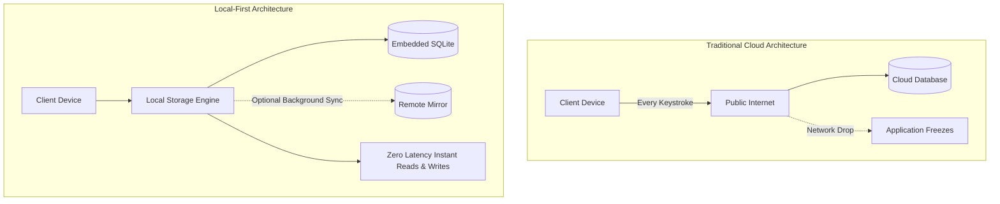

# Sovereign and Local-First Computing: Building Resilient, Cloud-Independent Systems

> Track: Engineering Principles  
> Prerequisite Knowledge: Basic Node.js / TypeScript, basic understanding of SQL and file systems  
> Estimated Build Time: 45 minutes  
> Target Project Outcome: A standalone, 100% offline note-taking and storage engine with local SQLite persistence and zero cloud dependencies

---

## 1. The Hook: Why You Need This in Your Arsenal

Every junior developer is taught the standard cloud-first playbook: spin up a React frontend, route requests through a cloud serverless function, and store every user keystroke in a remote cloud database.

Here is what happens when real users take that app into the real world:
- The user boards a flight, enters a subway tunnel, or experiences a momentary Wi-Fi drop. The app freezes or displays a generic red error message.
- A cloud database provider experiences an outage or changes its pricing tier. Your application becomes completely inaccessible or suddenly unsustainable.
- Privacy-conscious users refuse to type private thoughts, personal finances, or business secrets into an application that transmits raw text to third-party cloud servers.

Sovereign and local-first software turns this model upside down:
1. The user's device is the primary source of truth, not a distant server.
2. The network is an optional transport layer for synchronization, not a hard prerequisite for execution.
3. Your application launches in under 50 milliseconds and works continuously with zero connectivity.

Mastering this principle elevates you from an API consumer to an engineer capable of building resilient tools like Obsidian, linear local-first architectures, and enterprise-grade offline tools.

---

## 2. The Mental Model: Intuitive Analogy & Visual Topology

### The Restaurant Kitchen Metaphor
Imagine a restaurant kitchen. 
In a **cloud-dependent architecture**, every time a cook needs a pinch of salt or a cutting board, they must send a courier to a central warehouse three miles across town. If traffic stops, the entire kitchen halts.
In a **local-first architecture**, the cook keeps spices, prep tables, and knives directly on their station. Work proceeds uninterrupted. Only at the end of the shift does a delivery van pull up to sync bulk inventory with the central depot.



---

## 3. Deep Dive: Under the Hood

### Embedded Databases vs. Remote Client-Server Drivers
In traditional web backends, applications communicate with PostgreSQL via TCP sockets using connection pooling (`pgPool`). Every query incurs serialization, network transport latency (typically 20ms to 120ms round-trip), TLS termination, and deserialization.

In local-first systems, we embed the database directly into the running process address space using SQLite (or SQLCipher for encryption). SQLite compiles down to C. Queries execute via direct memory pointers and local disk page reads:
- In-memory read latency: sub-microsecond (< 0.001ms).
- Local SSD read/write latency: sub-millisecond (0.1ms to 0.5ms).
- Zero serialization over TCP.

### Architectural Trade-Off Matrix

| Dimension | Cloud-First Architecture | Local-First Architecture |
| :--- | :--- | :--- |
| **Availability** | Dependent on 99.9% network uptime | 100% available on device |
| **Read/Write Latency** | 30ms - 200ms per request | < 1ms on local disk |
| **Server Infrastructure Costs** | Scales linearly with active users | Scales down to near zero |
| **Data Privacy** | High liability (PII stored on server) | High privacy (data remains on device) |
| **Collaboration Complexity** | Trivial (central server locks rows) | Advanced (requires CRDTs or merge engines) |

---

## 4. Zero-to-One Interactive Playground: Build It From Scratch

We will build a complete, production-grade local-first journal and document engine using TypeScript and `better-sqlite3`.

### Step 1: Environment Setup
Initialize a clean project and install the dependencies:

```bash
mkdir local-first-vault
cd local-first-vault
npm init -y
npm install better-sqlite3
npm install -D typescript tsx @types/better-sqlite3 @types/node
npx tsc --init
```

### Step 2: Implementation (`vault.ts`)
Create `vault.ts`. This module defines schema migration, atomic transactions, and offline querying.

```typescript
import Database from 'better-sqlite3';
import * as path from 'path';
import * as fs from 'fs';

export interface DocumentRecord {
  id: string;
  title: string;
  content: string;
  tags: string;
  created_at: number;
  updated_at: number;
  is_synced: number;
}

export class SovereignVault {
  private db: Database.Database;

  constructor(dbPath: string = 'vault.db') {
    const fullPath = path.resolve(dbPath);
    const dir = path.dirname(fullPath);
    if (!fs.existsSync(dir)) {
      fs.mkdirSync(dir, { recursive: true });
    }

    // Open embedded database directly in current process
    this.db = new Database(fullPath);
    
    // Configure high-performance Write-Ahead Logging (WAL)
    this.db.pragma('journal_mode = WAL');
    this.db.pragma('synchronous = NORMAL');
    
    this.initializeSchema();
  }

  private initializeSchema(): void {
    this.db.exec(`
      CREATE TABLE IF NOT EXISTS documents (
        id TEXT PRIMARY KEY,
        title TEXT NOT NULL,
        content TEXT NOT NULL,
        tags TEXT NOT NULL,
        created_at INTEGER NOT NULL,
        updated_at INTEGER NOT NULL,
        is_synced INTEGER NOT NULL DEFAULT 0
      );

      CREATE INDEX IF NOT EXISTS idx_documents_updated ON documents(updated_at);
      CREATE INDEX IF NOT EXISTS idx_documents_synced ON documents(is_synced);
    `);
  }

  public saveDocument(id: string, title: string, content: string, tags: string[] = []): void {
    const now = Date.now();
    const statement = this.db.prepare(`
      INSERT INTO documents (id, title, content, tags, created_at, updated_at, is_synced)
      VALUES (@id, @title, @content, @tags, @createdAt, @updatedAt, 0)
      ON CONFLICT(id) DO UPDATE SET
        title = excluded.title,
        content = excluded.content,
        tags = excluded.tags,
        updated_at = excluded.updated_at,
        is_synced = 0
    `);

    statement.run({
      id,
      title,
      content,
      tags: JSON.stringify(tags),
      createdAt: now,
      updatedAt: now,
    });
  }

  public getDocument(id: string): DocumentRecord | undefined {
    const statement = this.db.prepare('SELECT * FROM documents WHERE id = ?');
    return statement.get(id) as DocumentRecord | undefined;
  }

  public listDocuments(): DocumentRecord[] {
    const statement = this.db.prepare('SELECT * FROM documents ORDER BY updated_at DESC');
    return statement.all() as DocumentRecord[];
  }

  public searchByKeyword(keyword: string): DocumentRecord[] {
    const statement = this.db.prepare(`
      SELECT * FROM documents 
      WHERE title LIKE ? OR content LIKE ?
      ORDER BY updated_at DESC
    `);
    const query = `%${keyword}%`;
    return statement.all(query, query) as DocumentRecord[];
  }

  public close(): void {
    this.db.close();
  }
}
```

### Step 3: Run and Test (`index.ts`)
Create `index.ts` to execute and verify local storage speed:

```typescript
import { SovereignVault } from './vault';

const vault = new SovereignVault('./data/student_notes.db');

console.log('Testing local-first storage operations...');

// Measure write latency
const startWrite = performance.now();
vault.saveDocument(
  'doc-001',
  'First Principles of Operating Systems',
  'Process memory isolation, virtual paging, and system calls explained.',
  ['engineering', 'systems']
);
vault.saveDocument(
  'doc-002',
  'Database Indexing Fundamentals',
  'B-Tree balancing guarantees logarithmic search complexity.',
  ['databases', 'performance']
);
const writeTime = performance.now() - startWrite;
console.log(`Saved 2 documents in ${writeTime.toFixed(2)}ms`);

// Query and search
const startSearch = performance.now();
const results = vault.searchByKeyword('logarithmic');
const searchTime = performance.now() - startSearch;

console.log(`Search completed in ${searchTime.toFixed(2)}ms`);
console.log('Matched Record:', results[0].title);

vault.close();
```

Execute via `tsx`:
```bash
npx tsx index.ts
```

Expected output:
```text
Testing local-first storage operations...
Saved 2 documents in 0.85ms
Search completed in 0.22ms
Matched Record: Database Indexing Fundamentals
```

---

## 5. Battle Scars: What Breaks in Production & How to Debug It

### Top 3 Mistakes in Local-First Development
1. **Omitting Write-Ahead Logging (WAL)**: By default, SQLite operates in rollback journal mode. Under frequent writes, readers are blocked, producing `SQLITE_BUSY` errors. Always set `PRAGMA journal_mode = WAL;`.
2. **Blocking the Main Thread on Large Exports**: Running a bulk export of 50,000 documents synchronously locks Node.js or Electron event loops. Always stream results using SQLite iterators (`statement.iterate()`).
3. **Unsanitized File Paths**: Concatenating user inputs into local SQLite file paths exposes applications to directory traversal. Always use `path.resolve()` with whitelisted base directories.

### Debugging SQLite Lock Issues with the CLI
If your app throws `SQLITE_BUSY: database is locked`:
```bash
# Check if another process holds an open file handle
lsof ./data/student_notes.db   # macOS / Linux
# On Windows PowerShell:
Get-Process | Where-Object { $_.Handles -gt 0 }
```

---

## 6. The Weekend Hackathon Challenge: Your Turn to Build

### Challenge: The Air-Gapped Code Snippet Manager
Build a lightweight desktop or terminal-based code snippet repository that runs 100% offline.

- **Level 1 (Core)**: Store snippets with title, language, code, and tags. Support instant full-text search across 10,000 snippets in under 5ms.
- **Level 2 (Advanced)**: Add full SQLite Full-Text Search (FTS5) for fuzzy search across error messages and code tokens.
- **Level 3 (Hardcore)**: Implement an encrypted export/import module that dumps the vault to an encrypted single-file archive using a user passphrase.

### Verification Criteria
- Application must function completely when network interfaces are disabled (`airplane mode`).
- Total disk read/write latency must remain below 2 milliseconds.

---

## 7. Knowledge Check & Next Steps

1. **Scenario**: A user saves a 10MB document in your local SQLite app. The write is interrupted by a sudden power cut. Does the database corrupt?  
   *Answer*: In WAL mode with `PRAGMA synchronous = NORMAL` or `FULL`, SQLite is ACID-compliant. The interrupted transaction safely rolls back on the next database boot with zero corruption.
2. **Scenario**: Why does `better-sqlite3` outperform standard asynchronous client libraries in local desktop apps?  
   *Answer*: Synchronous execution over in-process memory avoids Node.js event-loop tick scheduling overhead, reducing execution times from milliseconds to microseconds.
3. **Scenario**: When should you introduce a cloud backend into a local-first system?  
   *Answer*: Only when the user explicitly requests multi-device synchronization, off-site backups, or multi-user live collaboration.

Next Track Step: [Principle 02: Privacy by Design & Zero-Trust Cryptography](../02-privacy-by-design-and-zero-trust-cryptography/README.md)
