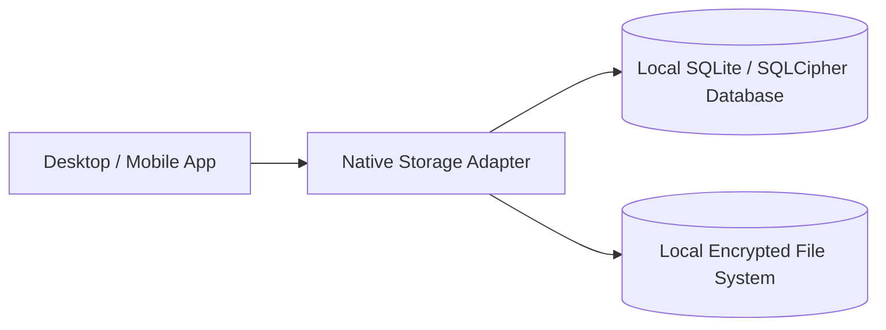

# Architectural Patterns for Local-First Computing

---

## 1. Storage Topology: SQLite with Local Schema Migrations

Local-first applications store data within embedded databases directly on the host filesystem rather than opening persistent network connections.



### Key Considerations:
- Ensure schema migrations run synchronously on local application boot.
- Store database files in standard operating system directories (`AppData` on Windows, `Application Support` on macOS, `~/.local/share` on Linux).

---

## 2. In-Memory State Slices and Synchronous Persistence

State changes are applied immediately to in-memory reactive stores (e.g. Zustand) and asynchronously debounced to local disk storage, providing sub-millisecond UI responsiveness without locking the main thread.

```typescript
// Example: Zustand store with local disk persistence adapter
import { create } from 'zustand';

interface LocalState {
  data: Record<string, unknown>;
  update: (key: string, val: unknown) => void;
}

export const useLocalStore = create<LocalState>((set) => ({
  data: {},
  update: (key, val) => {
    set((state) => {
      const nextData = { ...state.data, [key]: val };
      // Schedule asynchronous background disk write
      scheduleLocalDiskSync(nextData);
      return { data: nextData };
    });
  },
}));
```

---

## 3. Anti-Patterns to Avoid

- **Hidden Network Fallbacks**: Falling back to remote servers when local models are slow creates unexpected telemetry leaks.
- **Blocking Disk I/O on UI Thread**: Never execute synchronous file reads or writes inside render loops.
