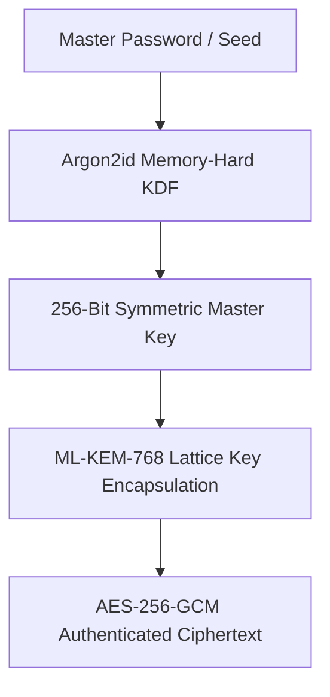

# Post-Quantum Cryptography & Air-Gap Standards

---

## 1. Cryptographic Primitive Hierarchy

To achieve long-term resistance against both classical adversaries and future quantum computers, we implement a layered defense:



### Specifications:
- **Key Derivation**: Argon2id with minimum memory cost $m = 64\,\text{MB}$, iteration count $t = 3$, parallelism $p = 4$.
- **Symmetric Cipher**: AES-256-GCM with distinct, cryptographically random 96-bit initialization vectors (IV) per payload.
- **Post-Quantum Key Exchange**: ML-KEM-768 (NIST FIPS 203 standardized lattice-based algorithm).

---

## 2. Secure Memory Disposal (Zeroization)

Sensitive cryptographic material stored in volatile RAM must be wiped immediately following use.

```kotlin
// Example: Safe in-memory byte buffer zeroization
fun zeroizeByteArray(buffer: ByteArray) {
    java.util.Arrays.fill(buffer, 0.toByte())
}
```

Never leave plaintext secrets in immutable strings where garbage collection controls memory retention.

---

## 3. Threat Model and Verification

| Attack Vector | Defense Mechanism | Verified In |
| :--- | :--- | :--- |
| Exfiltration via background HTTP | No `INTERNET` permission in OS manifest | Kryptyx |
| Harvest-now, decrypt-later (Quantum) | ML-KEM-768 Lattice Cryptography | Kryptyx |
| Eavesdropping on signaling node | WebRTC peer-to-peer + Double Ratchet | Calypso |
