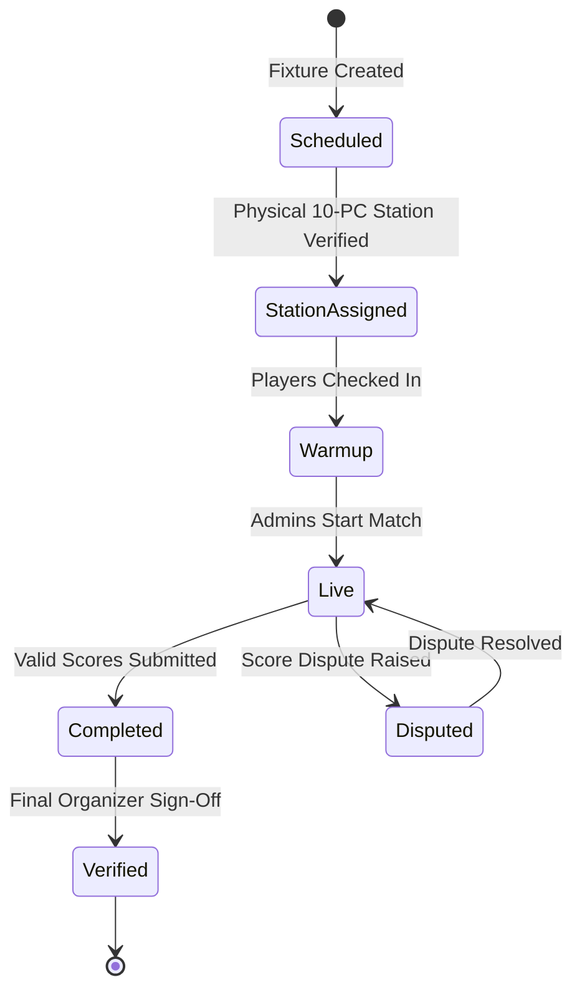

# Invariant-Driven State Machines: Modeling Reality and Eliminating Impossible States

> Track: Engineering Principles  
> Prerequisite Knowledge: TypeScript basics, union types, fundamental object-oriented or functional patterns  
> Estimated Build Time: 45 minutes  
> Target Project Outcome: A mathematically verified, physical hardware tournament match state machine that prevents invalid transitions at compile-time and runtime

---

## 1. The Hook: Why You Need This in Your Arsenal

Look at almost any beginner or intermediate React or Node.js project. You will inevitably find code that looks like this:

```typescript
// The Boolean Flag Trap (Anti-Pattern)
interface MatchState {
  isLoading: boolean;
  isStarted: boolean;
  isPaused: boolean;
  isCompleted: boolean;
  isDisputed: boolean;
  hasHardwareStationAssigned: boolean;
}
```

Now consider what happens when:
- `isStarted = true` AND `isCompleted = true` at the same time.
- `isStarted = true`, but `hasHardwareStationAssigned = false`.
- A tournament admin accidentally double-clicks a "Report Score" button while a match is still in warmup.

With 6 boolean flags, you have $2^6 = 64$ possible combinations of state. Only 5 of them make physical sense; the remaining 59 represent **impossible, corrupt, or broken states**.

Real-world software engineering replaces boolean spaghetti with **Invariant-Driven Finite State Machines (FSMs)**:
1. Make illegal states unrepresentable in TypeScript types.
2. Enforce strict, single-direction transitions.
3. Verify physical reality (hardware, venue, capacity) before allowing state transitions.

---

## 2. The Mental Model: Intuitive Analogy & Visual Topology

### The Subway Turnstile Metaphor
Consider a mechanical subway turnstile. It has exactly two states: **Locked** and **Unlocked**.
- Inserting a coin transitions it from `Locked` -> `Unlocked`.
- Pushing the arm transitions it from `Unlocked` -> `Locked`.
- If you push the arm while it is `Locked`, nothing happens (transition rejected).
- If you insert a second coin while it is `Unlocked`, it does not become "double-unlocked".

It is physically impossible for the turnstile to be simultaneously locked and open.



---

## 3. Deep Dive: Under the Hood

### Discriminated Unions: Eliminating Corrupt States at Compile Time
TypeScript's type system allows us to model state machines using **Discriminated Unions**. By tying unique metadata specifically to designated state tags, developers cannot access data that does not physically exist in that state.

```typescript
// If the match is SCHEDULED, score cannot exist
type MatchState =
  | { status: 'SCHEDULED'; scheduledAt: Date }
  | { status: 'STATION_ASSIGNED'; stationId: string; pcCount: 10 }
  | { status: 'LIVE'; stationId: string; startTime: Date }
  | { status: 'COMPLETED'; winnerId: string; finalScore: [number, number] };
```

If you try to write `match.finalScore` when `status === 'SCHEDULED'`, TypeScript's compiler refuses to build. The bug is eliminated before the code ever runs.

### State Modeling Comparison Matrix

| Approach | Impossible States Possible? | Runtime Safety | Compile-Time Guard | Refactor Complexity |
| :--- | :--- | :--- | :--- | :--- |
| **Boolean Flags (`isLive`, `isDone`)** | Yes (50+ invalid combinations) | Low (easy to miss checks) | None | High (exponential bug risk) |
| **String Status (`status: string`)** | Yes (typos like `"COMPLEETED"`) | Medium | None | High |
| **Enum + Conditionals** | Yes (invalid transition logic) | Medium | Moderate | Medium |
| **Discriminated Unions + FSM Engine** | No (strictly zero invalid states) | High (deterministic guards) | Full compile safety | Low (compiler guides refactor) |

---

## 4. Zero-to-One Interactive Playground: Build It From Scratch

We will build a high-integrity tournament match state machine that enforces physical PC station verification.

### Step 1: Environment Setup
```bash
mkdir invariant-fsm
cd invariant-fsm
npm init -y
npm install -D typescript tsx @types/node
npx tsc --init
```

### Step 2: Implementation (`match-fsm.ts`)
Create `match-fsm.ts`:

```typescript
export interface Team {
  id: string;
  name: string;
}

export interface PhysicalStation {
  id: string;
  name: string;
  operationalPCs: number;
}

// 1. Discriminated Union representing strictly valid lifecycle states
export type MatchState =
  | {
      status: 'SCHEDULED';
      matchId: string;
      teams: [Team, Team];
      scheduledTime: Date;
    }
  | {
      status: 'STATION_ASSIGNED';
      matchId: string;
      teams: [Team, Team];
      stationId: string;
      assignedAt: Date;
    }
  | {
      status: 'LIVE';
      matchId: string;
      teams: [Team, Team];
      stationId: string;
      startedAt: Date;
    }
  | {
      status: 'COMPLETED';
      matchId: string;
      teams: [Team, Team];
      stationId: string;
      winner: Team;
      finalScore: [number, number];
      completedAt: Date;
    };

export class MatchStateMachine {
  private currentState: MatchState;

  constructor(matchId: string, teamA: Team, teamB: Team, scheduledTime: Date) {
    // Initial State is strictly SCHEDULED
    this.currentState = {
      status: 'SCHEDULED',
      matchId,
      teams: [teamA, teamB],
      scheduledTime,
    };
  }

  public getState(): MatchState {
    return this.currentState;
  }

  /**
   * Transition 1: Assign Physical Hardware Station
   * Invariant: Station must have at least 10 operational PCs for a 5v5 match
   */
  public assignStation(station: PhysicalStation): void {
    if (this.currentState.status !== 'SCHEDULED') {
      throw new Error(`Cannot assign station to match in status: ${this.currentState.status}`);
    }

    if (station.operationalPCs < 10) {
      throw new Error(
        `Hardware Invariant Violation: Station ${station.name} has only ${station.operationalPCs}/10 operational PCs.`
      );
    }

    this.currentState = {
      status: 'STATION_ASSIGNED',
      matchId: this.currentState.matchId,
      teams: this.currentState.teams,
      stationId: station.id,
      assignedAt: new Date(),
    };
  }

  /**
   * Transition 2: Start Match
   * Invariant: Match must have an assigned station before starting
   */
  public startMatch(): void {
    if (this.currentState.status !== 'STATION_ASSIGNED') {
      throw new Error(`Cannot start match. Current status is ${this.currentState.status}, expected STATION_ASSIGNED.`);
    }

    this.currentState = {
      status: 'LIVE',
      matchId: this.currentState.matchId,
      teams: this.currentState.teams,
      stationId: this.currentState.stationId,
      startedAt: new Date(),
    };
  }

  /**
   * Transition 3: Submit Final Score
   * Invariant: Match must be LIVE to submit score; scores cannot be a tie
   */
  public completeMatch(scoreA: number, scoreB: number): void {
    if (this.currentState.status !== 'LIVE') {
      throw new Error(`Cannot complete match that is not currently LIVE.`);
    }

    if (scoreA === scoreB) {
      throw new Error('Tournament Invariant Violation: Matches cannot end in a draw in knockout rounds.');
    }

    const winner = scoreA > scoreB ? this.currentState.teams[0] : this.currentState.teams[1];

    this.currentState = {
      status: 'COMPLETED',
      matchId: this.currentState.matchId,
      teams: this.currentState.teams,
      stationId: this.currentState.stationId,
      winner,
      finalScore: [scoreA, scoreB],
      completedAt: new Date(),
    };
  }
}
```

### Step 3: Run and Test (`test-fsm.ts`)
Create `test-fsm.ts`:

```typescript
import { MatchStateMachine, PhysicalStation, Team } from './match-fsm';

const teamAlpha: Team = { id: 't1', name: 'Sentinels' };
const teamBeta: Team = { id: 't2', name: 'Fnatic' };

const match = new MatchStateMachine('m-101', teamAlpha, teamBeta, new Date());

console.log('1. Initial State:', match.getState().status);

// Test Invariant 1: Broken Hardware Station Rejection
console.log('\n2. Attempting to assign damaged hardware station (only 8 operational PCs)...');
const brokenStation: PhysicalStation = { id: 'st-01', name: 'Arena Stage A', operationalPCs: 8 };

try {
  match.assignStation(brokenStation);
} catch (err: unknown) {
  if (err instanceof Error) {
    console.log('REJECTED SAFELY:', err.message);
  }
}

// Assign valid station
console.log('\n3. Assigning verified hardware station (10 operational PCs)...');
const validStation: PhysicalStation = { id: 'st-02', name: 'Arena Stage B', operationalPCs: 10 };
match.assignStation(validStation);
console.log('Current State:', match.getState().status);

// Start match
console.log('\n4. Starting match...');
match.startMatch();
console.log('Current State:', match.getState().status);

// Test Invariant 2: Illegal Transition (Cannot assign station while LIVE)
console.log('\n5. Attempting illegal transition: reassigning station while LIVE...');
try {
  match.assignStation(validStation);
} catch (err: unknown) {
  if (err instanceof Error) {
    console.log('REJECTED SAFELY:', err.message);
  }
}

// Complete match
console.log('\n6. Completing match with score 13-11...');
match.completeMatch(13, 11);
const finalState = match.getState();
if (finalState.status === 'COMPLETED') {
  console.log('Final State:  ', finalState.status);
  console.log('Winner:       ', finalState.winner.name);
  console.log('Score:        ', finalState.finalScore.join(' - '));
}
```

Run via `tsx`:
```bash
npx tsx test-fsm.ts
```

Expected output:
```text
1. Initial State: SCHEDULED

2. Attempting to assign damaged hardware station (only 8 operational PCs)...
REJECTED SAFELY: Hardware Invariant Violation: Station Arena Stage A has only 8/10 operational PCs.

3. Assigning verified hardware station (10 operational PCs)...
Current State: STATION_ASSIGNED

4. Starting match...
Current State: LIVE

5. Attempting illegal transition: reassigning station while LIVE...
REJECTED SAFELY: Cannot assign station to match in status: LIVE

6. Completing match with score 13-11...
Final State:   COMPLETED
Winner:        Sentinels
Score:         13 - 11
```

---

## 5. Battle Scars: What Breaks in Production & How to Debug It

### Top 3 Mistakes in State Machine Design
1. **Allowing Backwards Transitions**: Allowing a match in `COMPLETED` state to revert directly to `LIVE` without an explicit dispute event. This causes downstream bracket calculations to corrupt.
2. **Side Effects Inside Transition Guards**: Putting asynchronous API calls inside synchronous validation checks. Guards must remain pure functions; actions execute only *after* the guard succeeds.
3. **Database State Drift**: Storing state machine state in memory while the database column contains outdated data. Always wrap transition checks and database updates in a single atomic transaction.

---

## 6. The Weekend Hackathon Challenge: Your Turn to Build

### Challenge: The Autonomous E-Commerce Order Lifecycle Engine
Build an invariant-driven state machine for an e-commerce order lifecycle:
`CREATED` -> `PAYMENT_PENDING` -> `PAID` -> `PACKED` -> `SHIPPED` -> `DELIVERED` (with branches for `CANCELLED` and `REFUNDED`).

- **Level 1 (Core)**: Enforce that an order cannot transition to `SHIPPED` unless tracking number and carrier are present.
- **Level 2 (Advanced)**: Prevent `REFUNDED` unless the order was previously `PAID` or `DELIVERED`.
- **Level 3 (Hardcore)**: Implement an audit event emitter that records immutable timestamped entries for every transition with operator ID and previous state.

---

## 7. Knowledge Check & Next Steps

1. **Scenario**: How does a discriminated union prevent a developer from writing `match.winner` on a scheduled match?  
   *Answer*: In TypeScript, narrowing by `if (match.status === 'COMPLETED')` is required before the compiler exposes properties specific to completed matches.
2. **Scenario**: What is the difference between a state transition and an invariant?  
   *Answer*: A state transition is the allowed movement from State A to State B. An invariant is a rule or condition that must be true for that transition to occur.
3. **Scenario**: Why should a tournament system model physical computer stations in software?  
   *Answer*: To ensure matches are never scheduled to offline, broken, or occupied hardware stations.

Next Track Step: [Principle 04: Client-Side Heavy Compute & WebAssembly](../04-client-side-heavy-compute-and-wasm/README.md)
