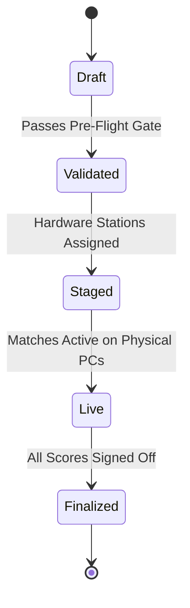

# Physical Resource Modeling & State Invariants

---

## 1. Modeling the Real World in Code

When software models physical hardware (e.g., LAN tournament stages, hardware labs, vehicle parking spaces), abstract schedules fail if they ignore real-world constraints.



---

## 2. The 10-Point Pre-Flight Validation Pattern

Before an operation transitions from setup to active execution, it passes through an invariant check:

```typescript
export interface ValidationGateResult {
  passed: boolean;
  blockers: string[];
  warnings: string[];
}

export function validateTournamentReadiness(tournament: Tournament): ValidationGateResult {
  const blockers: string[] = [];
  const warnings: string[] = [];

  // Invariant 1: Sufficient verified teams
  if (tournament.teams.length < tournament.minTeams) {
    blockers.push(`Requires at least ${tournament.minTeams} teams. Current: ${tournament.teams.length}`);
  }

  // Invariant 2: Hardware station allocation
  if (tournament.allocatedStations.length === 0) {
    blockers.push("No physical LAN stations assigned to tournament.");
  }

  // Invariant 3: Station capacity check
  for (const station of tournament.allocatedStations) {
    if (station.activeMachineCount < 10) {
      blockers.push(`Station ${station.name} has only ${station.activeMachineCount}/10 operational PCs.`);
    }
  }

  return {
    passed: blockers.length === 0,
    blockers,
    warnings,
  };
}
```

---

## 3. Concurrency Safety: Optimistic vs. Pessimistic

| Scenario | Strategy | Rationale |
| :--- | :--- | :--- |
| LAN match station assignment | Pessimistic Lock (`SELECT FOR UPDATE`) | Physical hardware is scarce; absolute mutual exclusion required. |
| Marketplace slot reservation | Optimistic Lock (Version Increment) | Read-heavy workload with occasional burst contention; lower DB lock overhead. |
