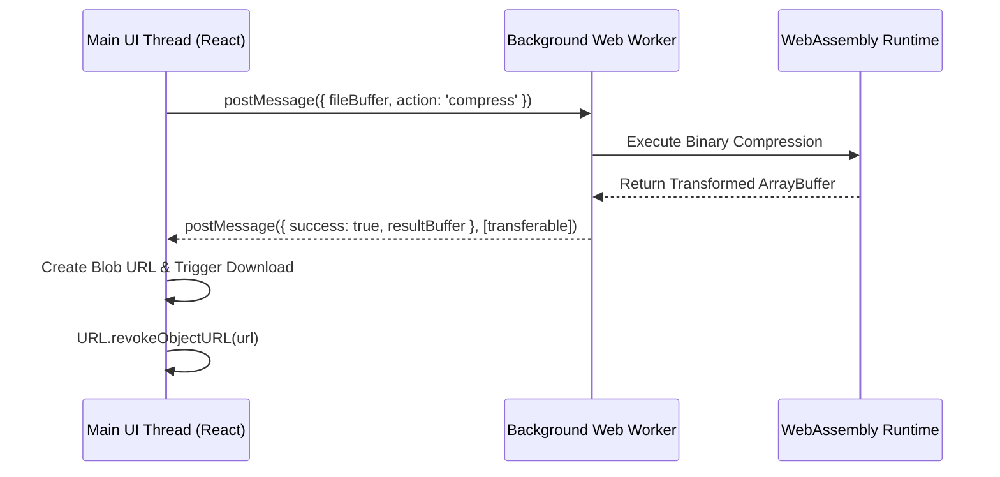

# Memory Management & Worker Concurrency in Client Compute

---

## 1. Web Worker Pipeline Architecture

To keep the UI responsive during CPU-intensive tasks, work is dispatched to a background Web Worker pool.



---

## 2. Preventing Browser Memory Leaks

### Explicit Object URL Revocation
```typescript
export function downloadFile(buffer: Uint8Array, fileName: string, mimeType: string) {
  const blob = new Blob([buffer], { type: mimeType });
  const url = URL.createObjectURL(blob);
  
  const a = document.createElement('a');
  a.href = url;
  a.download = fileName;
  document.body.appendChild(a);
  a.click();
  document.body.removeChild(a);

  // Critical: Revoke URL immediately to release underlying memory from browser heap
  setTimeout(() => URL.revokeObjectURL(url), 100);
}
```

### Transferable Objects
When sending large data structures (such as `ArrayBuffer`) between the main thread and Web Workers, pass them as **transferables** (`[buffer]`) to transfer ownership instead of duplicating memory.

---

## 3. DOM Virtualization Standards

When rendering lists exceeding 100 dynamic items, always use `@tanstack/react-virtual` to keep total rendered DOM nodes small, preserving 60 FPS scrolling performance.
