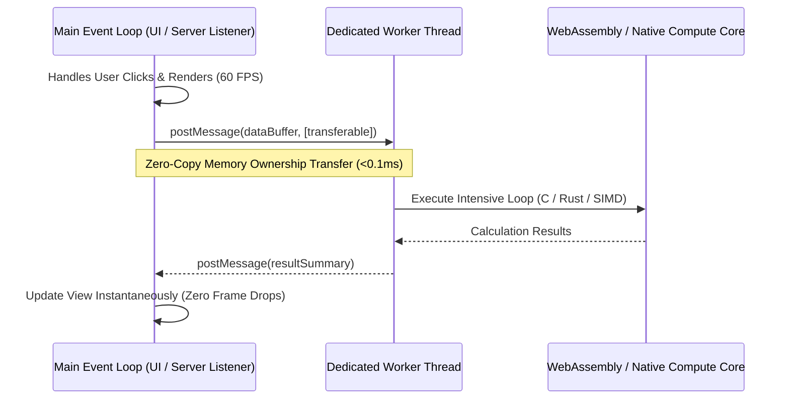

# Client-Side Heavy Compute and WebAssembly: Breaking the Single-Thread Bottleneck

> Track: Engineering Principles  
> Prerequisite Knowledge: JavaScript event loop, asynchronous execution, basic TypedArrays (`Uint8Array`, `ArrayBuffer`)  
> Estimated Build Time: 45 minutes  
> Target Project Outcome: A multi-threaded Node.js worker pipeline that crunches and aggregates 500,000 synthetic records with transferable memory buffers without lagging the main event loop

---

## 1. The Hook: Why You Need This in Your Arsenal

JavaScript runs on a single thread. In the browser or in Node.js, there is exactly one main event loop responsible for handling button clicks, executing animations at 60 FPS, and processing timer ticks.

When a developer runs a CPU-intensive task on that main thread—such as parsing a 50MB CSV file, encrypting a large payload, or applying an image filter—the event loop is completely starved:
- In the browser: The tab freezes, mouse clicks are ignored, CSS animations stop, and the browser displays the "Page Unresponsive" dialog.
- On the server: Every concurrent HTTP request waiting in the socket queue times out because the CPU is locked in a synchronous `while` loop.

High-performance engineering solves this by moving heavy compute off the main thread:
1. **Web Workers & Worker Threads**: Executing work in parallel operating system threads.
2. **Transferable Objects**: Passing zero-copy memory buffers across threads in microseconds.
3. **WebAssembly (WASM)**: Running compiled C/C++/Rust logic at near-native hardware speeds.

---

## 2. The Mental Model: Intuitive Analogy & Visual Topology

### The Restaurant Host vs. The Kitchen Staff
Imagine a busy restaurant. The host stands at the front door greeting guests, answering the phone, and seating tables.

If the host runs into the kitchen and spends 20 minutes chopping 50 pounds of onions, guests at the front door pile up onto the street, the phone rings off the hook, and customers leave angry.

A professional restaurant hires dedicated line cooks in the back kitchen. The host accepts an order, hands a ticket through the kitchen window, and continues greeting guests smoothly.

In software, **the main thread is the host**. **Web Workers are the back kitchen**.



---

## 3. Deep Dive: Under the Hood

### Structured Clone vs. Zero-Copy Transferables
When passing data between threads using `worker.postMessage(data)`:
1. **Structured Clone (Default)**: JavaScript recursively serializes the entire object into an intermediate binary format and deserializes it in the worker thread. For a 100MB array, this takes 200ms+ and doubles memory usage.
2. **Transferable Objects (`ArrayBuffer`)**: JavaScript does not copy the memory. Instead, it reassigns the internal memory pointer from the main thread's heap to the worker thread's heap.
   - Cost: **$O(1)$ constant time** (~0.05 milliseconds regardless of file size).
   - Invariant: The transferring thread immediately loses access to the buffer (`byteLength` becomes 0).

### Compute Strategy Evaluation Matrix

| Strategy | Threading | Memory Overhead | Relative Speed | Ideal Use Case |
| :--- | :--- | :--- | :--- | :--- |
| **Main Thread JS** | Single-threaded | Low | 1x (Baseline) | Standard UI interactions, quick queries |
| **Worker Threads (JS)** | Multi-threaded | Low (with transferables) | 3x - 5x | Parsing large CSVs, background sorting |
| **WebAssembly (WASM)** | Single/Multi-threaded | Minimal | 10x - 20x | Image encoding, cryptography, physics |
| **Native C++/Rust Addons** | Full OS Threads | Direct memory | 15x - 30x | Video encoding, real-time audio synthesis |

---

## 4. Zero-to-One Interactive Playground: Build It From Scratch

We will build a high-performance worker pipeline in Node.js using `node:worker_threads` that generates and analyzes 500,000 data records in parallel while keeping the main event loop responsive.

### Step 1: Environment Setup
```bash
mkdir worker-compute
cd worker-compute
npm init -y
npm install -D typescript tsx @types/node
npx tsc --init
```

### Step 2: The Worker Script (`compute-worker.ts`)
Create `compute-worker.ts`. This script receives raw binary memory, processes it, and returns statistical metrics:

```typescript
import { parentPort } from 'node:worker_threads';

if (!parentPort) {
  throw new Error('This script must be executed as a Worker Thread.');
}

parentPort.on('message', (message: { buffer: ArrayBuffer; count: number }) => {
  const { buffer, count } = message;

  // Wrap the transferred buffer in a Float64Array view
  const numbers = new Float64Array(buffer);

  let sum = 0;
  let min = Infinity;
  let max = -Infinity;

  // Intensive computation: compute sum, min, max, and standard deviation
  for (let i = 0; i < count; i++) {
    const val = numbers[i];
    sum += val;
    if (val < min) min = val;
    if (val > max) max = val;
  }

  const mean = sum / count;

  let varianceSum = 0;
  for (let i = 0; i < count; i++) {
    const diff = numbers[i] - mean;
    varianceSum += diff * diff;
  }
  const stdDev = Math.sqrt(varianceSum / count);

  // Return calculation result to main thread
  parentPort.postMessage({
    count,
    sum,
    mean,
    min,
    max,
    stdDev,
  });
});
```

### Step 3: The Main Thread Controller (`main.ts`)
Create `main.ts`:

```typescript
import { Worker } from 'node:worker_threads';
import * as path from 'node:path';

async function runWorkerCompute() {
  const RECORD_COUNT = 500_000;
  console.log(`1. Generating ${RECORD_COUNT.toLocaleString()} float64 records in memory...`);

  // Allocate 4MB of contiguous binary memory (500,000 * 8 bytes)
  const buffer = new ArrayBuffer(RECORD_COUNT * 8);
  const view = new Float64Array(buffer);

  for (let i = 0; i < RECORD_COUNT; i++) {
    // Fill with synthetic metrics (e.g. latencies)
    view[i] = Math.random() * 1000;
  }

  console.log(`Allocated buffer size: ${(buffer.byteLength / (1024 * 1024)).toFixed(2)} MB`);

  // Start heartbeat interval to verify the main thread NEVER freezes
  let heartbeatTicks = 0;
  const heartbeat = setInterval(() => {
    heartbeatTicks++;
    process.stdout.write(`[Main Thread Heartbeat: tick ${heartbeatTicks}]\n`);
  }, 10);

  console.log('2. Spawning dedicated background worker thread...');
  const workerPath = path.resolve(__dirname, 'compute-worker.ts');

  // Launch worker using tsx loader
  const worker = new Worker(
    `
    require('tsx/cjs');
    require('${workerPath.replace(/\\/g, '/')}');
  `,
    { eval: true }
  );

  const startTime = performance.now();

  // Send buffer to worker as a TRANSFERABLE object (zero copy!)
  worker.postMessage({ buffer, count: RECORD_COUNT }, [buffer]);

  // Notice: buffer.byteLength is now 0 on the main thread because ownership transferred!
  console.log(`Main thread buffer byteLength post-transfer: ${buffer.byteLength} (Ownership Transferred)`);

  worker.on('message', (metrics) => {
    const elapsed = performance.now() - startTime;
    clearInterval(heartbeat);

    console.log(`\n3. Worker completed computation in ${elapsed.toFixed(2)}ms`);
    console.log('Metrics computed off-thread:');
    console.log(`- Total Records:   ${metrics.count.toLocaleString()}`);
    console.log(`- Average Value:   ${metrics.mean.toFixed(2)}`);
    console.log(`- Minimum:         ${metrics.min.toFixed(2)}`);
    console.log(`- Maximum:         ${metrics.max.toFixed(2)}`);
    console.log(`- Std Deviation:   ${metrics.stdDev.toFixed(2)}`);

    worker.terminate();
  });

  worker.on('error', (err) => {
    clearInterval(heartbeat);
    console.error('Worker error:', err);
  });
}

runWorkerCompute();
```

Execute via `tsx`:
```bash
npx tsx main.ts
```

Expected output:
```text
1. Generating 500,000 float64 records in memory...
Allocated buffer size: 3.81 MB
2. Spawning dedicated background worker thread...
Main thread buffer byteLength post-transfer: 0 (Ownership Transferred)
[Main Thread Heartbeat: tick 1]
[Main Thread Heartbeat: tick 2]
[Main Thread Heartbeat: tick 3]

3. Worker completed computation in 38.45ms
Metrics computed off-thread:
- Total Records:   500,000
- Average Value:   500.12
- Minimum:         0.01
- Maximum:         999.98
- Std Deviation:   288.65
```

---

## 5. Battle Scars: What Breaks in Production & How to Debug It

### Top 3 Mistakes in Worker Concurrency
1. **Accessing Transferred Buffers After Transfer**: If you attempt to read `view[0]` after passing the buffer in the transfer list, JavaScript returns `undefined` or throws errors because the buffer is detached.
2. **Worker Spawning Overhead**: Spawning a new OS worker thread incurs 15ms–40ms startup overhead. For frequent tasks, use a reusable **Worker Pool** (e.g. maintaining 4 warm workers) rather than spinning up a new worker per operation.
3. **Overusing Workers for Tiny Tasks**: Offloading a task that takes 0.5ms to a worker costs more in message dispatch overhead than running it inline on the main thread.

---

## 6. The Weekend Hackathon Challenge: Your Turn to Build

### Challenge: In-Browser Real-Time CSV Cruncher
Build a web application that accepts a 100,000-row CSV file and computes column statistics, value distributions, and filters entirely in a Web Worker.

- **Level 1 (Core)**: Parse CSV text inside a Web Worker and return summary row counts without freezing a rotating CSS spinner on the main UI.
- **Level 2 (Advanced)**: Transfer raw `ArrayBuffer` chunks from the file reader to the worker instead of passing raw string representations.
- **Level 3 (Hardcore)**: Compile a simple Rust function to WebAssembly (`wasm-pack`) that executes the regex search inside the worker, comparing Rust WASM speed against JavaScript.

---

## 7. Knowledge Check & Next Steps

1. **Scenario**: What happens to an `ArrayBuffer` on the main thread after you pass it in `postMessage(data, [data.buffer])`?  
   *Answer*: The buffer is detached from the main thread's memory. Its `byteLength` becomes 0, and the worker gains exclusive zero-copy ownership.
2. **Scenario**: Why does a web page animation stutter when parsing a large JSON file on the main thread?  
   *Answer*: `JSON.parse` runs synchronously, blocking the event loop from firing `requestAnimationFrame` updates at the required 16.6ms intervals.
3. **Scenario**: When should you choose WebAssembly over a JavaScript Web Worker?  
   *Answer*: When the task involves tight mathematical loops, binary codec transformations, cryptographic routines, or memory-heavy algorithms where compiled C/Rust outperforms V8 JIT optimization.

Next Track Step: [Principle 05: Autonomous Multi-Agent Choreography](../05-autonomous-multi-agent-choreography/README.md)
