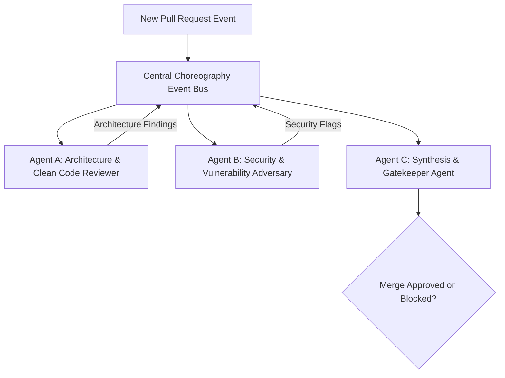

# Autonomous Multi-Agent Choreography: Designing Resilient Event-Driven Agent Systems

> Track: Engineering Principles  
> Prerequisite Knowledge: Asynchronous TypeScript, event emitters / pub-sub concepts, basic API structure  
> Estimated Build Time: 45 minutes  
> Target Project Outcome: A multi-agent code-review pipeline with specialized agents (Architect Reviewer & Security Adversary) communicating over an event bus

---

## 1. The Hook: Why You Need This in Your Arsenal

When beginners build AI applications, they usually write a single massive prompt:

```text
"You are a Senior Fullstack Architect, Security Auditor, Database DBA, 
and Tech Lead. Review this 1,000-line diff and tell me all bugs, 
security holes, and performance issues."
```

Here is why monolithic prompts fail in real-world systems:
1. **Cognitive Saturation**: LLMs suffer from attention dilution when asked to evaluate dozens of conflicting priorities simultaneously.
2. **Cascading Hallucinations**: If the model makes a mistaken assumption in paragraph one, the rest of the response builds upon that error.
3. **Zero Modularity**: You cannot independently upgrade your security model or replace your linter without rewriting the entire prompt.

Real-world AI engineering adopts **Autonomous Multi-Agent Choreography**:
- Decompose complex workflows into small, specialized agents with isolated roles.
- Coordinate agents through asynchronous event buses and message queues.
- Enforce strict input/output contracts (e.g. JSON Schemas / Model Context Protocol).

---

## 2. The Mental Model: Intuitive Analogy & Visual Topology

### The Hollywood Film Crew vs. The Solo Creator
Imagine shooting a Hollywood film. You do not ask one person to simultaneously hold the boom microphone, operate the camera, direct the actors, adjust lighting, and apply makeup.

Instead, you assemble a specialized crew:
- The **Director** guides overall vision.
- The **Cinematographer** ensures visual composition.
- The **Sound Engineer** ensures audio clarity.
- The **Safety Coordinator** halts production if a stunt violates safety protocols.

Each professional operates within their specialty and communicates over the shared crew radio (the event bus).



---

## 3. Deep Dive: Under the Hood

### Choreography vs. Orchestration
1. **Central Orchestration (Rigid)**: A central master script calls Agent A, waits for response, then calls Agent B, then calls Agent C. If Agent B hangs, the entire system blocks.
2. **Event Choreography (Decoupled)**: A central event bus emits an event (e.g., `pull_request.submitted`). Multiple independent agents subscribe to the event topic, execute in parallel, and emit their own typed findings when complete.

### Multi-Agent Architecture Evaluation Matrix

| Dimension | Monolithic Mega-Prompt | Central Orchestrator | Asynchronous Choreography |
| :--- | :--- | :--- | :--- |
| **Execution Latency** | High (Sequential token generation) | Moderate | Lowest (Full parallel execution) |
| **Specialization Depth** | Shallow (jack-of-all-trades) | High | Highest |
| **Failure Isolation** | Zero (Entire prompt fails) | Low | Complete (One agent crash does not halt others) |
| **Tool Calling Reliability** | Poor (conflicting tool schemas) | Moderate | High (Scoped domain tools per agent) |

---

## 4. Zero-to-One Interactive Playground: Build It From Scratch

We will build a two-agent code analysis pipeline where:
- **Agent A (Architect)** reviews code readability, SOLID principles, and structure.
- **Agent B (Adversary)** attempts to find security vulnerabilities and injection risks.
- A **Choreography Bus** coordinates their parallel analysis.

### Step 1: Environment Setup
```bash
mkdir multi-agent-pipeline
cd multi-agent-pipeline
npm init -y
npm install -D typescript tsx @types/node
npx tsc --init
```

### Step 2: Implementation (`swarm.ts`)
Create `swarm.ts`:

```typescript
import { EventEmitter } from 'node:events';

export interface CodeReviewEvent {
  prId: string;
  diff: string;
}

export interface ReviewFinding {
  agentName: string;
  category: 'ARCHITECTURE' | 'SECURITY';
  severity: 'INFO' | 'WARNING' | 'BLOCKER';
  comment: string;
}

export class AgentEventBus extends EventEmitter {
  public emitReviewRequest(event: CodeReviewEvent): void {
    this.emit('review.requested', event);
  }

  public emitFinding(finding: ReviewFinding): void {
    this.emit('review.finding', finding);
  }
}

// 1. Specialized Agent A: Clean Architecture Reviewer
export class ArchitecturalReviewerAgent {
  constructor(private bus: AgentEventBus) {
    this.bus.on('review.requested', (event: CodeReviewEvent) => this.analyze(event));
  }

  private analyze(event: CodeReviewEvent): void {
    console.log('[Architect Agent] Evaluating code architecture and separation of concerns...');
    
    // Domain rule: Check for giant functions or god classes
    if (event.diff.includes('class DatabaseAndAuthAndMailer')) {
      this.bus.emitFinding({
        agentName: 'ArchitectAgent',
        category: 'ARCHITECTURE',
        severity: 'BLOCKER',
        comment: 'Violates Single Responsibility Principle: Class bundles database, authentication, and emailing.',
      });
    }

    if (!event.diff.includes('interface') && event.diff.includes('class')) {
      this.bus.emitFinding({
        agentName: 'ArchitectAgent',
        category: 'ARCHITECTURE',
        severity: 'WARNING',
        comment: 'Tight coupling detected: Classes implemented without declaring explicit interfaces.',
      });
    }
  }
}

// 2. Specialized Agent B: Security Adversary
export class SecurityAdversaryAgent {
  constructor(private bus: AgentEventBus) {
    this.bus.on('review.requested', (event: CodeReviewEvent) => this.audit(event));
  }

  private audit(event: CodeReviewEvent): void {
    console.log('[Security Adversary] Stress-testing code for injection and secret exposure...');

    // Domain rule: Check for string concatenation in SQL
    if (event.diff.includes('query(`SELECT * FROM users WHERE id = ${') || event.diff.includes('query("SELECT * FROM users WHERE id = " +')) {
      this.bus.emitFinding({
        agentName: 'SecurityAdversary',
        category: 'SECURITY',
        severity: 'BLOCKER',
        comment: 'High Severity SQL Injection Vulnerability: Raw parameter interpolated directly into query string. Use parameterized queries ($1, $2).',
      });
    }

    // Domain rule: Check for hardcoded API keys
    if (event.diff.includes('sk_live_') || event.diff.includes('api_key = "')) {
      this.bus.emitFinding({
        agentName: 'SecurityAdversary',
        category: 'SECURITY',
        severity: 'BLOCKER',
        comment: 'Credential Leak Risk: Hardcoded live API key found in source code.',
      });
    }
  }
}

// 3. Coordinator / Gatekeeper
export class GatekeeperAgent {
  private findings: ReviewFinding[] = [];

  constructor(private bus: AgentEventBus) {
    this.bus.on('review.finding', (finding: ReviewFinding) => {
      this.findings.push(finding);
      console.log(`-> Received finding from ${finding.agentName} [${finding.severity}]: ${finding.comment}`);
    });
  }

  public evaluateGate(): { approved: boolean; findings: ReviewFinding[] } {
    const blockers = this.findings.filter((f) => f.severity === 'BLOCKER');
    const approved = blockers.length === 0;
    return {
      approved,
      findings: this.findings,
    };
  }
}
```

### Step 3: Run and Test (`run-swarm.ts`)
Create `run-swarm.ts`:

```typescript
import {
  AgentEventBus,
  ArchitecturalReviewerAgent,
  SecurityAdversaryAgent,
  GatekeeperAgent,
} from './swarm';

async function main() {
  const bus = new AgentEventBus();

  // Initialize independent specialized agents
  new ArchitecturalReviewerAgent(bus);
  new SecurityAdversaryAgent(bus);
  const gatekeeper = new GatekeeperAgent(bus);

  // Simulated code diff submitted by a developer
  const suspiciousDiff = `
    class DatabaseAndAuthAndMailer {
      async handleUser(id) {
        const query = "SELECT * FROM users WHERE id = " + id;
        const res = await db.raw(query);
        const apiKey = "sk_live_9482019481204918204";
        return res;
      }
    }
  `;

  console.log('Publishing pull request event to choreography bus...\n');
  bus.emitReviewRequest({
    prId: 'pr-402',
    diff: suspiciousDiff,
  });

  // Evaluate gate results
  const result = gatekeeper.evaluateGate();
  console.log('\n--- Final Review Gate Result ---');
  console.log('Merge Allowed:', result.approved ? 'YES (APPROVED)' : 'NO (BLOCKED)');
  console.log('Total Findings:', result.findings.length);
}

main();
```

Execute via `tsx`:
```bash
npx tsx run-swarm.ts
```

Expected output:
```text
Publishing pull request event to choreography bus...

[Architect Agent] Evaluating code architecture and separation of concerns...
[Security Adversary] Stress-testing code for injection and secret exposure...
-> Received finding from ArchitectAgent [BLOCKER]: Violates Single Responsibility Principle: Class bundles database, authentication, and emailing.
-> Received finding from ArchitectAgent [WARNING]: Tight coupling detected: Classes implemented without declaring explicit interfaces.
-> Received finding from SecurityAdversary [BLOCKER]: High Severity SQL Injection Vulnerability: Raw parameter interpolated directly into query string. Use parameterized queries ($1, $2).
-> Received finding from SecurityAdversary [BLOCKER]: Credential Leak Risk: Hardcoded live API key found in source code.

--- Final Review Gate Result ---
Merge Allowed: NO (BLOCKED)
Total Findings: 4
```

---

## 5. Battle Scars: What Breaks in Production & How to Debug It

### Top 3 Mistakes in Multi-Agent Topologies
1. **Infinite Echo Loops**: Agent A emits event `X`, Agent B responds with event `Y`, which triggers Agent A to emit event `X` again. Always attach a maximum hop count (`hopLimit: 3`) to event payloads.
2. **Missing Correlation IDs**: In asynchronous architectures with multiple PRs in-flight, findings get cross-attributed to the wrong jobs if events do not carry a unique `correlationId`.
3. **Unbounded Agent Execution**: If an LLM agent times out, the event listener never completes. Always wrap agent invocations in an explicit `AbortController` timeout (e.g. 15 seconds).

---

## 6. The Weekend Hackathon Challenge: Your Turn to Build

### Challenge: The Multi-Agent Bug Triage System
Build an automated issue triage team that listens to incoming GitHub Issue events.

- **Level 1 (Core)**: Deploy a Classifier Agent (tags issues as `bug`, `feature`, or `docs`) and an Urgency Agent (assigns `P0`, `P1`, `P2`).
- **Level 2 (Advanced)**: Add a Duplicate Detection Agent that uses cosine similarity to identify whether an issue has already been reported.
- **Level 3 (Hardcore)**: Implement an Auto-Responder Agent that constructs a minimal code reproduction template and posts it as a GitHub issue comment.

---

## 7. Knowledge Check & Next Steps

1. **Scenario**: Why is a multi-agent system more reliable than a single mega-prompt?  
   *Answer*: Independent agents have specialized context, smaller prompt boundaries, isolated failure domains, and can run in parallel without attention dilution.
2. **Scenario**: What prevents two agents in an event-driven system from generating infinite message loops?  
   *Answer*: Strict event schemas, finite state machines, and correlation IDs with decremented hop counters.
3. **Scenario**: What role does the Model Context Protocol (MCP) play in multi-agent architectures?  
   *Answer*: MCP standardizes how AI agents discover and execute external tools, ensuring consistent JSON schema validation across tools.

Next Track Step: [Principle 06: Clinical & Ethical Data Governance](../06-clinical-and-ethical-data-governance/README.md)
