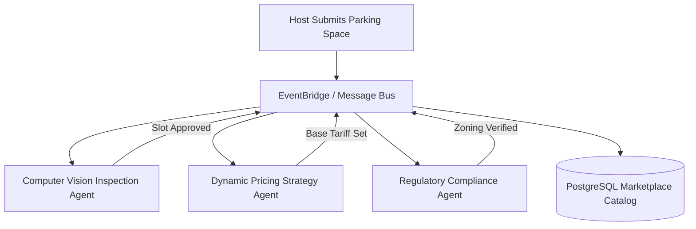

# Event-Driven Architecture for Multi-Agent Systems

---

## 1. Multi-Agent Event Topology



---

## 2. Event Envelope Standards

All events emitted across the system follow a uniform metadata envelope:

```json
{
  "eventId": "evt_9812401fba",
  "eventType": "marketplace.listing.submitted",
  "timestamp": "2026-10-04T07:15:00.000Z",
  "version": "1.0",
  "correlationId": "tx_8829104",
  "payload": {
    "listingId": "lst_4021",
    "hostId": "usr_9912",
    "coordinates": { "lat": 12.9716, "lng": 77.5946 },
    "bayCount": 2
  }
}
```

---

## 3. Resilience Guidelines for Autonomous Agents

- **Idempotency**: Agents must handle duplicate delivery safely via idempotency keys.
- **Circuit Breakers**: If an agent model times out, fall back to rule-based defaults rather than halting the workflow.
- **Audit Trails**: Every agent decision and confidence score must be logged for auditing.
