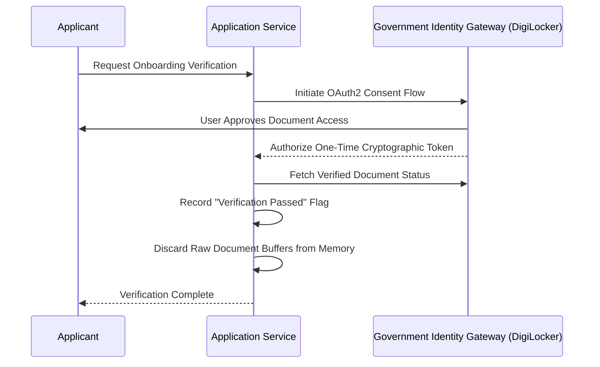

# Non-Extractive Verification & Clinical Data Ethics

---

## 1. The Principle of Non-Extractive Identity

Traditional verification platforms often unnecessarily collect biometric data, selfie comparisons, and permanent copies of government IDs, creating significant privacy risks.

---

## 2. Clinical Risk Calculation Rules

1. **Explainable Methodology**: Calculations must state their clinical parameters (e.g. age at menarche, first live birth, family history of breast cancer).
2. **Transparent Output**: Always frame scores clearly (e.g., "5-Year Absolute Risk: 2.1% (Population Average: 1.2%)") and advise consulting healthcare professionals.
3. **Client-Side Evaluation**: Calculating health risk locally in the browser protects personal health data from unnecessary network exposure.
