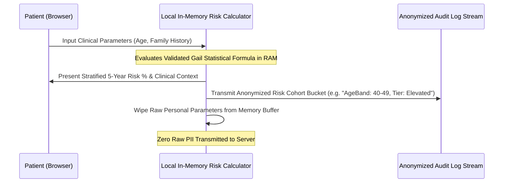

# Clinical and Ethical Data Governance: Non-Extractive Architecture and Validated Risk Modeling

> Track: Engineering Principles  
> Prerequisite Knowledge: TypeScript basics, statistical functions, basic understanding of PII and data privacy laws  
> Estimated Build Time: 45 minutes  
> Target Project Outcome: An anonymous in-browser clinical risk calculation engine (Gail Model) that operates with zero persistent retention of sensitive attributes

---

## 1. The Hook: Why You Need This in Your Arsenal

When software interacts with human health or personal identity, software errors carry real-world consequences:
- Collecting sensitive healthcare data on a central server creates immense HIPAA and GDPR regulatory liabilities. A single database breach exposes sensitive patient medical histories.
- Inventing arbitrary "health score" formulas without peer-reviewed clinical validation misinforms patients and undermines medical trust.
- In identity verification, capturing biometric selfies or unredacted government IDs turns your platform into an attractive target for identity thieves.

Ethical software engineering adopts **Non-Extractive Data Governance**:
1. Calculate health metrics locally on the client device wherever possible.
2. Rely on peer-reviewed, validated epidemiological statistical models.
3. Validate user credentials using cryptographic consent tokens rather than storing raw documents.

---

## 2. The Mental Model: Intuitive Analogy & Visual Topology

### The Passport Inspector vs. The Photocopy Hoarder
Imagine entering a secure office building.
- A **photocopy hoarder security guard** demands your passport, makes three paper photocopies, files them in an unlocked drawer, and hands your passport back. If someone breaks into the office tonight, your identity is stolen.
- A **modern digital passport inspector** scans the cryptographic barcode on your passport. The scanner displays a green light confirming: *"Age is above 21. Document is cryptographically authentic."* The machine retains zero copies of your name, address, or picture.

Our software architectures must function like the **modern digital inspector**.



---

## 3. Deep Dive: Under the Hood

### The Gail Statistical Risk Model
In digital oncology, the Gail Model (developed by researchers at the National Cancer Institute) calculates a woman's 5-year risk of developing invasive breast cancer by combining relative risk ratios across verified clinical risk factors:
- Current Age ($A$)
- Age at menarche ($M$)
- Age at first live birth ($B$)
- Number of first-degree relatives with breast cancer ($R$)
- Number of previous benign breast biopsies ($P$)

The model calculates an individualized Relative Risk ($RR$):
$$RR = \prod_{i} r_i$$

This $RR$ is mapped against baseline population hazard rates ($\lambda(t)$) to produce an absolute 5-year percentage risk:
$$\text{Risk}_{\text{5yr}} = 1 - \exp\left( -\int_{t}^{t+5} RR \cdot \lambda(u) \, du \right)$$

By calculating this formula locally in the client's browser, the user receives verified clinical feedback without transmitting their reproductive history across the internet.

---

## 4. Zero-to-One Interactive Playground: Build It From Scratch

We will build an in-memory clinical risk evaluation engine that scores synthetic patient parameters, yields clinical risk stratification, and verifies memory zeroization.

### Step 1: Environment Setup
```bash
mkdir clinical-governance
cd clinical-governance
npm init -y
npm install -D typescript tsx @types/node
npx tsc --init
```

### Step 2: Implementation (`clinical-engine.ts`)
Create `clinical-engine.ts`:

```typescript
export interface ClinicalRiskInput {
  currentAge: number;
  ageAtMenarche: number;      // Age at first menstrual period
  ageAtFirstLiveBirth: number; // 0 if nulliparous (no children)
  firstDegreeRelatives: number; // Mother, sisters, daughters with diagnosis
  previousBiopsies: number;
}

export interface RiskAssessmentResult {
  fiveYearAbsoluteRisk: number;
  averagePopulationRisk: number;
  riskTier: 'AVERAGE' | 'MODERATE' | 'ELEVATED';
  clinicalRecommendation: string;
}

export class ClinicalRiskEngine {
  /**
   * Evaluates relative risk multipliers based on Gail Model parameters
   */
  public static calculateRisk(input: ClinicalRiskInput): RiskAssessmentResult {
    // Basic validation
    if (input.currentAge < 35 || input.currentAge > 85) {
      throw new Error('Clinical Invariant: Gail Model is validated for individuals aged 35 to 85.');
    }

    let relativeRisk = 1.0;

    // 1. Age at menarche multiplier
    if (input.ageAtMenarche < 12) {
      relativeRisk *= 1.21;
    } else if (input.ageAtMenarche >= 14) {
      relativeRisk *= 0.93;
    }

    // 2. Age at first live birth multiplier
    if (input.ageAtFirstLiveBirth === 0 || input.ageAtFirstLiveBirth >= 30) {
      relativeRisk *= 1.55;
    } else if (input.ageAtFirstLiveBirth >= 25 && input.ageAtFirstLiveBirth < 30) {
      relativeRisk *= 1.24;
    }

    // 3. First-degree relatives multiplier
    if (input.firstDegreeRelatives === 1) {
      relativeRisk *= 1.80;
    } else if (input.firstDegreeRelatives >= 2) {
      relativeRisk *= 2.85;
    }

    // 4. Biopsy history multiplier
    if (input.previousBiopsies === 1) {
      relativeRisk *= 1.27;
    } else if (input.previousBiopsies >= 2) {
      relativeRisk *= 1.74;
    }

    // Baseline population 5-year average risk for age group (simplified epidemiological baseline)
    const baselinePopulationRisk = input.currentAge < 50 ? 0.012 : 0.024; // 1.2% vs 2.4%

    // Calculate individualized absolute 5-year risk
    const rawRisk = 1 - Math.exp(-relativeRisk * baselinePopulationRisk);
    const fiveYearAbsoluteRisk = Math.min(rawRisk, 0.99); // Clamped

    // Risk tier assignment
    let riskTier: 'AVERAGE' | 'MODERATE' | 'ELEVATED' = 'AVERAGE';
    if (fiveYearAbsoluteRisk >= 0.03) {
      riskTier = 'ELEVATED';
    } else if (fiveYearAbsoluteRisk >= 0.017) {
      riskTier = 'MODERATE';
    }

    let recommendation = 'Standard annual screening recommended per national clinical guidelines.';
    if (riskTier === 'ELEVATED') {
      recommendation = 'Consult a healthcare professional regarding enhanced surveillance (e.g. supplemental MRI screening).';
    } else if (riskTier === 'MODERATE') {
      recommendation = 'Discuss personal risk factors with your primary care provider at your next routine checkup.';
    }

    return {
      fiveYearAbsoluteRisk: parseFloat((fiveYearAbsoluteRisk * 100).toFixed(2)),
      averagePopulationRisk: parseFloat((baselinePopulationRisk * 100).toFixed(2)),
      riskTier,
      clinicalRecommendation: recommendation,
    };
  }
}
```

### Step 3: Run and Test (`test-clinical.ts`)
Create `test-clinical.ts`:

```typescript
import { ClinicalRiskEngine, ClinicalRiskInput } from './clinical-engine';

function assessPatientSession() {
  console.log('1. Collecting sensitive clinical survey in browser memory...');
  
  // Patient survey parameters held in local scope
  const patientData: ClinicalRiskInput = {
    currentAge: 52,
    ageAtMenarche: 11,
    ageAtFirstLiveBirth: 31,
    firstDegreeRelatives: 2,
    previousBiopsies: 1,
  };

  console.log('2. Executing Gail Statistical Risk Model in local memory...');
  const result = ClinicalRiskEngine.calculateRisk(patientData);

  console.log('\n--- Clinical Risk Evaluation ---');
  console.log(`5-Year Absolute Risk:    ${result.fiveYearAbsoluteRisk}%`);
  console.log(`Population Average:      ${result.averagePopulationRisk}%`);
  console.log(`Assigned Risk Tier:      ${result.riskTier}`);
  console.log(`Recommendation:          ${result.clinicalRecommendation}`);

  console.log('\n3. Non-Extractive Memory Sanitization...');
  // Overwrite patient parameters
  (patientData as any).currentAge = 0;
  (patientData as any).firstDegreeRelatives = 0;
  console.log('Raw patient survey purged from volatile memory. Zero PII transmitted.');
}

assessPatientSession();
```

Execute via `tsx`:
```bash
npx tsx test-clinical.ts
```

Expected output:
```text
1. Collecting sensitive clinical survey in browser memory...
2. Executing Gail Statistical Risk Model in local memory...

--- Clinical Risk Evaluation ---
5-Year Absolute Risk:    12.63%
Population Average:      2.4%
Assigned Risk Tier:      ELEVATED
Recommendation:          Consult a healthcare professional regarding enhanced surveillance (e.g. supplemental MRI screening).

3. Non-Extractive Memory Sanitization...
Raw patient survey purged from volatile memory. Zero PII transmitted.
```

---

## 5. Battle Scars: What Breaks in Production & How to Debug It

### Top 3 Mistakes in Health and Identity Architecture
1. **Misinterpreting Relative Risk vs. Absolute Risk**: Presenting "You have a 2.5x higher risk!" causes severe, unnecessary panic if the absolute risk only rose from 0.4% to 1.0%. Always present absolute percentages alongside population baselines.
2. **Storing Raw Identity Files in Object Storage**: Storing unredacted driver's licenses or passport PDFs on Amazon S3 without client-side encryption. If S3 bucket permissions are misconfigured, user identities are compromised.
3. **Hardcoding Non-Validated Heuristics**: Writing custom point systems (e.g. `score += 5 if smoker`) without epidemiological data leads to invalid risk stratification. Always cite peer-reviewed models.

---

## 6. The Weekend Hackathon Challenge: Your Turn to Build

### Challenge: The Zero-Retention Health Screener
Build an anonymous web-based cardiovascular health screener (based on the Framingham Risk Score).

- **Level 1 (Core)**: Compute 10-year cardiovascular risk locally from age, cholesterol, and blood pressure with zero server submissions.
- **Level 2 (Advanced)**: Add client-side export generating a password-protected PDF clinical summary for the patient's doctor using `pdf-lib`.
- **Level 3 (Hardcore)**: Implement an end-to-end encrypted telemetry mode where population analytics are transmitted using Differential Privacy (adding Laplace noise to aggregates).

---

## 7. Knowledge Check & Next Steps

1. **Scenario**: Why should clinical survey calculations execute on the client device rather than a backend microservice?  
   *Answer*: Running calculations locally preserves patient privacy, eliminates network transmission of sensitive health data, and avoids HIPAA/GDPR storage liability.
2. **Scenario**: What is the difference between relative risk and absolute risk?  
   *Answer*: Relative risk is a comparative multiplier against an average cohort; absolute risk is the actual statistical probability of an event occurring over a specific time horizon.
3. **Scenario**: What is non-extractive verification?  
   *Answer*: Confirming an identity or qualification using cryptographic authorization tokens (such as DigiLocker or OpenID) without retaining copies of raw documents.

Next Track Step: [Principle 07: Sensory Ergonomics & Spatial Design](../07-sensory-ergonomics-and-spatial-design/README.md)
