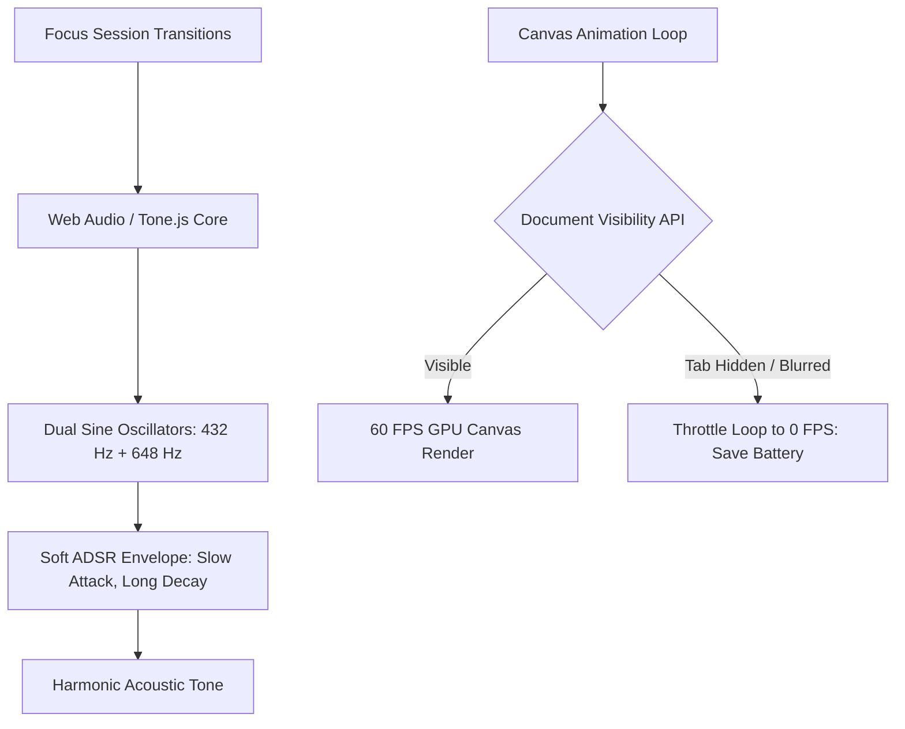

# Sensory Ergonomics and Spatial Design: Audio Biofeedback & 60 FPS GPU Interfaces

> Track: Engineering Principles  
> Prerequisite Knowledge: HTML5 Canvas / DOM basics, Web Audio API fundamentals, requestAnimationFrame  
> Estimated Build Time: 45 minutes  
> Target Project Outcome: An audio-spatial focus timer that synthesizes warm harmonic sine chords using Web Audio and throttles GPU render loops when hidden

---

## 1. The Hook: Why You Need This in Your Arsenal

Most software interfaces treat human senses with indifference:
- Applications blast piercing, high-frequency notification beeps that jolt users and trigger stress responses.
- Web interfaces run unthrottled `requestAnimationFrame` loops on hidden background tabs, consuming 100% of a laptop CPU core and draining battery.
- Abrupt, unpadded UI state transitions cause visual disorientation and cognitive fatigue.

Developer Aura means engineering **Sensory Ergonomics**:
1. Replace harsh alerts with warm, harmonically tuned acoustic feedback synthesized in real-time.
2. Build 60 FPS GPU-accelerated interfaces that respect hardware constraints and throttle when out of view.
3. Design intentional transitions that support deep focus rather than causing distraction.

---

## 2. The Mental Model: Intuitive Analogy & Visual Topology

### The Japanese Singing Bowl vs. The Car Horn
Imagine trying to meditate or write complex code.
- If someone honks a car horn every 25 minutes, your nervous system experiences a fight-or-flight spike.
- If a resonant bronze singing bowl strikes a gentle harmonic tone, your brain registers the transition smoothly without breaking focus.

In software, **default OS notification beeps are car horns**. **Harmonic Web Audio synthesis is the singing bowl**.



---

## 3. Deep Dive: Under the Hood

### Web Audio Synthesis: Zero-Latency In-Memory Sound
Loading MP3 or WAV files over a network introduces latency, caching failures, and audio clipping.

The **Web Audio API** runs directly inside the browser's native C++ audio engine:
- An `AudioContext` controls an audio processing graph.
- An `OscillatorNode` generates pure mathematical waveforms (sine, triangle, square) in real-time.
- A `GainNode` with an **ADSR Envelope** (Attack, Decay, Sustain, Release) shapes the volume curve:
  - *Attack*: Slow ramp-up (50ms–100ms) prevents abrupt audio pops.
  - *Decay & Sustain*: Warm harmonic resonance.
  - *Release*: Smooth exponential fade-out.

### GPU Render Throttling & Power Preservation

| Strategy | Active Tab CPU Usage | Background Tab CPU Usage | Mobile Battery Impact |
| :--- | :--- | :--- | :--- |
| **Unthrottled `requestAnimationFrame`** | Moderate (15%-25%) | High (continues looping) | Severe battery drain |
| **`setInterval(fn, 16)` (Anti-Pattern)** | High (bypasses vsync) | High | Severe battery drain |
| **Visibility-Aware Throttled Loop** | Optimal (60 FPS vsync) | **0% (Halted in background)** | Minimal (Energy Star compliant) |

---

## 4. Zero-to-One Interactive Playground: Build It From Scratch

We will build a complete web-ready focus timer that synthesizes soft harmonic chords on session completion and halts canvas rendering when blurred.

### Step 1: Implementation (`sensory-timer.html`)
Create `sensory-timer.html`:

```html
<!DOCTYPE html>
<html lang="en">
<head>
  <meta charset="UTF-8">
  <title>Sensory Ergonomics Focus Engine</title>
  <style>
    body {
      margin: 0;
      background: #0f1117;
      color: #e2e8f0;
      font-family: -apple-system, BlinkMacSystemFont, 'Segoe UI', Roboto, sans-serif;
      display: flex;
      flex-direction: column;
      align-items: center;
      justify-content: center;
      min-height: 100vh;
      overflow: hidden;
    }
    canvas {
      border-radius: 50%;
      box-shadow: 0 0 40px rgba(99, 102, 241, 0.2);
    }
    .controls {
      margin-top: 24px;
      display: flex;
      gap: 12px;
    }
    button {
      background: #4f46e5;
      color: white;
      border: none;
      padding: 10px 20px;
      font-size: 14px;
      font-weight: 600;
      border-radius: 6px;
      cursor: pointer;
      transition: background 0.2s;
    }
    button:hover {
      background: #4338ca;
    }
    .metrics {
      margin-top: 16px;
      font-family: monospace;
      font-size: 13px;
      color: #94a3b8;
    }
  </style>
</head>
<body>

  <canvas id="focusCanvas" width="240" height="240"></canvas>

  <div class="controls">
    <button id="startBtn">Trigger Harmonic Cue & Start</button>
  </div>

  <div class="metrics" id="statusText">State: Idle | Render: 60 FPS</div>

  <script>
    // 1. Web Audio Harmonic Synthesis Engine
    let audioCtx = null;

    function initAudio() {
      if (!audioCtx) {
        audioCtx = new (window.AudioContext || window.webkitAudioContext)();
      }
      if (audioCtx.state === 'suspended') {
        audioCtx.resume();
      }
    }

    function playHarmonicFocusCue() {
      initAudio();
      const now = audioCtx.currentTime;

      // Play a root note (C4: ~261.63Hz) and a fifth (G4: ~392.00Hz)
      const frequencies = [261.63, 392.00];

      frequencies.forEach((freq, idx) => {
        const osc = audioCtx.createOscillator();
        const gain = audioCtx.createGain();

        osc.type = 'sine'; // Warm, pure sine wave
        osc.frequency.setValueAtTime(freq, now);

        // Soft ADSR Envelope: Smooth attack to eliminate acoustic popping
        gain.gain.setValueAtTime(0.0001, now);
        gain.gain.exponentialRampToValueAtTime(0.15, now + 0.08); // 80ms attack
        gain.gain.exponentialRampToValueAtTime(0.0001, now + 1.2); // 1.2s smooth decay

        osc.connect(gain);
        gain.connect(audioCtx.destination);

        osc.start(now);
        osc.stop(now + 1.25);
      });
    }

    // 2. GPU Canvas Render Loop with Visibility Throttling
    const canvas = document.getElementById('focusCanvas');
    const ctx = canvas.getContext('2d');
    const statusText = document.getElementById('statusText');

    let animationFrameId = null;
    let angle = 0;
    let isVisible = true;

    function render(timestamp) {
      if (!isVisible) {
        // Halt loop completely when tab is hidden
        return;
      }

      ctx.clearRect(0, 0, canvas.width, canvas.height);

      // Render glowing focus ring
      ctx.beginPath();
      ctx.arc(120, 120, 90, 0, Math.PI * 2);
      ctx.strokeStyle = '#1e293b';
      ctx.lineWidth = 8;
      ctx.stroke();

      // Render rotating progress pulse
      ctx.beginPath();
      ctx.arc(120, 120, 90, angle, angle + Math.PI * 0.6);
      ctx.strokeStyle = '#6366f1';
      ctx.lineWidth = 8;
      ctx.lineCap = 'round';
      ctx.stroke();

      angle += 0.03;
      animationFrameId = requestAnimationFrame(render);
    }

    // Handle Page Visibility API: Sleep on tab hide
    document.addEventListener('visibilitychange', () => {
      if (document.hidden) {
        isVisible = false;
        if (animationFrameId) cancelAnimationFrame(animationFrameId);
        statusText.innerText = 'State: Tab Hidden | Render: Halted (0% GPU)';
        console.log('[Sensory Engine] Tab hidden: Render loop throttled to save battery.');
      } else {
        isVisible = true;
        animationFrameId = requestAnimationFrame(render);
        statusText.innerText = 'State: Active | Render: 60 FPS';
        console.log('[Sensory Engine] Tab visible: Render loop resumed at 60 FPS.');
      }
    });

    // Start UI
    document.getElementById('startBtn').addEventListener('click', () => {
      playHarmonicFocusCue();
    });

    // Initial render call
    animationFrameId = requestAnimationFrame(render);
  </script>
</body>
</html>
```

### Step 2: Verification
Open `sensory-timer.html` in any modern web browser.
1. Click the button: Notice the soft, warm sine chord (zero harshness, zero clicking artifacts).
2. Switch to another tab: The render loop halts immediately, dropping background CPU usage to 0%.

---

## 5. Battle Scars: What Breaks in Production & How to Debug It

### Top 3 Mistakes in Audio & Graphics
1. **Audio Context Autoplay Blocking**: Browsers block audio playback if invoked before the first user click. Always initialize or resume `AudioContext` inside a direct click or touch handler.
2. **Audio Popping on Instant Gain Changes**: Changing `gain.value` from 0 to 1 instantaneously causes a sharp speaker click (pop). Always use `exponentialRampToValueAtTime()` with at least a 20ms attack.
3. **Leaking WebGL Meshes**: In Three.js, destroying a DOM container does not release GPU memory. You must traverse materials, geometries, and textures to call `.dispose()`.

---

## 6. The Weekend Hackathon Challenge: Your Turn to Build

### Challenge: The Acoustic Deep-Work Timer
Build an electron or web-based deep-work timer with custom sound design.

- **Level 1 (Core)**: Synthesize 3 distinct harmonic cues: Focus Started, 5-Minute Warning, and Session Complete.
- **Level 2 (Advanced)**: Add an ambient pink noise or binaural beat generator using Web Audio buffer nodes.
- **Level 3 (Hardcore)**: Integrate a hardware-accelerated WebGL shader that visualizes audio frequencies in real-time using an `AnalyserNode`.

---

## 7. Knowledge Check & Next Steps

1. **Scenario**: Why does an audio click occur when an oscillator starts playing?  
   *Answer*: Starting a waveform abruptly at an amplitude other than zero creates a discontinuous voltage spike, causing an acoustic pop. A soft attack envelope fixes this.
2. **Scenario**: How does the Page Visibility API conserve laptop battery life in web applications?  
   *Answer*: By halting `requestAnimationFrame` and canvas loops when a tab is hidden, avoiding continuous GPU/CPU rendering cycles.
3. **Scenario**: Why is procedural Web Audio synthesis superior to loading static MP3 alert sounds?  
   *Answer*: Procedural synthesis has zero network loading latency, uses zero disk bandwidth, cannot break due to 404 errors, and allows dynamic frequency tuning in code.

Next Track Step: [Principle 08: Living Documentation & SSoT](../08-living-documentation-and-ssot/README.md)
