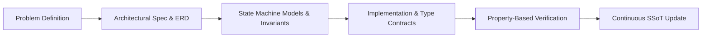

# Specification-Driven Development & Living Documentation

---

## 1. The Specification-First Lifecycle



---

## 2. Essential Specification Components

Every comprehensive architectural specification must include:
1. **System Invariants**: Rules that must never be broken (e.g., "A physical station cannot host two concurrent matches").
2. **State Machine Diagrams**: Visual definitions of all permissible entity states and valid transitions.
3. **Entity-Relationship Models**: Explicit field types, nullability, unique constraints, and cascade policies.
4. **Error Envelopes & Response Contracts**: Predictable API error formats with machine-readable codes.

---

## 3. Conventional Commit Enforcement

All repositories enforce the Conventional Commits specification:
```text
<type>(<scope>): <subject>
```
Types: `feat`, `fix`, `docs`, `refactor`, `perf`, `test`, `chore`.
Commits must be atomic, focused on one change, and pass all linter checks.
