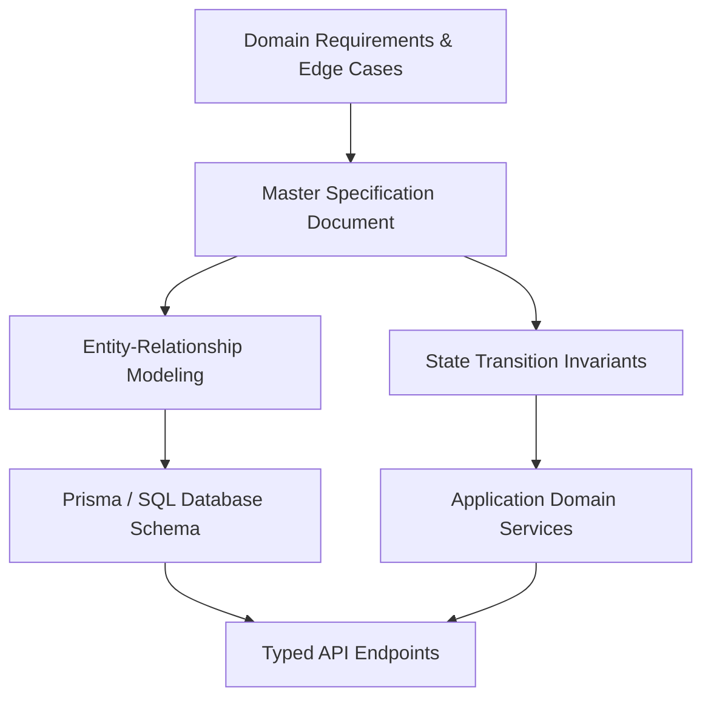

# Specification-Driven Development & Living Documentation: The Architecture-First Blueprint

> Track: Engineering Principles  
> Prerequisite Knowledge: Relational data concepts, Git version control, basic TypeScript / SQL  
> Estimated Build Time: 45 minutes  
> Target Project Outcome: A complete, verified technical specification, Entity-Relationship Diagram (ERD), and relational migration schema built prior to writing backend application code

---

## 1. The Hook: Why You Need This in Your Arsenal

The most common trap for junior engineers and student hackathon teams is **"Vibe Coding"**: jumping straight into an empty IDE file, hacking together ad-hoc database columns, and figuring out the architecture as they go.

Here is what happens on day three of that project:
- Two team members build conflicting assumptions about what a "User" or "Order" contains.
- A critical entity relationship is discovered to be many-to-many instead of one-to-one, requiring hours of database surgery and painful refactoring.
- The pull request contains 4,000 modified lines across 45 files with commit messages like `"fix stuff"`, making code review impossible.

Senior engineers practice **Specification-Driven Development (SDD)**:
1. Define the business domain invariants, entities, and state transitions in an explicit document first.
2. Build the relational schema and validation schemas from that Single Source of Truth (SSoT).
3. Write clean, atomic pull requests backed by Conventional Commits.

---

## 2. The Mental Model: Intuitive Analogy & Visual Topology

### The Architectural Blueprint vs. Laying Random Bricks
Imagine building a skyscraper. 
Nobody says: *"Let's pour some concrete in the dirt today and decide whether it will be an elevator shaft or a swimming pool next Tuesday."*

Architects draw blueprints, evaluate soil load ratings, design plumbing conduits, and submit them for engineering inspection. Once the blueprint is approved, construction proceeds efficiently without structural re-work.

In software, **the specification is your blueprint**.



---

## 3. Deep Dive: Under the Hood

### The Cost of Architectural Changes Over Time
Barry Boehm's classical Software Engineering Economics curve demonstrates that finding a flaw during the specification phase costs **1x**. Finding that same flaw in production costs **100x**:

```text
Cost to Fix Defects Across Project Phases:
Requirements / Spec Phase:  $100   (Rewrite a Markdown heading)
Implementation Phase:       $1,000 (Refactor 10 classes and tests)
Post-Release / Production:  $10,000+ (Database migration, data patching, downtime)
```

### Living Documentation vs. Stale Wiki Pages
Why do traditional enterprise wikis (Confluence, Notion) become outdated? Because they live in external silos disconnected from code commits.

**Living Documentation** lives in the git repository itself (`docs/` directory):
- Code changes and documentation updates happen in the exact same pull request.
- CI linters verify that markdown links and code snippet schemas compile.
- Pull request templates enforce that architectural changes update the master spec.

---

## 4. Zero-to-One Interactive Playground: Build It From Scratch

We will author an authoritative specification and corresponding relational Prisma schema for an urban parking reservation system.

### Step 1: Environment Setup
```bash
mkdir spec-driven-project
cd spec-driven-project
npm init -y
npm install prisma --save-dev
npx prisma init --datasource-provider postgresql
```

### Step 2: The Architectural Specification (`SPECIFICATION.md`)
Create `SPECIFICATION.md`:

```markdown
# System Specification: Urban Parking Marketplace Engine

## 1. Core Domain Invariants
- An Parking Bay can have at most one active reservation for any overlapping time window.
- Reservation prices must be calculated dynamically based on base tariff and slot duration.
- Once a reservation transitions to COMPLETED, financial settlement records are immutable.

## 2. State Machine: Reservation Lifecycle
- PENDING -> CONFIRMED (Payment authorized within 10 minutes)
- PENDING -> EXPIRED (No payment authorization received)
- CONFIRMED -> ACTIVE (Vehicle checked in via QR / ANPR sensor)
- ACTIVE -> COMPLETED (Vehicle departs)
- CONFIRMED -> CANCELLED (User cancels before booking start)

## 3. Relational Entity Definitions
- User (Host / Driver)
- ParkingLocation (Physical property, address, geo-coordinates)
- ParkingBay (Individual slot, vehicle size compatibility)
- Reservation (Booking instance, time window, status, price)
```

### Step 3: Deriving the Relational Schema (`prisma/schema.prisma`)
Translate the approved specification directly into `prisma/schema.prisma`:

```prisma
datasource db {
  provider = "postgresql"
  url      = env("DATABASE_URL")
}

generator client {
  provider = "prisma-client-js"
}

enum UserRole {
  DRIVER
  HOST
  ADMIN
}

enum ReservationStatus {
  PENDING
  CONFIRMED
  ACTIVE
  COMPLETED
  CANCELLED
  EXPIRED
}

enum VehicleSize {
  COMPACT
  SEDAN
  SUV
  VAN
}

model User {
  id           String            @id @default(uuid())
  email        String            @unique
  fullName     String
  role         UserRole          @default(DRIVER)
  createdAt    DateTime          @default(now())
  locations    ParkingLocation[] @relation("HostLocations")
  reservations Reservation[]     @relation("DriverReservations")
}

model ParkingLocation {
  id          String       @id @default(uuid())
  hostId      String
  title       String
  address     String
  latitude    Float
  longitude   Float
  host        User         @relation("HostLocations", fields: [hostId], references: [id], onDelete: Cascade)
  bays        ParkingBay[]
  createdAt   DateTime     @default(now())
}

model ParkingBay {
  id           String            @id @default(uuid())
  locationId   String
  bayIdentifier String           // e.g. "Slot A-12"
  maxSize      VehicleSize       @default(SEDAN)
  hourlyRate   Decimal           @db.Decimal(10, 2)
  location     ParkingLocation   @relation(fields: [locationId], references: [id], onDelete: Cascade)
  reservations Reservation[]

  @@unique([locationId, bayIdentifier])
}

model Reservation {
  id          String            @id @default(uuid())
  bayId       String
  driverId    String
  startTime   DateTime
  endTime     DateTime
  totalAmount Decimal           @db.Decimal(10, 2)
  status      ReservationStatus @default(PENDING)
  createdAt   DateTime          @default(now())
  updatedAt   DateTime          @updatedAt

  bay         ParkingBay        @relation(fields: [bayId], references: [id])
  driver      User              @relation("DriverReservations", fields: [driverId], references: [id])

  // Invariant index: Fast check for overlapping reservations per bay
  @@index([bayId, startTime, endTime])
  @@index([driverId, status])
}
```

Validate schema syntax:
```bash
npx prisma validate
```

Expected output:
```text
The schema at prisma/schema.prisma is valid
```

---

## 5. Battle Scars: What Breaks in Production & How to Debug It

### Top 3 Documentation & Git Anti-Patterns
1. **The Giant Monolithic Pull Request**: Submitting 60 files touching auth, database, frontend, and tests in one PR. Break your work into atomic pull requests: (PR 1: Spec and Prisma Schema, PR 2: Database Migration, PR 3: Service Layer, PR 4: UI).
2. **Ambiguous Commit Histories**: Writing commits like `wip`, `update`, `fixed bug`. When a production defect occurs, finding the breaking commit with `git bisect` becomes almost impossible. Enforce Conventional Commits (`feat:`, `fix:`, `docs:`).
3. **Ghost Schemas**: Changing a database column in staging via manual SQL commands without checking a migration script into version control. Staging and production drift apart, causing deployment failures.

---

## 6. The Weekend Hackathon Challenge: Your Turn to Build

### Challenge: The Complete Technical Spec Suite
Select a project idea you want to build this semester.

- **Level 1 (Core)**: Write a comprehensive `SPECIFICATION.md` detailing: System Purpose, Core Invariants, and Finite State Machines with Mermaid diagrams.
- **Level 2 (Advanced)**: Write the complete database schema (Prisma, SQL, or Drizzle) with primary keys, indexes, and cascade delete rules directly derived from the spec.
- **Level 3 (Hardcore)**: Create a standardized GitHub Pull Request template (`.github/PULL_REQUEST_TEMPLATE.md`) with automated quality check gates.

---

## 7. Knowledge Check & Next Steps

1. **Scenario**: Why should Entity-Relationship Diagrams and state machine specs live in the Git repository rather than a separate wiki?  
   *Answer*: Storing specs in Git ensures documentation is version-controlled, reviewed during pull requests, and kept up-to-date alongside code changes.
2. **Scenario**: How does writing an explicit state machine diagram prevent bugs during database modeling?  
   *Answer*: State machine diagrams clarify all valid transitions upfront, highlighting necessary database status enums, timestamps, and indexes before writing queries.
3. **Scenario**: What is the core rule of Conventional Commits?  
   *Answer*: Every commit must use a structured prefix (`feat`, `fix`, `docs`, `refactor`) communicating the intent and scope of the atomic change.

Next Track: [Project Case Studies: Native Desktop & Systems](../../project-case-studies/native-desktop-and-systems/README.md)
