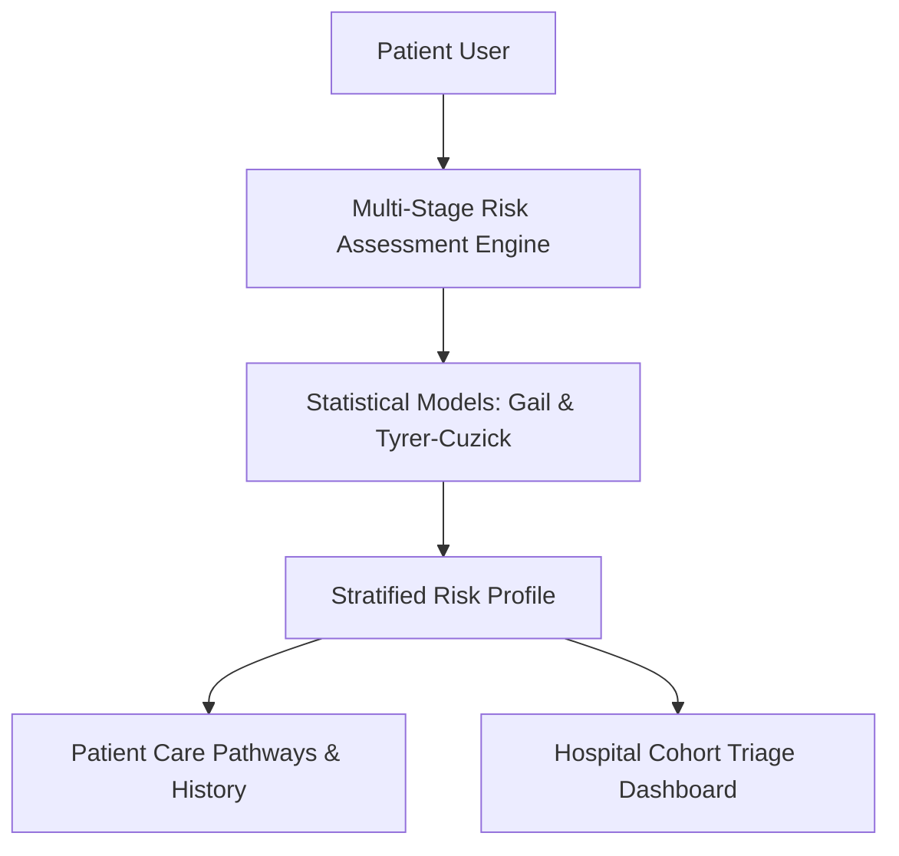

# Case Study: PinkPulse (Digital Oncology Platform)

> **Platform**: Web Application  
> **Tech Stack**: Next.js 16, React 19, TypeScript, Tailwind CSS, XLSX

---

## 1. System Overview

PinkPulse is a digital health platform designed to connect clinical oncology models with patient care, offering breast cancer risk assessment, symptom tracking, and appointment management.

---

## 2. Key Architectural Decisions

- **In-Browser Risk Stratification**: Risk calculations run locally in the browser to maintain patient privacy during initial assessments.
- **Longitudinal Symptom Tracking**: Centralized symptom logs enable patients to record physical symptoms, severity, and timelines over months for clinical review.
- **Audit Trails**: All patient record modifications and risk evaluations generate timestamped audit entries.

---

## 3. What Was Learned

- **Responsible Communication of Risk**: Presenting numerical health risks requires clear, non-alarmist explanations and explicit reminders to consult healthcare providers.
- **Handling Incomplete Historical Data**: Clinical risk models require fallback strategies when patients cannot recall specific historical medical parameters (e.g. maternal age at childbirth).
