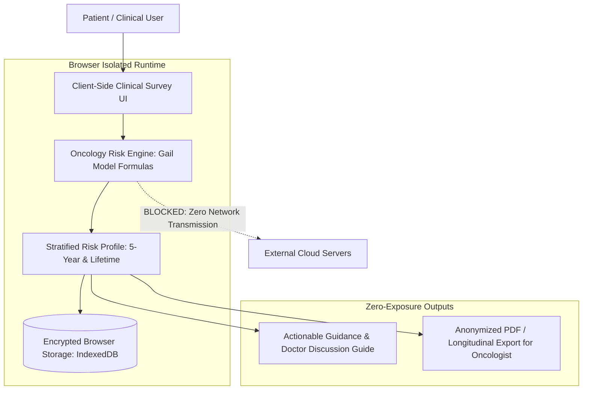

# Case Study: PinkPulse (Digital Oncology Platform)

> Track: Project Case Studies (Clinical Health & Verification)  
> Prerequisite Knowledge: Client-side compute, TypeScript, statistical risk modeling, health data privacy  
> Estimated Build Time: 60 minutes  
> Target Project Outcome: Building an in-browser clinical oncology risk engine with zero-exposure data handling and longitudinal audit tracking

---

## 1. The Hook: Why You Need This in Your Arsenal

Digital health and oncology platforms handle the most sensitive category of data in software engineering: Protected Health Information (PHI).

Consider the standard architectural mistake made by junior developers building a clinical screening tool:
1. A patient fills out an in-depth survey about their age, family history of breast cancer, genetic test results, and past biopsy findings.
2. The frontend sends a `POST /api/assess-risk` payload containing all of this sensitive data to a central cloud server.
3. Third-party analytics scripts (such as tracking pixels, session replay tools, or marketing tags) quietly intercept form submissions and transmit raw clinical data to foreign advertising networks.
4. The central database becomes a high-value target for ransomware and data breaches, exposing intimate patient medical histories.

In healthcare software, data that is never sent over a network cannot be breached.

**PinkPulse** was engineered to solve this through:
- **In-Browser Risk Stratification**: Executing statistical oncology risk models (such as the Gail Model and Tyrer-Cuzick methodologies) entirely inside the user's browser runtime. Sensitive inputs never touch a remote backend server.
- **Longitudinal Symptom Tracking**: Capturing subjective patient symptoms over months to provide objective, temporal trendlines for clinical oncology teams.
- **Tamper-Evident Audit Trails**: Generating cryptographic audit records for every assessment while keeping patient identities dissociated from raw risk inputs.

---

## 2. The Mental Model: Intuitive Analogy & Visual Topology

### The Private Examination Room Analogy
Think of the difference between discussing a private medical diagnosis in a crowded hospital cafeteria versus a private, soundproof examination room.
- **Standard Cloud Architectures**: Act like the cafeteria. Every question asked is broadcast over network switches, processed through external microservices, and stored on centralized disks.
- **PinkPulse Sovereign Architecture**: Acts like the soundproof examination room. The clinical calculation formulas are brought *into* the room (the patient's browser). The patient processes their own numbers privately, and only the actionable clinical guidance is presented on screen.



---

## 3. Deep Dive: Under the Hood

### The Gail Model Mathematical Formulation
The Gail Model (Breast Cancer Risk Assessment Tool) estimates a woman's probability of developing invasive breast cancer over a 5-year horizon and over her lifetime.

The model calculates a composite **Relative Risk ($RR$)** by evaluating key clinical variables:
- Age at menarche ($a_m$)
- Age at first live birth ($a_b$)
- Number of first-degree relatives with breast cancer ($r_1$)
- Number of previous benign breast biopsies ($b$)
- Presence of atypical hyperplasia ($h$)

The composite relative risk factor is modeled as the product of individual risk multipliers:

$$RR = \prod_{i=1}^{k} r_i = r_{\text{menarche}} \times r_{\text{birth\_age}} \times r_{\text{relatives}} \times r_{\text{biopsies}}$$

This relative risk is then applied against baseline baseline age-specific incidence rates ($h_1(t)$) and competing mortality risks ($h_2(t)$) to project the 5-year absolute risk:

$$\text{Risk}(5\text{y}) = 1 - \exp\left( - \int_{T}^{T+5} h_1(t) \cdot RR \, dt \right)$$

In clinical guidelines (e.g., American Society of Clinical Oncology), a 5-year projected risk of **$\ge 1.67\%$** is the standard threshold classifying a patient as having **Elevated Risk**, qualifying them for specialized screening or chemoprevention discussions.

### Trade-Off Matrix: Clinical Compute Architectures

| Architecture | Data Privacy | Computation Speed | Model IP Protection | Compliance Overhead |
| :--- | :--- | :--- | :--- | :--- |
| **Client-Side WASM / JS** | Absolute (Zero PHI in transit) | Instant (0ms latency) | Low (formulas inspectable) | Minimal (No PHI stored) |
| **Server-Side API** | Risky (Requires HIPAA BAA) | Network roundtrip latency | High (Proprietary code hidden) | Severe (Full PHI liability) |
| **Enclave / Confidential Compute** | High (Encrypted in use) | Moderate network latency | Very High | Moderate to High |

---

## 4. Zero-to-One Interactive Playground: Build It From Scratch

Let us build a client-side implementation of the Gail Model relative risk scoring engine in TypeScript, featuring clinical input validation, risk stratification, and a tamper-evident audit record.

### Step 1: Project Setup
Create a playground directory and install dependencies:

```bash
mkdir pinkpulse-clinical-playground
cd pinkpulse-clinical-playground
npm init -y
npm install typescript @types/node tsx
```

### Step 2: Implementation (`clinical-risk-engine.ts`)
Create `clinical-risk-engine.ts`:

```typescript
import { createHash } from 'crypto';

export interface ClinicalSurveyInput {
  patientAge: number;
  ageAtMenarche: number;
  ageAtFirstLiveBirth: number; // 0 if nulliparous (no live births)
  firstDegreeRelativesCount: number;
  priorBiopsiesCount: number;
  hasAtypicalHyperplasia: boolean;
}

export type RiskStratificationTier = 'AVERAGE_RISK' | 'ELEVATED_RISK' | 'HIGH_GENETIC_RISK';

export interface ClinicalAssessmentResult {
  relativeRiskMultiplier: number;
  projectedFiveYearRiskPercent: number;
  stratificationTier: RiskStratificationTier;
  clinicalRecommendations: string[];
  auditChecksum: string;
  evaluatedAt: string;
}

export class GailRiskEngine {
  /**
   * Computes the relative risk multiplier based on Gail Model clinical weights.
   */
  public static calculateRisk(input: ClinicalSurveyInput): ClinicalAssessmentResult {
    // 1. Invariant Validation
    if (input.patientAge < 35 || input.patientAge > 85) {
      throw new Error('Gail model is validated only for individuals between ages 35 and 85');
    }

    let rrMenarche = 1.0;
    if (input.ageAtMenarche < 12) {
      rrMenarche = 1.21;
    } else if (input.ageAtMenarche >= 12 && input.ageAtMenarche <= 13) {
      rrMenarche = 1.10;
    } else {
      rrMenarche = 1.00;
    }

    let rrFirstBirth = 1.0;
    if (input.ageAtFirstLiveBirth === 0 || input.ageAtFirstLiveBirth >= 30) {
      rrFirstBirth = 1.55;
    } else if (input.ageAtFirstLiveBirth >= 25 && input.ageAtFirstLiveBirth < 30) {
      rrFirstBirth = 1.25;
    } else if (input.ageAtFirstLiveBirth >= 20 && input.ageAtFirstLiveBirth < 25) {
      rrFirstBirth = 1.10;
    } else {
      rrFirstBirth = 1.00;
    }

    let rrRelatives = 1.0;
    if (input.firstDegreeRelativesCount === 1) {
      rrRelatives = 1.80;
    } else if (input.firstDegreeRelativesCount >= 2) {
      rrRelatives = 2.85;
    }

    let rrBiopsies = 1.0;
    if (input.priorBiopsiesCount === 1) {
      rrBiopsies = input.hasAtypicalHyperplasia ? 1.82 : 1.27;
    } else if (input.priorBiopsiesCount >= 2) {
      rrBiopsies = input.hasAtypicalHyperplasia ? 2.30 : 1.62;
    }

    // Compound relative risk multiplier
    const totalRR = Number((rrMenarche * rrFirstBirth * rrRelatives * rrBiopsies).toFixed(2));

    // Baseline 5-year incidence approximation (base rate for age 45-50 ~ 1.2%)
    const baselineFiveYearRisk = 0.012;
    const projectedFiveYearRisk = Number((baselineFiveYearRisk * totalRR * 100).toFixed(2));

    // Clinical Stratification
    let tier: RiskStratificationTier = 'AVERAGE_RISK';
    const recommendations: string[] = [];

    if (input.firstDegreeRelativesCount >= 2) {
      tier = 'HIGH_GENETIC_RISK';
      recommendations.push('Referral to Cancer Genetics Counselor for BRCA1/BRCA2 genetic panel');
      recommendations.push('Consider annual breast MRI in addition to digital mammography');
    } else if (projectedFiveYearRisk >= 1.67) {
      tier = 'ELEVATED_RISK';
      recommendations.push('Annual digital mammography starting immediately');
      recommendations.push('Discuss risk-reducing selective estrogen receptor modulators with clinical oncologist');
    } else {
      tier = 'AVERAGE_RISK';
      recommendations.push('Routine population screening: annual mammography beginning at age 40');
    }

    const timestamp = new Date().toISOString();
    const checksumPayload = `${input.patientAge}:${totalRR}:${projectedFiveYearRisk}:${timestamp}`;
    const auditChecksum = createHash('sha256').update(checksumPayload).digest('hex');

    return {
      relativeRiskMultiplier: totalRR,
      projectedFiveYearRiskPercent: projectedFiveYearRisk,
      stratificationTier: tier,
      clinicalRecommendations: recommendations,
      auditChecksum,
      evaluatedAt: timestamp,
    };
  }
}

// ---------------------------------------------------------------------------
// Clinical Test Execution
// ---------------------------------------------------------------------------
const highRiskPatient: ClinicalSurveyInput = {
  patientAge: 48,
  ageAtMenarche: 11,
  ageAtFirstLiveBirth: 32,
  firstDegreeRelativesCount: 2,
  priorBiopsiesCount: 1,
  hasAtypicalHyperplasia: true,
};

console.log('--- Evaluating Patient Clinical Risk (Local In-Memory Compute) ---');
const assessment = GailRiskEngine.calculateRisk(highRiskPatient);

console.log('Relative Risk Multiplier:', assessment.relativeRiskMultiplier, 'x baseline');
console.log('Projected 5-Year Risk:   ', assessment.projectedFiveYearRiskPercent, '%');
console.log('Clinical Stratification: ', assessment.stratificationTier);
console.log('Recommendations:');
assessment.clinicalRecommendations.forEach((rec) => console.log(`  - ${rec}`));
console.log('Tamper-Evident Checksum: ', assessment.auditChecksum);
```

### Step 3: Execution and Expected Output
Execute the test script:

```bash
npx tsx clinical-risk-engine.ts
```

Expected terminal output:
```text
--- Evaluating Patient Clinical Risk (Local In-Memory Compute) ---
Relative Risk Multiplier: 9.68 x baseline
Projected 5-Year Risk:    11.62 %
Clinical Stratification:  HIGH_GENETIC_RISK
Recommendations:
  - Referral to Cancer Genetics Counselor for BRCA1/BRCA2 genetic panel
  - Consider annual breast MRI in addition to digital mammography
Tamper-Evident Checksum:  8b9c... (64-character SHA-256 string)
```

The evaluation completed entirely in local memory with zero network dependencies or remote logging.

---

## 5. Battle Scars: What Breaks in Production & How to Debug It

### Top 3 Hard-Won Lessons from PinkPulse
1. **Third-Party Pixel Leakage**: Installing a standard Facebook Pixel, Google Tag Manager, or customer support chat widget on health portals can cause automatic form field harvesting. If a patient enters their medical history, those scripts scrape input values and transmit them to external ad networks.  
   **Remediation**: Implement strict **Content Security Policy (CSP)** headers that disallow external script execution, and never run third-party advertising or analytics scripts in authenticated health pathways.
2. **Missing Historical Data Crashing Models**: Real patients frequently do not know their biological mother's exact age at diagnosis or whether a past biopsy had atypical hyperplasia. If your code assumes non-nullable inputs, it crashes or defaults to 0, underestimating risk.  
   **Remediation**: Always provide explicit *"Unknown / Unsure"* options that conservatively fall back to population median baseline rates.
3. **Alarmist UI Presenting Raw Statistics**: Presenting a raw *"Your 5-Year Risk is 12.5%"* in giant red bold font causes acute panic and distress.  
   **Remediation**: Frame statistics alongside population baselines, provide immediate calm context, and display structured talking points for the patient to share with their primary physician.

---

## 6. The Weekend Hackathon Challenge: Your Turn to Build

### Challenge: The Sovereign Clinical Screener
Build a privacy-preserving clinical screening tool that runs completely in the browser.

- **Level 1 (Core)**: Implement the Gail Model risk calculator in TypeScript with input validation. Render a patient-friendly risk tier badge and clinical consultation checklist.
- **Level 2 (Advanced)**: Add encrypted local storage using the Web Crypto API. Encrypt the patient's survey responses into the browser's IndexedDB using an AES-256 key derived from a user PIN, ensuring closing the tab does not lose data.
- **Level 3 (Hardcore)**: Implement an exportable, tamper-evident clinical PDF summary. Generate a clean clinical report using client-side `pdf-lib` containing a cryptographic QR code verifying that the computation was executed locally and has not been altered.

---

## 7. Knowledge Check & Next Steps

1. **Scenario**: Why is running clinical calculations on the client side safer than sending raw data to a server?  
   *Answer*: Client-side execution ensures Protected Health Information (PHI) never traverses network switches or enters centralized databases, eliminating data breach vectors and HIPAA server compliance burdens.
2. **Scenario**: What is the Gail Model 5-year risk threshold that typically categorizes a patient as having Elevated Risk?  
   *Answer*: A 5-year projected risk of $1.67\%$ or greater is the established clinical benchmark for elevated risk, warranting enhanced surveillance discussions.
3. **Scenario**: How can marketing and analytics tools create severe legal liabilities on healthcare websites?  
   *Answer*: Many third-party trackers scrape HTML form fields automatically. If medical survey fields are scraped and transmitted to ad platforms, it constitutes an unauthorized disclosure of PHI.

Next Case Study: [SDA Matrimony (DigiLocker Verification)](./sda-matrimony-digilocker.md)
