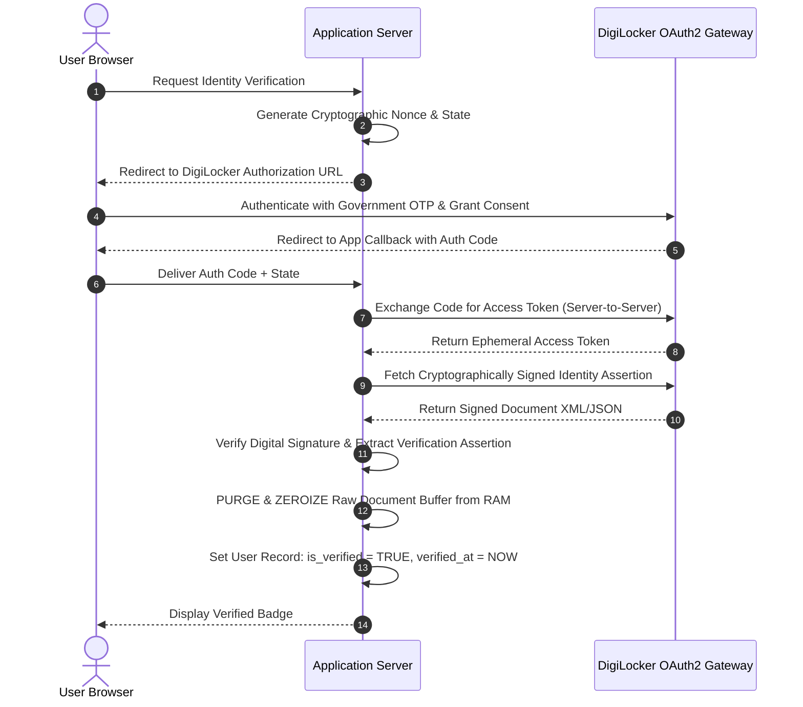

# Case Study: SDA Matrimony (DigiLocker Verification)

> Track: Project Case Studies (Clinical Health & Verification)  
> Prerequisite Knowledge: OAuth2 authorization code flows, cryptographic token exchange, identity security, zero-trust data architectures  
> Estimated Build Time: 60 minutes  
> Target Project Outcome: Building an ephemeral, non-extractive identity verification gateway using government OAuth2 infrastructure with zero biometric capture and immediate memory buffer purging

---

## 1. The Hook: Why You Need This in Your Arsenal

When building consumer web platforms (social networks, matrimonial services, fintech, or shared economy marketplaces), developers are frequently asked to "verify user identity."

The common, extractive approach taken by junior teams looks like this:
1. Ask the user to upload a photo of their government ID card (Passport, National ID, Driver's License).
2. Ask the user to take a live selfie or record a video.
3. Send the image to a third-party facial recognition API to match faces.
4. Save the high-resolution ID images in an AWS S3 bucket.

This architecture creates enormous hazards:
- **Massive Regulatory Liability**: Under modern data protection laws (India's DPDPA, EU GDPR, California CCPA), storing raw government IDs and facial biometric templates creates severe financial liabilities in the event of a breach.
- **Biometric Weaponization**: If your S3 bucket is compromised, attackers acquire permanent biometric facial hashes and government document scans that users can never change or reset.
- **Architectural Waste**: The application usually does not need a user's biometric facial scan. It only needs to answer a simple boolean question: *"Has this user's identity and age been certified by a sovereign government entity?"*

**SDA Matrimony** solved this by implementing **Non-Extractive Identity Proofing** via India's DigiLocker public digital infrastructure. The system uses a document-only OAuth2 consent flow, captures zero biometrics, and purges all identity buffers from memory immediately upon verification.

---

## 2. The Mental Model: Intuitive Analogy & Visual Topology

### The Bouncer at the Door
Consider two different security protocols at an age-restricted venue:
- **The Extractive Bouncer**: Takes your national passport, photocopies it, takes a polaroid photo of your face, files them in an unlocked metal filing cabinet, and lets you inside.
- **The Sovereign Non-Extractive Bouncer**: Looks at the official government holographic seal on your credential, confirms you are over 21, applies an invisible UV hand stamp, and immediately returns your passport. The bouncer keeps zero copies, zero images, and zero biometric scans.



---

## 3. Deep Dive: Under the Hood

### The 3-Legged OAuth2 Consent Protocol
DigiLocker acts as an OpenID Connect (OIDC) and OAuth2 identity provider backed by national citizen databases.

1. **Authorization Request**:
   The client directs the user to the DigiLocker consent gateway with required scopes:
   ```text
   GET /public/oauth2/1/authorize?
     response_type=code
     &client_id=APP_CLIENT_ID
     &redirect_uri=https%3A%2F%2Fapp.com%2Fcallback
     &state=CRYPTOGRAPHIC_RANDOM_STATE
   ```
2. **User Consent**: The citizen logs into their government-managed portal using multi-factor authentication (SMS OTP or authenticator) and explicitly reviews the permission request (e.g., *"Allow App to view your Driving License / Aadhaar Card for identity verification"*).
3. **Token Exchange**: The application exchanges the single-use authorization code for a short-lived access token over mutual TLS.
4. **Signature Verification & Ephemeral Extraction**: The application downloads the document payload, verifies the digital signature of the issuing authority (UIDAI or Department of Transport), extracts the required verification booleans, and immediately overwrites the memory buffer.

### Trade-Off Matrix: Identity Verification Architectures

| Vector | Document Scan + Face Biometrics | DigiLocker OAuth2 Consent | Third-Party Commercial KYC |
| :--- | :--- | :--- | :--- |
| **Biometric Capture** | High (Facial templates stored) | Zero (Explicitly rejected) | High (Liveness video check) |
| **Data Breach Liability** | Extreme (Raw ID scans in S3) | Minimal (No raw data stored) | Moderate (Delegated to vendor) |
| **User Trust & Friction** | Low trust, high drop-off | High trust (Government portal) | Moderate |
| **Storage Cost** | High (Megabytes per user) | Zero (Only boolean flags stored) | Vendor subscription fee |

---

## 4. Zero-to-One Interactive Playground: Build It From Scratch

Let us build an ephemeral identity verification gateway in TypeScript that executes the OAuth2 callback exchange, validates the cryptographic token, extracts minimal assertions, and zeroizes memory buffers.

### Step 1: Project Setup
Create a playground directory and install dependencies:

```bash
mkdir sda-digilocker-playground
cd sda-digilocker-playground
npm init -y
npm install typescript @types/node tsx
```

### Step 2: Implementation (`verification-gateway.ts`)
Create `verification-gateway.ts`:

```typescript
import { randomBytes } from 'crypto';

export interface UserSession {
  userId: string;
  expectedOAuthState: string;
  isVerified: boolean;
  verifiedAt: string | null;
}

export interface VerificationResult {
  success: boolean;
  userId: string;
  isAdult: boolean;
  error?: string;
}

export class EphemeralVerificationGateway {
  private activeSessions: Map<string, UserSession> = new Map();

  /**
   * Generates a secure authorization URL with CSRF state protection.
   */
  public generateAuthorizationRequest(userId: string): { authUrl: string; state: string } {
    const state = randomBytes(24).toString('hex');
    this.activeSessions.set(state, {
      userId,
      expectedOAuthState: state,
      isVerified: false,
      verifiedAt: null,
    });

    const clientId = 'APP_GOV_CLIENT_ID';
    const redirectUri = encodeURIComponent('https://app.example.com/api/verify/callback');
    const authUrl = `https://digilocker.example.gov.in/oauth2/authorize?client_id=${clientId}&redirect_uri=${redirectUri}&state=${state}&response_type=code`;

    return { authUrl, state };
  }

  /**
   * Processes the OAuth2 callback code ephemerally.
   * Extracts verification flags and zeroizes raw payload buffers.
   */
  public async handleOAuthCallback(code: string, state: string): Promise<VerificationResult> {
    const session = this.activeSessions.get(state);

    // 1. Verify CSRF state invariant
    if (!session || session.expectedOAuthState !== state) {
      return { success: false, userId: 'UNKNOWN', isAdult: false, error: 'Invalid or expired state parameter' };
    }

    // 2. Simulated server-to-server token exchange
    // In production, this performs a POST to DigiLocker /token endpoint
    const mockAccessToken = `dgl_token_${randomBytes(16).toString('hex')}`;

    // 3. Simulated signed document fetch into raw memory Buffer
    // This represents the raw XML/JSON identity credential returned by the government gateway
    const rawGovernmentPayload = Buffer.from(
      JSON.stringify({
        docType: 'NATIONAL_ID',
        issuer: 'Government Authority',
        signatureValid: true,
        citizenName: 'Jane Doe',
        birthYear: 1996,
        idNumberMasked: 'XXXX-XXXX-4812',
      }),
      'utf-8'
    );

    let isAdult = false;
    let isSignatureValid = false;

    try {
      // 4. Parse payload and verify assertions
      const parsedData = JSON.parse(rawGovernmentPayload.toString('utf-8'));
      isSignatureValid = parsedData.signatureValid === true;

      const currentYear = new Date().getFullYear();
      const age = currentYear - parsedData.birthYear;
      isAdult = age >= 18;

      if (!isSignatureValid) {
        throw new Error('Government digital signature verification failed');
      }

      // Update persistent session with non-PII verification flags only
      session.isVerified = true;
      session.verifiedAt = new Date().toISOString();
    } finally {
      // 5. CRITICAL: Zeroize and purge raw memory buffer
      // Overwrite the memory buffer with zeros before releasing reference
      rawGovernmentPayload.fill(0);
      console.log('Security Action: Raw government document buffer zeroized from memory.');
    }

    // Clean up temporary CSRF state
    this.activeSessions.delete(state);

    return {
      success: true,
      userId: session.userId,
      isAdult,
    };
  }
}

// ---------------------------------------------------------------------------
// Verification Simulation
// ---------------------------------------------------------------------------
async function runSimulation() {
  const gateway = new EphemeralVerificationGateway();

  console.log('--- Step 1: User initiates verification ---');
  const { authUrl, state } = gateway.generateAuthorizationRequest('user-alice-99');
  console.log('Generated DigiLocker Consent URL:\n', authUrl);

  console.log('\n--- Step 2: User completes consent, callback received ---');
  const mockAuthCode = 'mock_auth_code_xyz789';
  const result = await gateway.handleOAuthCallback(mockAuthCode, state);

  console.log('\nFinal Verification Outcome:');
  console.log('Result:', result);
  console.log('Identity Status: Verified adult without persisting national ID scans.');
}

runSimulation();
```

### Step 3: Execution and Expected Output
Execute the test script:

```bash
npx tsx verification-gateway.ts
```

Expected terminal output:
```text
--- Step 1: User initiates verification ---
Generated DigiLocker Consent URL:
 https://digilocker.example.gov.in/oauth2/authorize?client_id=APP_GOV_CLIENT_ID&redirect_uri=https%3A%2F%2Fapp.example.com%2Fapi%2Fverify%2Fcallback&state=...&response_type=code

--- Step 2: User completes consent, callback received ---
Security Action: Raw government document buffer zeroized from memory.

Final Verification Outcome:
Result: { success: true, userId: 'user-alice-99', isAdult: true }
Identity Status: Verified adult without persisting national ID scans.
```

---

## 5. Battle Scars: What Breaks in Production & How to Debug It

### Top 3 Hard-Won Lessons from SDA Matrimony
1. **Accidental Logging of Raw Payloads**: A developer adds a catch-all logger to their HTTP client (`axios.interceptors.response.use(res => console.log(res.data))`). This silently writes unmasked national ID numbers and personal addresses into Datadog, CloudWatch, or centralized logging clusters.  
   **Remediation**: Explicitly blacklist authorization and verification endpoints from HTTP logging filters, or strip sensitive payload objects before logger serialization.
2. **Missing State Invariant Allowing CSRF Hijacking**: If the OAuth2 callback does not strictly validate the `state` query parameter against a session nonce, an attacker can complete verification with their own DigiLocker credentials and trick a victim into submitting the final callback, binding the wrong identity to the victim's account.  
   **Remediation**: Always store `state` in an HTTP-only, secure cookie or encrypted session store and require an exact byte match on callback.
3. **Multipart Form Upload Leakage**: When using libraries like Express `multer` without memory storage, uploaded files are written to `/tmp` on disk. Even if deleted, file data remains in unallocated disk blocks until overwritten.  
   **Remediation**: Use `multer.memoryStorage()` exclusively or process streams in memory without touching physical swap or disk partitions.

---

## 6. The Weekend Hackathon Challenge: Your Turn to Build

### Challenge: The Ephemeral Verification Gateway
Build an end-to-end identity proofing service that operates on zero-knowledge and ephemeral principles.

- **Level 1 (Core)**: Implement the OAuth2 3-legged consent flow mock with CSRF `state` validation and code exchange.
- **Level 2 (Advanced)**: Add memory buffer zeroization. Build a middleware that intercepts identity document responses, validates required attributes, zeroes out raw memory buffers with `buffer.fill(0)`, and returns only a signed verification JWT to the frontend.
- **Level 3 (Hardcore)**: Implement an immutable verification audit log. Record a SHA-256 hash of the verification timestamp and issuing authority public key into a tamper-evident audit table, allowing proof that a user was verified on a specific date without preserving their underlying identity data.

---

## 7. Knowledge Check & Next Steps

1. **Scenario**: Why is storing raw national ID scans in an S3 bucket considered a critical security vulnerability?  
   *Answer*: If the bucket or credentials are breached, permanent citizen identity documents are exposed, enabling identity theft and exposing the company to severe regulatory fines under DPDPA and GDPR.
2. **Scenario**: How does OAuth2 consent exchange eliminate the need for an application to store user passwords or government credentials?  
   *Answer*: The citizen authenticates directly on the government's official portal. The portal returns a short-lived, scoped access token to the application, ensuring the app never handles the citizen's government credentials.
3. **Scenario**: What is the purpose of explicitly zeroizing a memory buffer (`buffer.fill(0)`) after processing sensitive data?  
   *Answer*: JavaScript garbage collection marks memory as unreferenced but does not immediately erase memory bytes. Zeroizing ensures sensitive identity data cannot be read from memory dumps or heap inspection before garbage collection occurs.

Next Case Study: [ZEUS (Interactive 3D Web & Physical Shaders)](../creative-engineering-and-3d-web/zeus-interactive-3d-shaders.md)
