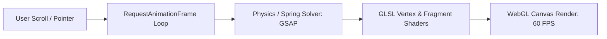

# Case Study: ZEUS (Interactive 3D Web & Physical Shaders)

> **Platform**: High-Performance Web Interface  
> **Tech Stack**: Next.js, React 19, Three.js, `@react-three/fiber`, `@react-three/drei`, GSAP, Framer Motion

---

## 1. System Overview

ZEUS delivers an interactive, hardware-accelerated 3D web experience that combines custom WebGL shaders, real-time lighting models, and physics-driven micro-interactions.

---

## 2. Key Architectural Decisions

- **GPU Pipeline Optimization**: Minimizes draw calls by merging static geometries into unified mesh buffers.
- **Intersection-Based Throttling**: Automatically pauses rendering loops when the WebGL canvas is outside the viewport, conserving mobile battery life.
- **Micro-Interaction Polish**: Combines spring physics with procedural camera movements to create tactile interface responses.

---

## 3. What Was Learned

- **WebGL Resource Leaks**: Unlike standard HTML elements, WebGL textures and materials are not cleaned up automatically by JavaScript garbage collection. Explicitly calling `.dispose()` on unmount is required to prevent memory leaks.
- **Device Pixel Ratio (DPR) Scaling**: Clamping DPR to a maximum of 2 on high-density displays (such as Retina screens) prevents rendering fill-rate bottlenecks.
