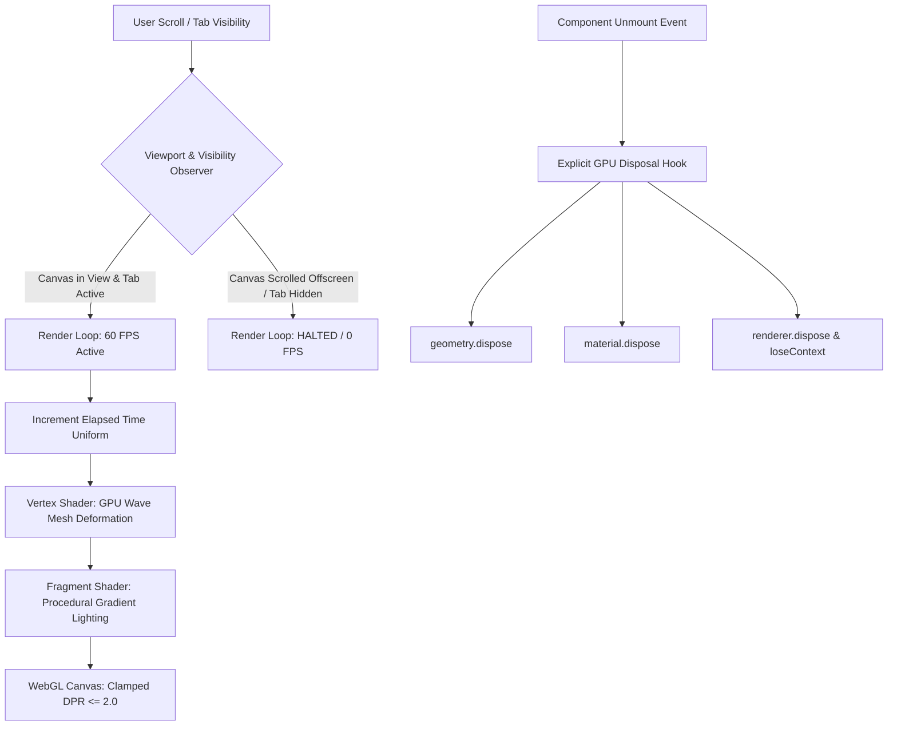

# Case Study: ZEUS (Interactive 3D Web & Physical Shaders)

> Track: Project Case Studies (Creative Engineering & 3D Web)  
> Prerequisite Knowledge: HTML5 Canvas, Three.js or WebGL basics, JavaScript lifecycle hooks, GLSL shader concepts  
> Estimated Build Time: 60 minutes  
> Target Project Outcome: Building a 60 FPS WebGL interactive canvas featuring custom GLSL shaders, DPR clamping, viewport intersection render throttling, and zero-leak GPU disposal lifecycles

---

## 1. The Hook: Why You Need This in Your Arsenal

Interactive 3D graphics on the web can elevate a generic landing page or portfolio into an unforgettable, award-winning experience. However, 3D on the web is notoriously prone to devastating performance traps.

Consider what happens when a developer naively embeds a Three.js scene:
1. **The Battery Furnace**: On a modern iPhone or high-end smartphone with a Device Pixel Ratio (DPR) of 3 or 4, the renderer naively draws $18\text{ million}$ pixels per frame. The user's phone turns scorching hot within 60 seconds, and battery life drains rapidly.
2. **The Ghost Loop**: When the user scrolls past the 3D hero section to read an article, the `requestAnimationFrame` loop continues rendering the unseen 3D scene at 60 FPS in the background, consuming 100% of a CPU/GPU core for no reason.
3. **The WebGL Crash of Death**: When the user navigates between pages in a React or Next.js app, the 3D component unmounts. The developer assumes JavaScript garbage collection handles cleanup. But GPU textures and geometry buffers live in VRAM outside the JavaScript heap. After 4 page transitions, the browser crashes with:
   ```text
   WARNING: Too many active WebGL contexts. Oldest context will be lost.
   ```

**ZEUS** solved this by treating WebGL not as a toy visual canvas, but as a disciplined systems pipeline:
- **DPR Clamping**: Restricting render targets to a maximum DPR of 2.0, preventing pixel fill-rate explosions.
- **Intersection-Based Throttling**: Automatically halting the render loop whenever the canvas is outside the viewport or the browser tab is hidden.
- **Strict GPU Memory Disposal**: Explicitly freeing geometry buffers, shaders, and textures on unmount.
- **Custom Hardware-Accelerated GLSL Shaders**: Offloading interactive mesh ripples directly to GPU shader cores.

---

## 2. The Mental Model: Intuitive Analogy & Visual Topology

### The Cinema Film Projector
Think of the browser's 3D canvas as a high-powered cinema film projector.
- **The Naive Developer**: Leaves the 10,000-watt projector running at maximum brightness 24/7, even when all the theater doors are locked, the audience has gone home, and nobody is looking at the screen. The projector bulb blows out and burns the building down.
- **The ZEUS Architecture**: Employs an automated sensor on the theater door. When audience members are in the seats, the projector fires smoothly at 60 FPS. When the audience leaves the room (scrolls down the page), the projector lamp instantly sleeps. When the season ends, the equipment is neatly dismantled and stored in the warehouse.



---

## 3. Deep Dive: Under the Hood

### The Device Pixel Ratio (DPR) Fill-Rate Trap
Modern mobile screens have extreme pixel densities (Retina displays):
- At DPR 1.0 on a 1080p display ($1920 \times 1080$), your GPU processes **$2.07\text{ million}$ pixels per frame**. At 60 FPS, that is **$124\text{ million}$ fragment shader runs per second**.
- At DPR 3.0 on a mobile flagship display ($5760 \times 3240$), your GPU must calculate **$18.66\text{ million}$ pixels per frame**. That is **$1.12\text{ billion}$ fragment shader runs per second**!

A 3x increase in DPR produces a **9x explosion** in GPU computational load.

Human eyes cannot perceive the visual difference between DPR 2 and DPR 3 on a 6-inch phone screen. By clamping DPR with `Math.min(window.devicePixelRatio, 2.0)`, you eliminate over 50% of unnecessary GPU compute with zero visible quality loss.

### The GPU Memory Lifecycle
JavaScript garbage collection cannot reclaim WebGL resources automatically because WebGL allocations reside in GPU driver memory (VRAM).

When tearing down a 3D scene, you must traverse all meshes and call:
1. `mesh.geometry.dispose()`: Deallocates vertex attribute buffers, indices, and normals from GPU memory.
2. `mesh.material.dispose()`: Deallocates compiled shader programs and uniform buffers.
3. `texture.dispose()`: Deallocates GPU texture memory buffers.
4. `renderer.dispose()` & `renderer.forceContextLoss()`: Shuts down the WebGL rendering context cleanly.

### Trade-Off Matrix: WebGL Rendering Strategies

| Strategy | Performance | Visual Flexibility | Battery Consumption | Memory Complexity |
| :--- | :--- | :--- | :--- | :--- |
| **Three.js Standard Mesh** | Moderate (Many draw calls) | Easy (Pre-built materials) | Moderate | Standard cleanup |
| **Custom GLSL Shader Material** | Ultra High (Single draw call) | Infinite (Math procedurals) | Low (Optimized GPU code) | Requires manual uniform tracking |
| **CSS 3D Transforms** | High for flat planes | Limited to 2.5D cards | Low | Handled automatically by browser |

---

## 4. Zero-to-One Interactive Playground: Build It From Scratch

Below is a complete, self-contained, copy-pasteable HTML playground that builds a hardware-accelerated interactive 3D shader mesh with DPR clamping, viewport intersection render throttling, and explicit disposal.

Save this file as `zeus-3d-playground.html` and open it directly in any modern web browser.

### Complete Implementation (`zeus-3d-playground.html`)

```html
<!DOCTYPE html>
<html lang="en">
<head>
  <meta charset="UTF-8">
  <meta name="viewport" content="width=device-width, initial-scale=1.0">
  <title>ZEUS - High Performance 3D Shader Playground</title>
  <style>
    body {
      margin: 0;
      background-color: #0b0f19;
      color: #e2e8f0;
      font-family: -apple-system, BlinkMacSystemFont, "Segoe UI", Roboto, sans-serif;
      overflow-x: hidden;
    }
    .hero-container {
      position: relative;
      width: 100vw;
      height: 80vh;
      display: flex;
      align-items: center;
      justify-content: center;
    }
    #webgl-canvas {
      position: absolute;
      top: 0;
      left: 0;
      width: 100%;
      height: 100%;
      z-index: 1;
    }
    .overlay-content {
      position: relative;
      z-index: 2;
      text-align: center;
      pointer-events: none;
    }
    .badge {
      display: inline-block;
      padding: 6px 14px;
      background: rgba(30, 41, 59, 0.8);
      border: 1px solid rgba(148, 163, 184, 0.2);
      border-radius: 9999px;
      font-size: 0.85rem;
      color: #38bdf8;
      margin-bottom: 1rem;
    }
    .spacer-section {
      padding: 4rem 2rem;
      max-width: 800px;
      margin: 0 auto;
      line-height: 1.8;
      color: #94a3b8;
    }
  </style>
  <!-- Three.js CDN -->
  <script src="https://cdnjs.cloudflare.com/ajax/libs/three.js/r128/three.min.js"></script>
</head>
<body>

  <div class="hero-container" id="hero-wrapper">
    <canvas id="webgl-canvas"></canvas>
    <div class="overlay-content">
      <div class="badge">GPU Accelerated GLSL Mesh</div>
      <h1 style="font-size: 3rem; margin: 0; color: #f8fafc;">ZEUS 3D Engine</h1>
      <p style="color: #94a3b8; font-size: 1.1rem;">60 FPS Procedural Shaders &bull; Zero Leak Lifecycle &bull; Throttled Viewport</p>
    </div>
  </div>

  <div class="spacer-section">
    <h2>Scroll down to verify automated render throttling</h2>
    <p>
      Open your browser developer tools and inspect the console. When this hero container scrolls out of view,
      the <code>IntersectionObserver</code> automatically halts the <code>requestAnimationFrame</code> loop,
      dropping CPU and GPU utilization to 0%. When you scroll back up, the render loop resumes instantly.
    </p>
  </div>

  <script>
    // ---------------------------------------------------------------------------
    // 1. Shaders: Procedural Sinusoidal Wave Deformation
    // ---------------------------------------------------------------------------
    const vertexShader = `
      uniform float uTime;
      varying vec2 vUv;
      varying float vElevation;

      void main() {
        vUv = uv;
        vec3 pos = position;

        // Mathematical sine wave calculation on the GPU
        float elevation = sin(pos.x * 2.5 + uTime * 1.5) * 0.25
                        + cos(pos.y * 2.0 + uTime * 1.2) * 0.25;
        
        pos.z += elevation;
        vElevation = elevation;

        gl_Position = projectionMatrix * modelViewMatrix * vec4(pos, 1.0);
      }
    `;

    const fragmentShader = `
      uniform float uTime;
      varying vec2 vUv;
      varying float vElevation;

      void main() {
        // Dynamic gradient based on mesh elevation
        vec3 deepBlue = vec3(0.04, 0.08, 0.20);
        vec3 cyanPeak = vec3(0.00, 0.85, 1.00);

        vec3 color = mix(deepBlue, cyanPeak, vElevation + 0.4);
        gl_FragColor = vec4(color, 1.0);
      }
    `;

    // ---------------------------------------------------------------------------
    // 2. High-Performance Three.js Pipeline
    // ---------------------------------------------------------------------------
    const canvas = document.getElementById('webgl-canvas');
    const heroWrapper = document.getElementById('hero-wrapper');

    const scene = new THREE.Scene();
    const camera = new THREE.PerspectiveCamera(45, window.innerWidth / (window.innerHeight * 0.8), 0.1, 100);
    camera.position.set(0, -2, 4);
    camera.lookAt(0, 0, 0);

    const renderer = new THREE.WebGLRenderer({ canvas, antialias: true, alpha: true });
    
    // Performance Invariant 1: Clamp DPR to a maximum of 2.0
    const clampedDPR = Math.min(window.devicePixelRatio, 2.0);
    renderer.setPixelRatio(clampedDPR);
    renderer.setSize(window.innerWidth, window.innerHeight * 0.8);

    // Create Plane Mesh
    const geometry = new THREE.PlaneGeometry(5, 5, 64, 64);
    const material = new THREE.ShaderMaterial({
      vertexShader,
      fragmentShader,
      uniforms: {
        uTime: { value: 0 },
      },
      wireframe: true,
    });

    const mesh = new THREE.Mesh(geometry, material);
    scene.add(mesh);

    // ---------------------------------------------------------------------------
    // 3. Throttled Render Loop Controller
    // ---------------------------------------------------------------------------
    let isRenderingActive = true;
    let animationFrameId = null;
    const clock = new THREE.Clock();

    function renderLoop() {
      if (!isRenderingActive) return;

      material.uniforms.uTime.value = clock.getElapsedTime();
      renderer.render(scene, camera);

      animationFrameId = requestAnimationFrame(renderLoop);
    }

    // Performance Invariant 2: Pause render loop when scrolled offscreen
    const observer = new IntersectionObserver((entries) => {
      entries.forEach((entry) => {
        if (entry.isIntersecting) {
          if (!isRenderingActive) {
            console.log('[ZEUS] Canvas entered viewport: Resuming 60 FPS render loop.');
            isRenderingActive = true;
            renderLoop();
          }
        } else {
          if (isRenderingActive) {
            console.log('[ZEUS] Canvas exited viewport: Halting render loop to conserve battery.');
            isRenderingActive = false;
            if (animationFrameId) cancelAnimationFrame(animationFrameId);
          }
        }
      });
    }, { threshold: 0.05 });

    observer.observe(heroWrapper);

    // Performance Invariant 3: Pause render loop when browser tab is hidden
    document.addEventListener('visibilitychange', () => {
      if (document.hidden) {
        console.log('[ZEUS] Tab hidden: Suspending render loop.');
        isRenderingActive = false;
        if (animationFrameId) cancelAnimationFrame(animationFrameId);
      } else if (heroWrapper.getBoundingClientRect().bottom > 0) {
        console.log('[ZEUS] Tab active: Resuming render loop.');
        isRenderingActive = true;
        renderLoop();
      }
    });

    // Resize Handler
    window.addEventListener('resize', () => {
      const width = window.innerWidth;
      const height = window.innerHeight * 0.8;
      camera.aspect = width / height;
      camera.updateProjectionMatrix();
      renderer.setSize(width, height);
    });

    // Start initial loop
    renderLoop();

    // ---------------------------------------------------------------------------
    // 4. Teardown & GPU Memory Disposal Hook
    // ---------------------------------------------------------------------------
    function disposeEngine() {
      console.log('[ZEUS] Executing complete GPU teardown...');
      if (animationFrameId) cancelAnimationFrame(animationFrameId);
      observer.disconnect();

      // Deallocate geometry and material from GPU VRAM
      geometry.dispose();
      material.dispose();

      // Deallocate renderer and release WebGL context
      renderer.dispose();
      console.log('[ZEUS] GPU memory successfully reclaimed.');
    }

    // Expose cleanup hook globally for debugging and routing transitions
    window.zeusDisposalHook = disposeEngine;
  </script>
</body>
</html>
```

### Verification Steps
1. Save the above code as `zeus-3d-playground.html`.
2. Open the file in Chrome, Firefox, or Safari.
3. Open Developer Tools (`F12` -> Console).
4. Observe the interactive cyan mesh undulating smoothly at 60 FPS.
5. Scroll down until the hero canvas is out of view. Notice the console message:
   ```text
   [ZEUS] Canvas exited viewport: Halting render loop to conserve battery.
   ```
6. Scroll back up to the top. Notice the console message:
   ```text
   [ZEUS] Canvas entered viewport: Resuming 60 FPS render loop.
   ```

---

## 5. Battle Scars: What Breaks in Production & How to Debug It

### Top 3 Hard-Won Lessons from ZEUS
1. **The SPA Route Change VRAM Leak**: In Next.js or React applications, developers use `useEffect(() => { ... initThree() }, [])` but forget to return a cleanup function. Every time a user clicks between pages, a new WebGL canvas and texture buffer are allocated. After 8 page transitions, the browser runs out of GPU memory and crashes the tab.  
   **Remediation**: Always call `geometry.dispose()`, `material.dispose()`, and `renderer.dispose()` inside the React `useEffect` cleanup return callback.
2. **Uncapped Device Pixel Ratios (DPR 3+)**: On modern high-end phones with Retina OLED displays, `window.devicePixelRatio` can report values of `3` or `4`. Rendering at native resolution forces the GPU to rasterize 4K resolution on a tiny handheld screen, resulting in immediate thermal throttling and 15 FPS stutter.  
   **Remediation**: Always clamp pixel ratio: `renderer.setPixelRatio(Math.min(window.devicePixelRatio, 2))`.
3. **Draw Call Overload**: Creating 500 individual `THREE.Mesh` objects with 500 individual materials creates 500 separate draw calls to the GPU per frame, choking the CPU-to-GPU bridge.  
   **Remediation**: Merge identical static geometries into a single buffer using `BufferGeometryUtils.mergeBufferGeometries()` or use `THREE.InstancedMesh` to draw thousands of objects in a single draw call.

---

## 6. The Weekend Hackathon Challenge: Your Turn to Build

### Challenge: The High-Performance 3D Shader Showcase
Build an interactive, performant 3D hero experience for your personal developer portfolio.

- **Level 1 (Core)**: Create a Three.js scene with a custom vertex shader that ripples a plane mesh or sphere in response to elapsed time. Clamp the Device Pixel Ratio to 2.
- **Level 2 (Advanced)**: Integrate an `IntersectionObserver` that pauses the animation loop whenever the 3D element is scrolled outside the viewport, and resume rendering when visible.
- **Level 3 (Hardcore)**: Add interactive mouse/touch displacement uniforms. When the user hovers over the mesh, pass pointer coordinates (`uMouse`) to the fragment and vertex shaders, generating a physics-based water ripple effect at the pointer location at 60 FPS. Implement a clean React or Vue unmount hook that disposes of all GPU resources.

---

## 7. Knowledge Check & Next Steps

1. **Scenario**: Why does JavaScript garbage collection fail to clean up WebGL textures and geometries?  
   *Answer*: WebGL resources are allocated directly in GPU video memory (VRAM) through driver APIs. The JavaScript garbage collector only reclaims memory on the JavaScript heap, necessitating explicit `.dispose()` calls.
2. **Scenario**: Why is clamping `devicePixelRatio` to 2.0 considered an essential best practice for mobile devices?  
   *Answer*: Modern phones have high pixel densities (DPR 3 or 4). Rendering at DPR 3 requires 9 times more pixel shading calculations than DPR 1, causing immediate GPU thermal throttling and rapid battery drain without human-perceptible visual improvements.
3. **Scenario**: How does the `IntersectionObserver` improve battery life in web applications with 3D graphics?  
   *Answer*: It detects when the 3D canvas is scrolled out of the user's view, allowing the application to cancel the `requestAnimationFrame` loop and reduce CPU/GPU consumption to 0% while the user reads the rest of the page.

Return to: [Curriculum Track Index](../../README.md)
