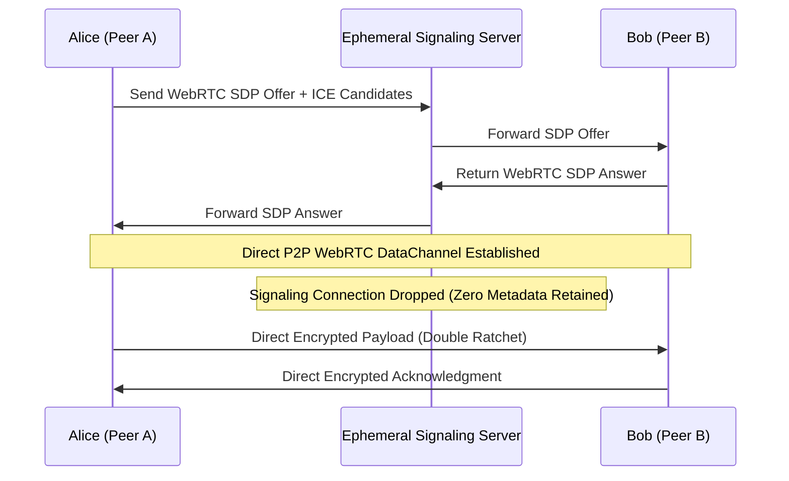

# Case Study: Ghost Messenger / Calypso (Zero-Metadata P2P Messaging)

> Track: Project Case Studies (Cryptography & Zero-Knowledge)  
> Prerequisite Knowledge: WebRTC fundamentals, Signal Protocol (Double Ratchet), symmetric encryption  
> Estimated Build Time: 60 minutes  
> Target Project Outcome: Understanding peer-to-peer WebRTC DataChannels, metadata elimination, and serverless cryptographic identities

---

## 1. The Hook: Why You Need This in Your Arsenal

Most mainstream encrypted messaging apps (WhatsApp, Telegram, iMessage) advertise "End-to-End Encryption". While the message text itself is encrypted, these platforms rely on centralized company servers to route every packet.

Here is the privacy problem:
- **Metadata is often more revealing than content**. Even if the server cannot read your text, it logs who you talk to, what time you talk, your physical IP address, and how frequently you communicate.
- In legal subpoenas or infrastructure breaches, these metadata communication graphs are readily extracted.
- Account identities are tied to centralized telephone numbers or email addresses, linking real-world identities to messaging activity.

**Ghost Messenger (Calypso)** was engineered to eliminate communication metadata:
- Messages travel directly between peer devices over encrypted **WebRTC DataChannels**.
- The signaling server is purely ephemeral: it brokers the initial WebRTC connection (SDP offers/answers) and immediately disconnects without logging traffic.
- User identities are derived from **BIP-39 mnemonic seed phrases**—no telephone numbers, email addresses, or central accounts exist.

---

## 2. The Mental Model: Intuitive Analogy & Visual Topology

### The Central Post Office vs. Direct Walkie-Talkies
- **Centralized Messaging** is like sending sealed letters through a single central post office. Even if the letters are written in a secret code, the postmaster sees who sent the envelope to whom and keeps a logbook of every delivery.
- **Calypso** is like two people using direct, encrypted walkie-talkies. The server only acts as a matchmaker who introduces the two frequencies. Once connected, they talk directly across the airwaves with no intermediate recording.



---

## 3. Deep Dive: Under the Hood

### The Double Ratchet Algorithm
The Signal Protocol's **Double Ratchet** algorithm combines two distinct cryptographic ratchets for every message exchange:
1. **The Symmetric KDF Ratchet**: Every message sent or received advances a key derivation function (KDF) chain, deriving a fresh encryption key for that specific message and immediately destroying the previous key.
2. **The Diffie-Hellman (DH) Ratchet**: Every time a reply is received, a new ephemeral Diffie-Hellman key exchange is completed, creating an entirely new root key.

### Security Guarantees:
- **Forward Secrecy**: If an attacker compromises your device today, they cannot decrypt messages sent in the past because past keys were permanently destroyed.
- **Break-in Recovery (Post-Compromise Security)**: Even if an attacker temporarily accesses your current key, the next DH ratchet exchange generates a new root key, locking the attacker out of all future messages.

---

## 4. Zero-to-One Interactive Playground: Build It From Scratch

Let us review how to establish an in-memory WebRTC DataChannel connection between two peers in JavaScript.

### Peer Connection Playground (`p2p-channel.ts`)
```typescript
// Example: Conceptual zero-metadata peer connection
export class PeerChannel {
  private pc: RTCPeerConnection;
  private dataChannel: RTCDataChannel | null = null;

  constructor(private isInitiator: boolean, onMessageReceived: (msg: string) => void) {
    this.pc = new RTCPeerConnection({
      iceServers: [{ urls: 'stun:stun.l.google.com:19302' }],
    });

    if (this.isInitiator) {
      // Initiator creates the WebRTC data channel
      this.dataChannel = this.pc.createDataChannel('chat', { ordered: true });
      this.setupDataChannel(this.dataChannel, onMessageReceived);
    } else {
      // Receiver listens for the incoming channel
      this.pc.ondatachannel = (event) => {
        this.dataChannel = event.channel;
        this.setupDataChannel(this.dataChannel, onMessageReceived);
      };
    }
  }

  private setupDataChannel(channel: RTCDataChannel, callback: (msg: string) => void) {
    channel.onopen = () => console.log('[P2P] Direct DataChannel opened! Signaling no longer needed.');
    channel.onmessage = (event) => callback(event.data);
  }

  public sendMessage(encryptedPayload: string): void {
    if (this.dataChannel && this.dataChannel.readyState === 'open') {
      // Transmitted directly peer-to-peer over DTLS-SRTP
      this.dataChannel.send(encryptedPayload);
    } else {
      throw new Error('P2P DataChannel is not open.');
    }
  }
}
```

---

## 5. Battle Scars: What Breaks in Production & How to Debug It

### Top 3 Hard-Won Lessons from Calypso
1. **Symmetric NAT Traversal**: Many mobile carriers and corporate firewalls place devices behind strict Symmetric NATs, preventing direct peer-to-peer UDP connections. While STUN servers help discover public IPs, strict NATs require a fallback TURN relay server.
2. **Offline Message Queuing**: Pure peer-to-peer architectures cannot deliver a message if the recipient's phone is currently turned off. Calypso addresses this by storing encrypted, time-limited blobs in temporary peer caches or requiring real-time session availability.
3. **WebRTC Signaling Message Collisions**: If both peers send simultaneous connection offers (Glare condition), the handshake can stall. Implement the standard "Perfect Negotiation" pattern using polite/impolite peer roles to resolve collisions cleanly.

---

## 6. The Weekend Hackathon Challenge: Your Turn to Build

### Challenge: The Serverless P2P File Dropper
Build a web application that sends files directly between two browser tabs without uploading them to any backend server.

- **Level 1 (Core)**: Exchange SDP offers and answers via a temporary WebSocket server, then send text messages peer-to-peer over WebRTC.
- **Level 2 (Advanced)**: Transfer binary image files by slicing `ArrayBuffer` data into 16KB chunks with transmission progress bars.
- **Level 3 (Hardcore)**: Implement account identity generation from a 12-word BIP-39 mnemonic seed using `@scure/bip39`, signing session invites with an Ed25519 keypair.

---

## 7. Knowledge Check & Next Steps

1. **Scenario**: Why is metadata (sender, recipient, timing) often considered as sensitive as the message content itself?  
   *Answer*: Metadata reveals patterns of communication, relationships, locations, and schedules, allowing observers to construct behavioral profiles even without message text.
2. **Scenario**: How does the Signal Protocol's Double Ratchet achieve Break-in Recovery?  
   *Answer*: Every reply introduces a new Diffie-Hellman key exchange that produces an entirely fresh root key, restoring confidentiality even after a temporary compromise.
3. **Scenario**: What is the purpose of a STUN server in WebRTC?  
   *Answer*: A STUN server allows a device behind a NAT router to discover its own public IP address and port so it can share them with peers.

Next Case Study: [ErgonPDF: Client-Side Document Workspace](../../client-side-wasm-compute/ergonpdf-document-workspace.md)
