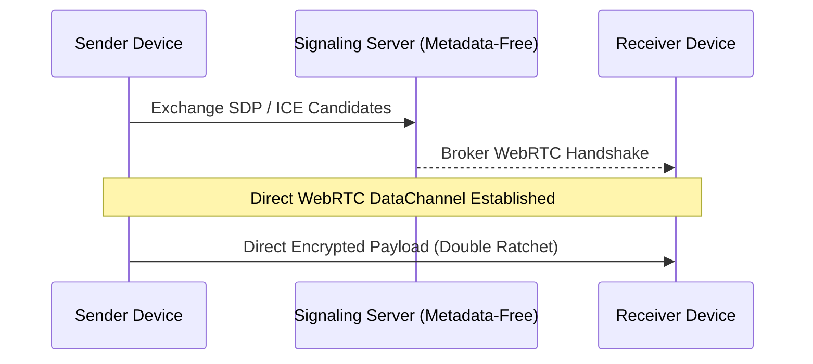

# Case Study: Ghost Messenger / Calypso (Zero-Metadata P2P Messaging)

> **Platform**: Android Native Client  
> **Tech Stack**: Kotlin, Jetpack Compose, WebRTC DataChannel, Signal Protocol, SQLCipher, BIP-39

---

## 1. System Overview

Calypso is a privacy-first, peer-to-peer messaging application. Messages travel directly between devices over an encrypted WebRTC DataChannel, using the Signal Protocol (Double Ratchet) for end-to-end security.

---

## 2. Key Architectural Decisions

- **Signal Protocol (Double Ratchet)**: Provides forward secrecy and break-in recovery for every message exchange.
- **Serverless BIP-39 Identities**: Users generate 12/24-word seed phrases to manage identity and recovery; no phone numbers, email addresses, or accounts are required.
- **Local Storage Encryption with SQLCipher**: Message history on the device is encrypted with SQLCipher, keyed by the hardware-backed identity seed.

---

## 3. What Was Learned

- **Signaling Metadata Hazards**: Centralized messaging servers leak metadata (who communicated with whom and when) even when payloads are encrypted. Using peer-to-peer data channels eliminates this metadata trail.
- **NAT Traversal in Restrictive Networks**: Establishing direct WebRTC connections through cellular carriers requires fallback TURN servers without allowing the TURN broker to decrypt payloads.
