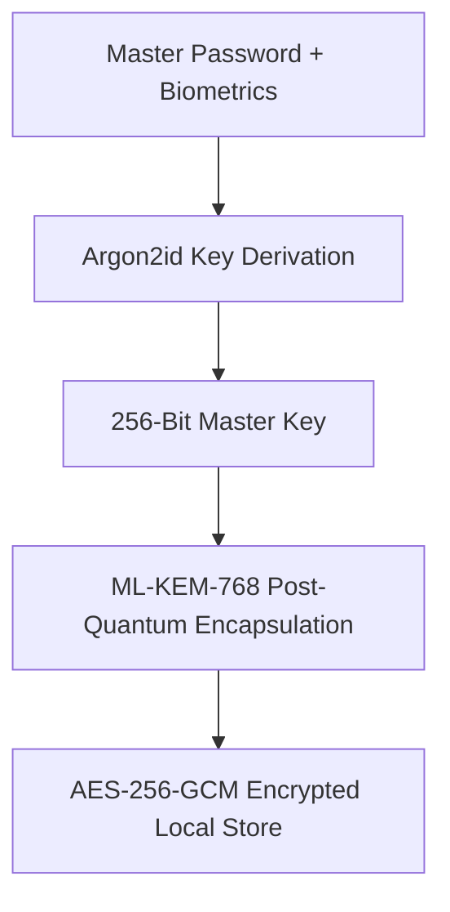

# Case Study: Kryptyx (Post-Quantum Password Fortress)

> **Platform**: Android 16 (API 36)  
> **Tech Stack**: Kotlin 2.3, Jetpack Compose, ML-KEM-768, AES-256-GCM, Argon2id, Android BiometricPrompt & Keystore

---

## 1. System Overview

Kryptyx is an offline password fortress built from the user's perspective: simple, intuitive, and mathematically fortified. It provides defense-in-depth against both classical adversaries and future quantum computers.

---

## 2. Key Architectural Decisions

- **Zero Network Permissions**: The `android.permission.INTERNET` flag is completely excluded from the Android manifest, delivering an air-gapped security model.
- **Biometric Hardware Keystore**: The master decryption key is backed by hardware-isolated Android Keystore primitives requiring direct biometric user presence (`BiometricPrompt`).
- **Memory Zeroization**: Plaintext credentials are wiped from volatile memory immediately after use to prevent memory-dump attacks.

---

## 3. What Was Learned

- **The Human Element in Security**: If a security tool feels intimidating, users avoid it or take shortcuts. Presenting simple UX over complex cryptographic mechanics drove consistent user adoption.
- **Volatile Memory Handling in Managed Runtimes**: Standard garbage collection does not guarantee timely memory erasure. Sensitive material must be held in primitive byte arrays and overwritten with zeroes explicitly.
