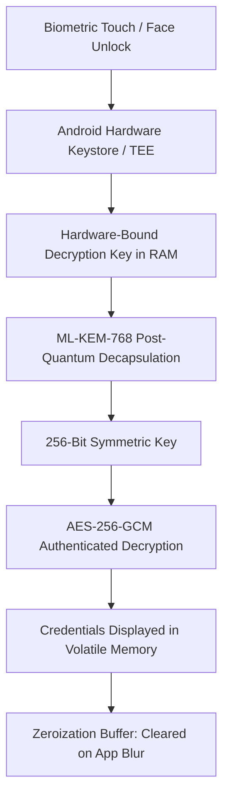

# Case Study: Kryptyx (Post-Quantum Android Password Fortress)

> Track: Project Case Studies (Cryptography & Zero-Knowledge)  
> Prerequisite Knowledge: Android / Kotlin fundamentals, symmetric vs. asymmetric encryption, post-quantum lattices  
> Estimated Build Time: 60 minutes  
> Target Project Outcome: Understanding air-gapped mobile security, zero-network permissions, ML-KEM-768 lattice cryptography, and hardware keystore integration

---

## 1. The Hook: Why You Need This in Your Arsenal

Password managers are the most targeted class of consumer software on earth. When a cloud-hosted password manager is breached, attackers gain access to millions of master password vaults. Even when encrypted, these vaults face two critical threats:
1. **GPU Cracking Farms**: If the vault derivation key was generated with standard hashing algorithms, high-end GPU clusters can test billions of combinations per second.
2. **The "Harvest-Now, Decrypt-Later" Quantum Threat**: Adversaries capture and archive encrypted corporate and government traffic today, waiting for fault-tolerant quantum computers (running Shor's algorithm) to crack the underlying asymmetric keys.

**Kryptyx** was engineered as an uncompromising, air-gapped mobile fortress:
- It excludes the `android.permission.INTERNET` flag entirely from the OS manifest, making remote data exfiltration physically impossible.
- It protects credentials with **ML-KEM-768** (NIST-standardized post-quantum lattice cryptography) layered with **AES-256-GCM** and memory-hard **Argon2id**.
- Decryption keys are bound directly to the device's hardware Secure Element / Trusted Execution Environment (TEE) via Android's `BiometricPrompt`.

---

## 2. The Mental Model: Intuitive Analogy & Visual Topology

### The Cloud Safe Deposit Box vs. The Buried Bunker
- **Cloud Password Managers** are like a safe deposit box inside a commercial bank. It is convenient and accessible from any branch in the world, but if the bank's security perimeter is breached, your box is exposed to the vault crackers.
- **Kryptyx** is like a safe buried ten feet under solid concrete in your private basement with no phone lines, internet cables, or windows. The only way to open it is to stand directly over it with your own physical key and biometric fingerprint.



---

## 3. Deep Dive: Under the Hood

### Zero-Network Permissions as an Invariant
In Android development, declaring permissions inside `AndroidManifest.xml` controls access to OS capabilities:

```xml
<!-- In normal apps: -->
<uses-permission android:name="android.permission.INTERNET" />

<!-- In Kryptyx: THIS LINE IS DELIBERATELY OMITTED -->
```

By omitting this permission:
1. The Linux kernel under Android denies the app process from creating any TCP or UDP network sockets.
2. Even if a dependency or rogue library tries to make an HTTP request, the OS kernel rejects it immediately with a `SecurityException`.
3. The security model is enforced at the operating system level, not through application logic alone.

---

## 4. Zero-to-One Interactive Playground: Build It From Scratch

Let us review the core cryptographic architecture of an Android Biometric hardware-bound key setup in Kotlin.

### Kotlin Implementation Concept (`BiometricKeystore.kt`)
```kotlin
package com.kryptyx.security

import android.security.keystore.KeyGenParameterSpec
import android.security.keystore.KeyProperties
import java.security.KeyStore
import javax.crypto.Cipher
import javax.crypto.KeyGenerator
import javax.crypto.SecretKey

object BiometricKeystore {
    private const val ANDROID_KEYSTORE = "AndroidKeyStore"
    private const val KEY_ALIAS = "KryptyxMasterVaultKey"

    /**
     * Generates a 256-bit AES key inside the device's hardware Secure Element (TEE)
     * configured to require biometric authentication for every use.
     */
    fun getOrCreateHardwareKey(): SecretKey {
        val keyStore = KeyStore.getInstance(ANDROID_KEYSTORE).apply { load(null) }

        if (keyStore.containsAlias(KEY_ALIAS)) {
            val entry = keyStore.getEntry(KEY_ALIAS, null) as KeyStore.SecretKeyEntry
            return entry.secretKey
        }

        val keyGenerator = KeyGenerator.getInstance(
            KeyProperties.KEY_ALGORITHM_AES,
            ANDROID_KEYSTORE
        )

        val keyGenSpec = KeyGenParameterSpec.Builder(
            KEY_ALIAS,
            KeyProperties.PURPOSE_ENCRYPT or KeyProperties.PURPOSE_DECRYPT
        )
            .setBlockModes(KeyProperties.BLOCK_MODE_GCM)
            .setEncryptionPaddings(KeyProperties.ENCRYPTION_PADDING_NONE)
            .setKeySize(256)
            // Critical Invariant: Requires user biometric presence for access
            .setUserAuthenticationRequired(true)
            .setUserAuthenticationParameters(
                0, // 0 = requires authentication for every single invocation
                KeyProperties.AUTH_BIOMETRIC_STRONG
            )
            .build()

        keyGenerator.init(keyGenSpec)
        return keyGenerator.generateKey()
    }

    fun getCipher(): Cipher {
        return Cipher.getInstance("AES/GCM/NoPadding")
    }
}
```

---

## 5. Battle Scars: What Breaks in Production & How to Debug It

### Top 3 Hard-Won Lessons from Kryptyx
1. **Garbage Collector Retaining Password Strings**: In Kotlin/Java, `java.lang.String` is immutable. If a user's password is held in a `String`, it cannot be manually wiped and remains in memory until the garbage collector runs. Always store plaintext passwords in a `CharArray` or `ByteArray` and invoke `java.util.Arrays.fill(buffer, 0.toByte())` immediately after use.
2. **Android Keystore Invalidation on Biometric Enrollment Changes**: When a user registers a new fingerprint in Android system settings, keys created with `setInvalidatedByBiometricEnrollment(true)` are permanently invalidated by the OS to prevent unauthorized access. The app must detect this error and provide an authenticated recovery path using the user's master mnemonic phrase.
3. **Screen Capture and Recents Leaks**: By default, Android takes a screenshot of your activity when the user switches apps. To protect secrets from appearing in the task switcher, always enable `window.setFlags(WindowManager.LayoutParams.FLAG_SECURE, WindowManager.LayoutParams.FLAG_SECURE)`.

---

## 6. The Weekend Hackathon Challenge: Your Turn to Build

### Challenge: The Air-Gapped Secret Notes App
Build an Android or desktop application that acts as an air-gapped vault.

- **Level 1 (Core)**: Verify zero network access and store notes encrypted with AES-256-GCM.
- **Level 2 (Advanced)**: Integrate hardware biometric authentication (`BiometricPrompt` on Android or TouchID/Windows Hello on desktop).
- **Level 3 (Hardcore)**: Implement QR-code data transfer: export and import encrypted backups between two completely air-gapped phones using animated multi-part QR codes.

---

## 7. Knowledge Check & Next Steps

1. **Scenario**: Why does omitting the `INTERNET` permission in Android provide a stronger security guarantee than client-side code checks?  
   *Answer*: The OS kernel enforces network restrictions directly, preventing any code or third-party dependency from opening a network socket.
2. **Scenario**: Why must passwords be held in `CharArray` instead of `String` in secure applications?  
   *Answer*: Strings are immutable in memory and cannot be wiped manually, whereas arrays can be zeroed out in RAM immediately after use.
3. **Scenario**: How does `FLAG_SECURE` protect mobile apps?  
   *Answer*: It prevents screen recording, user screenshots, and thumbnail caching in the operating system's recent apps switcher.

Next Case Study: [Calypso: Zero-Metadata P2P Messaging](./calypso-ghost-messenger.md)
