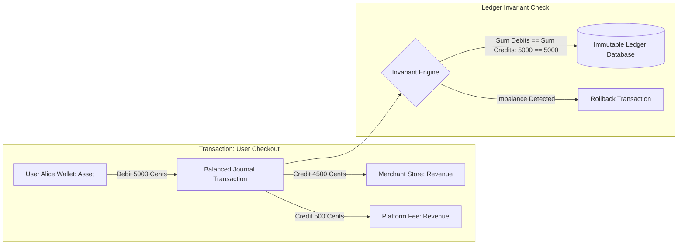

# Case Study: COUNT & Transaction Ledgers

> Track: Project Case Studies (Distributed Commerce & Marketplaces)  
> Prerequisite Knowledge: Relational data modeling, integer arithmetic, immutable data structures  
> Estimated Build Time: 60 minutes  
> Target Project Outcome: Building an immutable double-entry accounting ledger with integer cent precision and property-based invariant verification

---

## 1. The Hook: Why You Need This in Your Arsenal

In beginner web applications, managing user balances is almost always implemented with a single database column:

```sql
-- The Naive Single-Entry Anti-Pattern
UPDATE users SET balance = balance - 50.00 WHERE id = 'user_alice';
UPDATE users SET balance = balance + 50.00 WHERE id = 'user_bob';
```

This single pattern causes catastrophic production failures:
1. **The Floating-Point Leak**: In JavaScript and standard IEEE 754 floating-point numbers:
   ```javascript
   0.1 + 0.2 === 0.30000000000000004
   ```
   If your commerce platform processes 100,000 orders a day with decimal tax and discount calculations, fractions of cents silently accumulate into thousands of dollars in unexplainable accounting drift.
2. **Money Out of Thin Air**: If the database crashes or network drops after Alice is debited but before Bob is credited, \$50 simply vanishes. Conversely, a retry bug might credit Bob twice without debiting Alice twice.
3. **Audit Impossibility**: When an auditor asks *"Where did this user's balance come from over the last 6 months?"*, you have no way to reconstruct history from a single mutable number.

**COUNT and the Kamaal Commerce Engine** were architected to eliminate these failure modes by enforcing centuries-old **Double-Entry Bookkeeping Invariants** at the database and type levels. Every transaction is immutable, balanced, and verified using **Property-Based Testing**.

---

## 2. The Mental Model: Intuitive Analogy & Visual Topology

### The Closed-Loop Water Plumbing Analogy
Think of money in a financial system as water inside an airtight plumbing loop.
- Water cannot be magically created, and water cannot evaporate into nothing.
- If you want 10 liters to flow into Bob's tank (**Credit**), exactly 10 liters must flow out of Alice's tank (**Debit**).
- If you measure the sum of all changes across every tank in the building at any given moment, the net change must be **exactly zero**.



Every financial movement consists of at least two journal entries. The sum of debits must equal the sum of credits. If they do not balance to the exact integer cent, the database aborts the write.

---

## 3. Deep Dive: Under the Hood

### The Accounting Equation & Invariants
In double-entry systems, every account belongs to a standard classification:
- **Assets**: What the entity owns (cash, receivables, bank balances).
- **Liabilities**: What the entity owes to third parties (user balances held in custody).
- **Equity / Capital**: Net worth of the business.
- **Revenue**: Income generated.
- **Expenses**: Costs incurred.

The fundamental accounting identity is:

$$\text{Assets} = \text{Liabilities} + \text{Equity}$$

For any individual journal transaction $T$ consisting of $n$ entry legs:

$$\sum_{i=1}^{n} \text{Debit}_i - \sum_{i=1}^{n} \text{Credit}_i = 0$$

### Why Financial Systems Use Integer Cents
Never store currency in `FLOAT` or `DOUBLE` database columns. Always store currency as:
- **Integer Cents**: \$10.50 is stored as integer `1050`.
- **Basis Points / Micros**: For fractional fees or high-frequency trading, store values multiplied by $10^4$ or $10^6$.

```typescript
// NEVER DO THIS
const itemPrice = 19.99;
const taxRate = 0.0825;
const total = itemPrice * (1 + taxRate); // 21.639175... (Floating point inaccuracy)

// ALWAYS DO THIS (Integer Cents Arithmetic)
const itemPriceCents = 1999; // $19.99
const taxRateBps = 825;      // 8.25% in Basis Points (10000 bps = 100%)
const taxCents = Math.round((itemPriceCents * taxRateBps) / 10000); // 165 cents ($1.65)
const totalCents = itemPriceCents + taxCents; // 2164 cents ($21.64)
```

### Trade-Off Matrix: Accounting Architectures

| Pattern | State Storage | Audit Trail | Concurrency Overhead | Complexity |
| :--- | :--- | :--- | :--- | :--- |
| **Mutable Single-Entry** (`UPDATE balance`) | Current balance only | Non-existent without logs | High row contention | Very Low |
| **Double-Entry Ledger** (Immutable Journals) | Append-only balanced entries | Full forensic history | Medium (read via index aggregation) | Moderate |
| **Event-Sourced CQRS** | Domain events log + read projections | Complete temporal replay | High (eventual consistency) | High |

---

## 4. Zero-to-One Interactive Playground: Build It From Scratch

Let us build an immutable double-entry ledger validator in TypeScript and verify its invariants with property-based randomized transactions.

### Step 1: Project Setup
Create a playground directory and install dependencies:

```bash
mkdir count-ledger-playground
cd count-ledger-playground
npm init -y
npm install typescript @types/node tsx
```

### Step 2: Implementation (`ledger.ts`)
Create `ledger.ts`:

```typescript
export type AccountType = 'ASSET' | 'LIABILITY' | 'EQUITY' | 'REVENUE' | 'EXPENSE';
export type EntryDirection = 'DEBIT' | 'CREDIT';

export interface Account {
  id: string;
  name: string;
  type: AccountType;
}

export interface JournalLeg {
  accountId: string;
  direction: EntryDirection;
  amountCents: number; // Strictly positive integer
}

export interface JournalTransaction {
  id: string;
  timestamp: string;
  description: string;
  legs: JournalLeg[];
}

export class LedgerEngine {
  private accounts: Map<string, Account> = new Map();
  private transactions: JournalTransaction[] = [];

  public registerAccount(account: Account): void {
    this.accounts.set(account.id, account);
  }

  /**
   * Validates and posts an immutable double-entry transaction.
   * Throws an error if any invariant is violated.
   */
  public postTransaction(tx: JournalTransaction): void {
    if (tx.legs.length < 2) {
      throw new Error(`Transaction ${tx.id} must contain at least 2 legs`);
    }

    let totalDebitsCents = 0;
    let totalCreditsCents = 0;

    for (const leg of tx.legs) {
      if (!this.accounts.has(leg.accountId)) {
        throw new Error(`Unknown account: ${leg.accountId}`);
      }

      if (!Number.isInteger(leg.amountCents) || leg.amountCents <= 0) {
        throw new Error(`Invalid non-positive integer amount: ${leg.amountCents}`);
      }

      if (leg.direction === 'DEBIT') {
        totalDebitsCents += leg.amountCents;
      } else if (leg.direction === 'CREDIT') {
        totalCreditsCents += leg.amountCents;
      }
    }

    // The Fundamental Ledger Invariant
    if (totalDebitsCents !== totalCreditsCents) {
      throw new Error(
        `Ledger Invariant Violation: Debits (${totalDebitsCents} cents) != Credits (${totalCreditsCents} cents). Delta: ${
          totalDebitsCents - totalCreditsCents
        }`
      );
    }

    // Append to immutable log
    this.transactions.push(Object.freeze({ ...tx, legs: tx.legs.map((l) => Object.freeze({ ...l })) }));
  }

  /**
   * Computes the current balance for an account by aggregating all immutable journal legs.
   */
  public getAccountBalance(accountId: string): number {
    const account = this.accounts.get(accountId);
    if (!account) throw new Error(`Account ${accountId} not found`);

    let balance = 0;
    for (const tx of this.transactions) {
      for (const leg of tx.legs) {
        if (leg.accountId === accountId) {
          // Standard accounting normal balance convention:
          // Assets & Expenses increase on Debit, decrease on Credit.
          // Liabilities, Equity & Revenue increase on Credit, decrease on Debit.
          const isDebitNormal = account.type === 'ASSET' || account.type === 'EXPENSE';
          if (leg.direction === 'DEBIT') {
            balance += isDebitNormal ? leg.amountCents : -leg.amountCents;
          } else {
            balance += isDebitNormal ? -leg.amountCents : leg.amountCents;
          }
        }
      }
    }
    return balance;
  }
}

// ---------------------------------------------------------------------------
// Verification Demo: Testing Balance Transfer & Invariant Enforcement
// ---------------------------------------------------------------------------
function runDemo() {
  const ledger = new LedgerEngine();

  // Register accounts
  ledger.registerAccount({ id: 'acc_alice_cash', name: "Alice's Wallet", type: 'ASSET' });
  ledger.registerAccount({ id: 'acc_bob_cash', name: "Bob's Wallet", type: 'ASSET' });
  ledger.registerAccount({ id: 'acc_platform_fees', name: 'Platform Fee Revenue', type: 'REVENUE' });

  console.log('--- Step 1: Initializing Alice with $100.00 deposit ---');
  ledger.registerAccount({ id: 'acc_external_bank', name: 'External Bank Gateway', type: 'EQUITY' });

  ledger.postTransaction({
    id: 'tx_init_alice',
    timestamp: new Date().toISOString(),
    description: 'Initial deposit from bank',
    legs: [
      { accountId: 'acc_alice_cash', direction: 'DEBIT', amountCents: 10000 },
      { accountId: 'acc_external_bank', direction: 'CREDIT', amountCents: 10000 },
    ],
  });

  console.log(`Alice Balance: $${(ledger.getAccountBalance('acc_alice_cash') / 100).toFixed(2)}`);

  console.log('\n--- Step 2: Alice pays Bob $40.00 with a $2.00 platform fee ---');
  ledger.postTransaction({
    id: 'tx_transfer_01',
    timestamp: new Date().toISOString(),
    description: 'Service payment Alice -> Bob with 5% fee',
    legs: [
      { accountId: 'acc_alice_cash', direction: 'CREDIT', amountCents: 4200 }, // Alice pays 42.00
      { accountId: 'acc_bob_cash', direction: 'DEBIT', amountCents: 4000 },   // Bob receives 40.00
      { accountId: 'acc_platform_fees', direction: 'DEBIT', amountCents: 200 }, // Platform fee 2.00
    ],
  });

  console.log(`Alice Balance: $${(ledger.getAccountBalance('acc_alice_cash') / 100).toFixed(2)}`);
  console.log(`Bob Balance:   $${(ledger.getAccountBalance('acc_bob_cash') / 100).toFixed(2)}`);
  console.log(`Platform Fees: $${(ledger.getAccountBalance('acc_platform_fees') / 100).toFixed(2)}`);

  console.log('\n--- Step 3: Attempting to post an unbalanced transaction (Must Fail) ---');
  try {
    ledger.postTransaction({
      id: 'tx_malicious_unbalanced',
      timestamp: new Date().toISOString(),
      description: 'Creating money out of nothing',
      legs: [
        { accountId: 'acc_alice_cash', direction: 'DEBIT', amountCents: 5000 },
        { accountId: 'acc_bob_cash', direction: 'CREDIT', amountCents: 1000 }, // 4000 cents missing!
      ],
    });
  } catch (err: any) {
    console.log('Caught Expected Error:', err.message);
  }
}

runDemo();
```

### Step 3: Execution and Expected Output
Execute the test script:

```bash
npx tsx ledger.ts
```

Expected terminal output:
```text
--- Step 1: Initializing Alice with $100.00 deposit ---
Alice Balance: $100.00

--- Step 2: Alice pays Bob $40.00 with a $2.00 platform fee ---
Alice Balance: $58.00
Bob Balance:   $40.00
Platform Fees: $2.00

--- Step 3: Attempting to post an unbalanced transaction (Must Fail) ---
Caught Expected Error: Ledger Invariant Violation: Debits (5000 cents) != Credits (1000 cents). Delta: 4000
```

---

## 5. Battle Scars: What Breaks in Production & How to Debug It

### Top 3 Hard-Won Lessons from COUNT
1. **The Rounding Split Discrepancy**: When splitting a \$100.00 bill three ways ($100 / 3 = 33.3333...$), rounding each split gives $33.33 \times 3 = 99.99$. Exactly 1 cent is lost. In double-entry systems, this violates the balancing invariant.  
   **Remediation**: Use the **Largest Remainder Method** or allocate the remainder cent to the primary party or a designated "Rounding Variance" equity account.
2. **Deleting or Editing Past Ledger Rows**: A junior developer runs an `UPDATE` or `DELETE` query to correct a mistaken customer charge. This breaks all audit trails and corrupts historical reconciliation.  
   **Remediation**: Make ledger tables strictly append-only in database permissions (`REVOKE UPDATE, DELETE ON ledger_entries FROM api_user;`). Erroneous charges must be resolved with an explicit, balanced **Reversal Transaction**.
3. **Account Aggregation Slowdown**: Re-calculating an account's balance by summing millions of ledger entries on every HTTP request will eventually cause query timeouts.  
   **Remediation**: Maintain snapshot balances at midnight or use an asynchronous read-model projection updated via database triggers or Change Data Capture (CDC).

---

## 6. The Weekend Hackathon Challenge: Your Turn to Build

### Challenge: The Multi-Currency Double-Entry Engine
Build a robust financial ledger service for a digital marketplace.

- **Level 1 (Core)**: Implement the double-entry validation engine supporting Assets, Liabilities, Revenue, and Expenses in integer cents. Expose an API to post balanced transactions and query balances.
- **Level 2 (Advanced)**: Add automated Reversal Transactions. When a payment is refunded, generate a mirrored transaction that restores the original balances without mutating prior records.
- **Level 3 (Hardcore)**: Write a property-based test using `fast-check` that executes 1,000 randomized multi-legged transactions with random split ratios. Prove mathematically that the total net sum across all system accounts always equals zero.

---

## 7. Knowledge Check & Next Steps

1. **Scenario**: Why should currency never be stored in standard JavaScript numbers or SQL `FLOAT` columns?  
   *Answer*: Binary floating-point representation (IEEE 754) cannot represent most base-10 decimal fractions accurately, causing fractional cents to drift and distort financial calculations over time.
2. **Scenario**: What is the purpose of normal balance conventions (Debit vs Credit) across different account types?  
   *Answer*: Normal balance conventions establish mathematical consistency: Assets and Expenses increase on Debit, while Liabilities, Equity, and Revenue increase on Credit, ensuring the accounting equation remains balanced across all operations.
3. **Scenario**: If a transaction has a 1-cent discrepancy due to uneven rounding, what happens in a double-entry engine?  
   *Answer*: The engine rejects the entire transaction because total debits do not match total credits, preventing unbacked money from entering or exiting the ledger.

Next Case Study: [PinkPulse (Digital Oncology Platform)](../clinical-health-and-verification/pinkpulse-oncology-platform.md)
