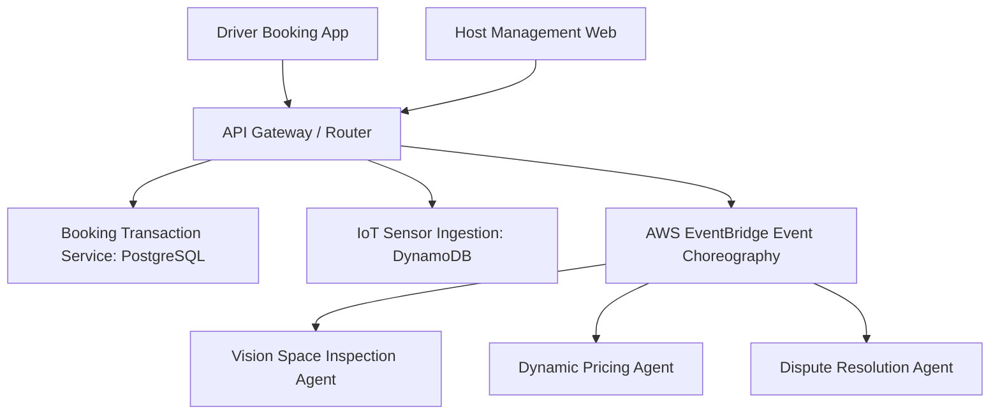

# Case Study: Parkly (Multi-Agent Parking Marketplace)

> **Platform**: Mobile (React Native Expo) & Web (React 18 / Vite)  
> **Tech Stack**: Node.js, TypeScript, PostgreSQL, Prisma ORM, AWS DynamoDB, AWS CDK, EventBridge

---

## 1. System Overview

Parkly is an AI-powered smart parking marketplace that unlocks urban parking capacity by connecting drivers with underutilized private driveways and commercial parking inventory.

---

## 2. Key Architectural Decisions

- **Multi-Agent Ecosystem**: Autonomous AI agents handle driveway photo validation, zoning verification, real-time demand tariff optimization, and dispute arbitration.
- **Dual-Database Strategy**: Relational PostgreSQL for ACID bookings and user financial ledgers; NoSQL DynamoDB for time-series IoT occupancy sensor telemetry.
- **Master Documentation Suite**: Developed an 8-part architectural specification suite covering business validation, unit economics, ERDs, and sprint roadmaps before writing application code.

---

## 3. What Was Learned

- **Concurrency Race Conditions**: High-demand slots require strict database transaction isolation (e.g. `SELECT FOR UPDATE` or version-incremented optimistic locking) to eliminate double-booking during concurrent reservations.
- **Value of Upfront Documentation**: Drafting full database schemas and service contracts in advance reduced mid-sprint architectural rework to near zero.
