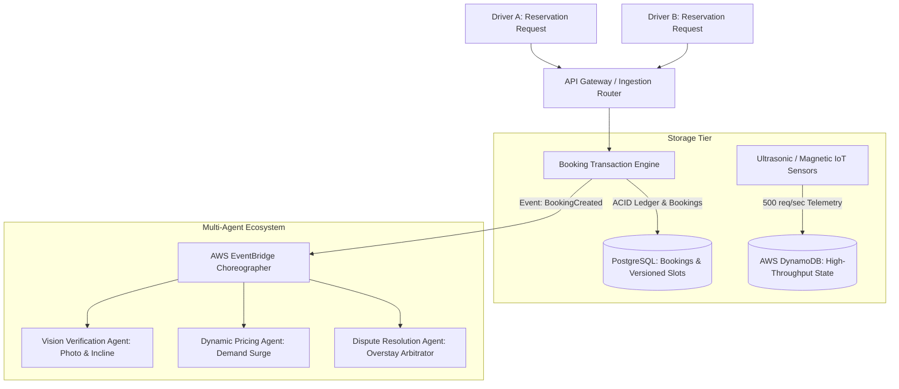

# Case Study: Parkly (Multi-Agent Parking Marketplace)

> Track: Project Case Studies (Distributed Commerce & Marketplaces)  
> Prerequisite Knowledge: Relational databases, SQL transactions, distributed event buses, optimistic concurrency  
> Estimated Build Time: 60 minutes  
> Target Project Outcome: Building a concurrent reservation engine with optimistic locking and event-choreographed multi-agent validation

---

## 1. The Hook: Why You Need This in Your Arsenal

Imagine deploying a smart parking marketplace app for a major downtown district. A major sporting event ends, and 500 drivers open your app simultaneously looking for parking.

Two drivers, Driver A and Driver B, spot the exact same parking spot: Driveway #42.
- At `10:00:00.100`, Driver A taps "Reserve Spot".
- At `10:00:00.105`, Driver B taps "Reserve Spot".

In a naive system, your backend does this:
1. `SELECT is_available FROM parking_spots WHERE id = 42;` (Returns `true` for both drivers).
2. `UPDATE parking_spots SET is_available = false WHERE id = 42;` (Executes for Driver A).
3. `UPDATE parking_spots SET is_available = false WHERE id = 42;` (Executes for Driver B).
4. Both drivers are charged \$25. Both receive a green confirmation screen.

Thirty minutes later, two angry drivers are standing in a suburban driveway, honking at each other, blocking traffic, and demanding chargebacks.

This is the classic **double-booking race condition**. In real-world commerce and physical resource allocation, database reads and writes cannot occur in isolation without concurrency controls.

**Parkly** solved this through:
- **Optimistic Concurrency Control (OCC)** using version increments to eliminate double-booking at zero database lock overhead.
- A **Dual-Database Architecture**: PostgreSQL for ACID financial bookings, paired with DynamoDB for high-throughput IoT sensor telemetry.
- **Event-Driven Multi-Agent Choreography**: AWS EventBridge routing asynchronous validation tasks to specialized AI workers (driveway photo verification, demand tariff pricing, and dispute arbitration).

---

## 2. The Mental Model: Intuitive Analogy & Visual Topology

### The Library Stamp Analogy
Think of a rare physical book in a library.
- **Naive approach**: Anyone can write their name on an index card claiming the book. If two people write their names simultaneously, both think they own it.
- **Pessimistic Locking**: The librarian locks the entire bookshelf with a physical padlock whenever anyone browses. No one else can look at any book until the first person finishes. (Safe, but creates massive waiting lines).
- **Optimistic Concurrency Control (OCC)**: The book has a stamped version number (e.g., `Edition Version: 7`). When you request to borrow it, you tell the librarian: *"I am checking out Book 42, assuming it is currently Version 7. If its version is still 7, stamp it to Version 8 and give it to me. If someone else changed the stamp to 8 while I walked to the counter, reject my request instantly."*

This allows thousands of users to read availability concurrently without locks, while guaranteeing that only the first write succeeds.



---

## 3. Deep Dive: Under the Hood

### Dual-Database Partitioning: PostgreSQL vs. DynamoDB
Physical marketplaces have two distinct data profiles:
1. **Financial and Legal Commitments (High Consistency, Low Velocity)**: User balances, spot ownership, rental agreements, and reservations. If a reservation is lost, money is lost. This belongs in **PostgreSQL** under strict ACID transaction isolation.
2. **Physical Sensor Telemetry (High Velocity, Ephemeral)**: Ultrasonic driveway sensors reporting vehicle presence every 5 seconds. Losing one ping does not break the business, but writing 50,000 pings per second into relational PostgreSQL causes connection exhaustion and WAL write saturation. This belongs in **DynamoDB** (NoSQL).

### Trade-Off Matrix: Concurrency Strategies

| Strategy | Mechanism | Read Performance | Write Contention | Best Use Case |
| :--- | :--- | :--- | :--- | :--- |
| **Pessimistic Locking** (`SELECT FOR UPDATE`) | Holds exclusive row locks during transaction | Low (concurrent reads blocked) | High deadlock risk | Banking balance transfers with high contention |
| **Optimistic Concurrency Control (OCC)** | Version counter check in `WHERE` clause | Very High (unlocked reads) | Retries on collision | Spot bookings, e-commerce shopping carts |
| **Distributed Redis Locks (Redlock)** | Mutex lock stored in Redis cluster with TTL | High | Network latency overhead | Cross-service multi-step workflows |

### The OCC SQL Invariant
Under Optimistic Concurrency Control, the SQL reservation query guarantees atomicity in a single statement:

```sql
UPDATE parking_spots
SET 
  is_occupied = TRUE,
  current_reservation_id = 'res_abc123',
  version = version + 1
WHERE 
  id = 'spot_42' 
  AND is_occupied = FALSE 
  AND version = 4;
```

If Driver A and Driver B both read `version = 4`:
- Driver A's update executes first. The row version increments to `5`. Exactly `1` row is affected.
- Driver B's update executes second. Because `version` is now `5`, the `WHERE version = 4` condition fails. Exactly `0` rows are affected.
- The application detects `affectedRows === 0` and rejects Driver B's request before charging their credit card.

---

## 4. Zero-to-One Interactive Playground: Build It From Scratch

Let us build an in-memory simulation of a concurrent parking reservation engine in TypeScript. We will demonstrate how concurrent requests collide and how Optimistic Concurrency Control cleanly prevents double-booking.

### Step 1: Project Setup
Create a playground directory and install TypeScript dependencies:

```bash
mkdir parkly-concurrency-playground
cd parkly-concurrency-playground
npm init -y
npm install typescript @types/node tsx
```

### Step 2: Implementation (`parking-engine.ts`)
Create `parking-engine.ts`:

```typescript
export interface ParkingSpot {
  id: string;
  locationName: string;
  isAvailable: boolean;
  version: number; // Monotonically increasing version counter
  reservedByUserId: string | null;
}

export interface ReservationResult {
  success: boolean;
  driverId: string;
  spotId: string;
  error?: string;
  versionAtBooking?: number;
}

export class ParkingEngine {
  private spots: Map<string, ParkingSpot> = new Map();

  constructor() {
    // Seed an initial parking spot at Version 1
    this.spots.set('spot-42', {
      id: 'spot-42',
      locationName: 'Downtown Garage Bay 42',
      isAvailable: true,
      version: 1,
      reservedByUserId: null,
    });
  }

  /**
   * Fetches the current snapshot of a parking spot.
   */
  public getSpot(spotId: string): ParkingSpot | undefined {
    const spot = this.spots.get(spotId);
    return spot ? { ...spot } : undefined;
  }

  /**
   * Attempts to reserve a parking spot using Optimistic Concurrency Control (OCC).
   * Atomically checks the version number before committing the update.
   */
  public reserveSpotWithOCC(
    spotId: string,
    driverId: string,
    expectedVersion: number
  ): ReservationResult {
    const currentSpot = this.spots.get(spotId);

    if (!currentSpot) {
      return { success: false, driverId, spotId, error: 'Spot does not exist' };
    }

    if (!currentSpot.isAvailable) {
      return { success: false, driverId, spotId, error: 'Spot is already occupied' };
    }

    // Atomic version invariant check
    if (currentSpot.version !== expectedVersion) {
      return {
        success: false,
        driverId,
        spotId,
        error: `OCC Conflict: Expected version ${expectedVersion}, but spot is at version ${currentSpot.version}`,
      };
    }

    // Mutate state atomically and increment version
    currentSpot.isAvailable = false;
    currentSpot.reservedByUserId = driverId;
    currentSpot.version += 1;

    return {
      success: true,
      driverId,
      spotId,
      versionAtBooking: currentSpot.version,
    };
  }
}

// ---------------------------------------------------------------------------
// Simulation: Two drivers competing for the same spot simultaneously
// ---------------------------------------------------------------------------
async function runSimulation() {
  const engine = new ParkingEngine();
  console.log('Initial Spot State:', engine.getSpot('spot-42'));

  // Both drivers read the spot at the exact same moment
  const driverASnapshot = engine.getSpot('spot-42')!;
  const driverBSnapshot = engine.getSpot('spot-42')!;

  console.log(`\nDriver A sees spot at version ${driverASnapshot.version}`);
  console.log(`Driver B sees spot at version ${driverBSnapshot.version}`);

  console.log('\n--- Both drivers submit reservation requests simultaneously ---');

  // Simulate slight asynchronous processing latency
  const promiseA = new Promise<ReservationResult>((resolve) => {
    setTimeout(() => {
      resolve(engine.reserveSpotWithOCC('spot-42', 'driver-alpha', driverASnapshot.version));
    }, 10);
  });

  const promiseB = new Promise<ReservationResult>((resolve) => {
    setTimeout(() => {
      resolve(engine.reserveSpotWithOCC('spot-42', 'driver-bravo', driverBSnapshot.version));
    }, 15);
  });

  const [resultA, resultB] = await Promise.all([promiseA, promiseB]);

  console.log('\nDriver A Result:', resultA);
  console.log('Driver B Result:', resultB);

  console.log('\nFinal Spot State:', engine.getSpot('spot-42'));
}

runSimulation();
```

### Step 3: Execution and Verification
Execute the script using `npx tsx`:

```bash
npx tsx parking-engine.ts
```

Expected terminal output:
```text
Initial Spot State: {
  id: 'spot-42',
  locationName: 'Downtown Garage Bay 42',
  isAvailable: true,
  version: 1,
  reservedByUserId: null
}

Driver A sees spot at version 1
Driver B sees spot at version 1

--- Both drivers submit reservation requests simultaneously ---

Driver A Result: {
  success: true,
  driverId: 'driver-alpha',
  spotId: 'spot-42',
  versionAtBooking: 2
}
Driver B Result: {
  success: false,
  driverId: 'driver-bravo',
  spotId: 'spot-42',
  error: 'OCC Conflict: Expected version 1, but spot is at version 2'
}

Final Spot State: {
  id: 'spot-42',
  locationName: 'Downtown Garage Bay 42',
  isAvailable: false,
  version: 2,
  reservedByUserId: 'driver-alpha'
}
```

Driver Alpha cleanly wins the spot; Driver Bravo receives an immediate conflict error without corrupting state or double-billing.

---

## 5. Battle Scars: What Breaks in Production & How to Debug It

### Top 3 Hard-Won Lessons from Parkly
1. **The Read-Then-Write Anti-Pattern in ORMs**: In naive Prisma or TypeORM code, engineers write:
   ```typescript
   const spot = await prisma.parkingSpot.findUnique({ where: { id } });
   if (spot.isAvailable) {
     await prisma.parkingSpot.update({ where: { id }, data: { isAvailable: false } });
   }
   ```
   Between the `findUnique` and `update` queries, another request can easily slip through. Always enforce the condition inside the `where` clause of the update:
   ```typescript
   const result = await prisma.parkingSpot.updateMany({
     where: { id, isAvailable: true, version: expectedVersion },
     data: { isAvailable: false, version: { increment: 1 } },
   });
   if (result.count === 0) throw new ConcurrencyConflictError();
   ```
2. **DynamoDB Hot Partitioning on IoT Streams**: When 5,000 sensors in the same city write to DynamoDB using `PartitionKey = city_id`, a single physical partition server gets overwhelmed and throttles writes. **Remediation**: Use composite partition keys with high cardinality (e.g., `PartitionKey = spot_id` or `PartitionKey = spot_id#YYYY-MM-DD`).
3. **Out-of-Order EventBridge Delivery**: Event buses guarantee at-least-once delivery, but network retries mean an `OverstayDetected` event might arrive before the initial `BookingConfirmed` event. **Remediation**: Enforce idempotency keys and state machine pre-condition checks on every downstream consumer.

---

## 6. The Weekend Hackathon Challenge: Your Turn to Build

### Challenge: The Concurrent Seat Booking Engine
Build a high-concurrency ticket and seat reservation service for a concert venue.

- **Level 1 (Core)**: Implement an in-memory venue with 100 seats. Support simultaneous booking requests from 50 simulated concurrent users using Optimistic Concurrency Control. Verify that no seat is booked twice.
- **Level 2 (Advanced)**: Add temporary reservations with a 5-minute Time-To-Live (TTL). If a user reserves a seat but does not complete payment within 5 minutes, an automated background reaper or queue restores availability.
- **Level 3 (Hardcore)**: Integrate an idempotency key cache. If a user double-clicks the "Pay" button and sends two identical network requests within 500 milliseconds, return the identical reservation result without processing a second charge.

---

## 7. Knowledge Check & Next Steps

1. **Scenario**: Why is Optimistic Concurrency Control generally preferred over Pessimistic Locking in web marketplaces?  
   *Answer*: Optimistic locking does not hold open database table or row locks during network roundtrips. Thousands of users can browse and read availability concurrently at full speed, with conflicts caught only at final checkout.
2. **Scenario**: What occurs if you use a single PostgreSQL table to ingest real-time IoT pings from 100,000 parking sensors every 3 seconds?  
   *Answer*: The database will experience severe write-ahead log (WAL) saturation, connection pool exhaustion, and ballooning table bloat, impacting critical user checkout transactions.
3. **Scenario**: How does an idempotency key prevent duplicate financial charges?  
   *Answer*: The server caches the client-provided unique key alongside the initial response. If an identical request arrives with the same key, the cached result is returned immediately without re-executing the payment logic.

Next Case Study: [COUNT & Transaction Ledgers](./count-and-transaction-ledgers.md)
