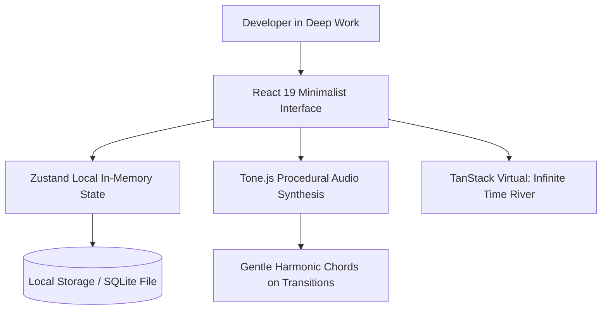

# Case Study: Aura 3.0 (Local-First Mindful Productivity)

> Track: Project Case Studies (Native Desktop & Systems)  
> Prerequisite Knowledge: React 19, state management concepts, Web Audio basics  
> Estimated Build Time: 45 minutes  
> Target Project Outcome: Understanding local-first state design, virtualized timelines, and synthesizing acoustic focus soundscapes with Tone.js

---

## 1. The Hook: Why You Need This in Your Arsenal

Most modern productivity tools (Notion, Jira, Linear) are engineered primarily as collaborative SaaS platforms. They rely on continuous cloud synchronization, external telemetry trackers, and recurring subscriptions.

When an engineer or student wants to enter a deep, focused flow state, cloud-dependent software introduces friction:
- Every time you open the app, network latency causes a loading spinner to flicker.
- Inactivity or minor connection drops trigger reconnection notifications.
- Background trackers monitor keystrokes and document edits, discouraging the recording of private thoughts or sensitive notes.

**Aura 3.0** was built to provide an intentional, distraction-free productivity environment:
- It runs 100% locally with zero cloud dependencies and zero analytics beacons.
- It incorporates real-time auditory feedback using Tone.js to ease task transitions.
- It uses `@tanstack/react-virtual` to render an infinite "Time River" chronology at a consistent 60 FPS.

---

## 2. The Mental Model: Intuitive Analogy & Visual Topology

### The Zen Garden vs. The Busy Marketplace
- Traditional project management tools are like a crowded street market: notifications flashing, network requests firing, and banners promoting upgrades.
- Aura 3.0 is designed like an enclosed stone garden: calm, private, offline, with acoustic chimes that provide gentle focus signals without visual distraction.



---

## 3. Deep Dive: Under the Hood

### Virtualized List Rendering with TanStack Virtual
If a user creates 10,000 tasks and journal entries over two years, rendering all 10,000 DOM nodes in a standard `div` will cause the browser to freeze and consume hundreds of megabytes of memory.

**DOM Virtualization** solves this:
- Instead of creating 10,000 elements, it computes the exact scroll offset of the container.
- It renders only the ~15 elements that are currently visible within the viewport, plus a small buffer of 2 elements above and below.
- As the user scrolls, the same 20 DOM nodes are dynamically reused with updated data.
- Result: Memory usage stays constant ($O(1)$), and scrolling remains smooth at 60 FPS regardless of list size.

---

## 4. Zero-to-One Interactive Playground: Build It From Scratch

Let us build an interactive prototype combining a lightweight local task store with Tone.js audio feedback.

### Step 1: Environment Setup
```bash
mkdir mindful-tasks
cd mindful-tasks
npm init -y
npm install tone zustand
npm install -D typescript tsx @types/node
npx tsc --init
```

### Step 2: Implementation (`mindful-engine.ts`)
Create `mindful-engine.ts`:

```typescript
import { create } from 'zustand';
import * as Tone from 'tone';

export interface Task {
  id: string;
  title: string;
  completed: boolean;
  timestamp: number;
}

interface TaskStore {
  tasks: Task[];
  addTask: (title: string) => void;
  toggleTask: (id: string) => void;
}

// Procedural audio synthesizer for subtle focus feedback
class Soundscape {
  private static synth: Tone.Synth | null = null;

  private static getSynth(): Tone.Synth {
    if (!this.synth) {
      this.synth = new Tone.Synth({
        oscillator: { type: 'sine' },
        envelope: { attack: 0.05, decay: 0.1, sustain: 0.3, release: 0.8 },
      }).toDestination();
    }
    return this.synth;
  }

  public static async playCompletionChime(): Promise<void> {
    if (Tone.context.state !== 'running') {
      await Tone.start();
    }
    const synth = this.getSynth();
    // Play warm major chord note (E5)
    synth.triggerAttackRelease('E5', '8n');
  }
}

export const useTaskStore = create<TaskStore>((set) => ({
  tasks: [],
  addTask: (title: string) => {
    set((state) => ({
      tasks: [
        {
          id: `task-${Date.now()}`,
          title,
          completed: false,
          timestamp: Date.now(),
        },
        ...state.tasks,
      ],
    }));
  },
  toggleTask: (id: string) => {
    set((state) => {
      const updated = state.tasks.map((t) => {
        if (t.id === id) {
          const nextState = !t.completed;
          if (nextState) {
            // Trigger audio cue when a task is completed
            Soundscape.playCompletionChime().catch(() => {});
          }
          return { ...t, completed: nextState };
        }
        return t;
      });
      return { tasks: updated };
    });
  },
}));
```

---

## 5. Battle Scars: What Breaks in Production & How to Debug It

### Top 3 Hard-Won Lessons from Aura 3.0
1. **Audio Context Autoplay Policies**: Browsers block Web Audio until the user interacts with the page (click or keypress). Attempting to play a chime during initial app boot throws unhandled promise rejections. Always gate audio initialization behind user gestures.
2. **State Desynchronization on Sudden Power Loss**: If using debounced file writes for local persistence, a sudden system shutdown can drop the last 500ms of changes. Solution: Write to a temporary file (`tasks.json.tmp`) and perform an atomic file rename (`fs.renameSync`) to prevent file corruption.
3. **Overusing Complex Animations**: Excessive spring physics and particle effects increase battery consumption on laptops. Restrict animations to purposeful visual feedback on focus transitions.

---

## 6. The Weekend Hackathon Challenge: Your Turn to Build

### Challenge: The Minimalist Local Journal
Build a distraction-free desktop or web application for reflective journaling.

- **Level 1 (Core)**: Fast keyboard shortcuts (`Ctrl+N` new note, `Ctrl+K` search) with automatic local storage saving.
- **Level 2 (Advanced)**: Integrate a virtualized list showing previous entries grouped by month, rendering smoothly across 5,000 entries.
- **Level 3 (Hardcore)**: Add a procedural ambient sound generator using Tone.js (e.g. gentle continuous white/pink noise or rain soundscape synthesis) with customizable frequency filters.

---

## 7. Knowledge Check & Next Steps

1. **Scenario**: How does list virtualization prevent memory bloat when displaying 10,000 tasks?  
   *Answer*: It renders only the items currently visible in the scroll viewport, reusing a small pool of DOM nodes instead of generating thousands of elements.
2. **Scenario**: Why does Tone.js require a user interaction before producing audio?  
   *Answer*: Modern web browsers enforce autoplay security policies that require a user gesture (such as a click or keypress) before activating an `AudioContext`.
3. **Scenario**: What makes atomic file renaming safer than direct file overwrites?  
   *Answer*: Atomic renaming (`fs.rename`) is guaranteed by the OS filesystem to either fully succeed or fail, preventing half-written corrupted files during unexpected crashes.

Next Case Study: [Kryptyx: Post-Quantum Password Fortress](../../cryptography-and-zero-knowledge/kryptyx-password-fortress.md)
