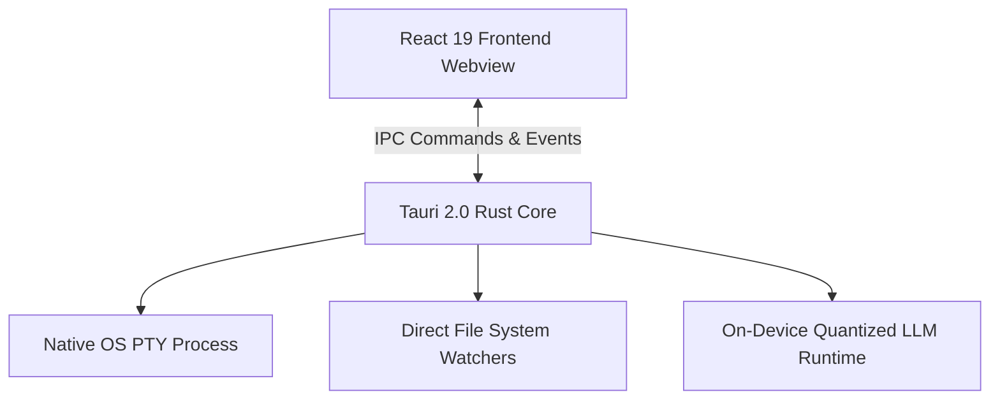

# Case Study: CodexOS (Native Developer Operating System)

> **Platform**: Windows, macOS, Linux  
> **Tech Stack**: Tauri 2.0, Rust, React 19, TypeScript, Monaco Editor, xterm.js, TanStack Virtual

---

## 1. System Overview

CodexOS is an offline developer workstation that unifies an in-app Monaco code editor, low-latency terminal emulator, local process manager, and on-device AI root-cause diagnostics within a glassmorphic interface.

---

## 2. Key Architectural Decisions

- **Tauri 2.0 over Electron**: Cut base idle RAM consumption from ~650MB to ~45MB, freeing resources for developer compile jobs.
- **Rust IPC Channels**: Spawning shell processes (PTY) and managing process signals (`SIGTERM`, `SIGKILL`) across POSIX and Windows channels with Rust type safety.
- **Offline Root-Cause Diagnostics**: Analyzing stack traces and system logs locally without transmitting source code to cloud endpoints.

---

## 3. What Was Learned

- **Terminal Pty Concurrency**: Managing high-throughput terminal outputs without freezing the UI requires debouncing xterm buffer updates.
- **Sandboxed File Permissions**: Tauri's capability-based security model requires explicit permission definitions for accessing arbitrary user files outside the sandbox.
