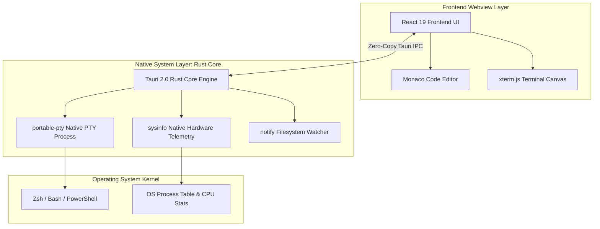

# Case Study: CodexOS (Native Developer Operating System)

> Track: Project Case Studies (Native Desktop & Systems)  
> Prerequisite Knowledge: Basic Rust / TypeScript, understanding of child processes and terminal PTYs  
> Estimated Build Time: 60 minutes  
> Target Project Outcome: Understanding Tauri 2.0 architecture, Rust FFI, and building a low-memory native developer control center

---

## 1. The Hook: Why You Need This in Your Arsenal

When developers decide to build a desktop application today, the default choice is almost always Electron. It is easy to see why: you write standard React or web code, and it runs in a native-looking window.

Here is the hidden price you pay:
- Electron bundles an entire instance of Google Chromium and Node.js with every application window.
- Open VS Code, Slack, Discord, and Spotify on your computer, and you have four separate Chromium instances consuming 3GB to 5GB of system RAM before you even compile a single line of code.
- If you are building developer tools—where users are simultaneously running heavy compilers, Docker containers, or AI models—your tool will feel sluggish and resource-heavy.

**CodexOS** takes a different approach:
- It replaces Electron with **Tauri 2.0 (Rust)**, leveraging the operating system's native Webview (WebKit on macOS, WebView2 on Windows, WebKitGTK on Linux).
- Baseline idle RAM drops from **650MB+ down to ~45MB**.
- Critical systems tasks—such as spawning terminal pseudo-terminals (PTYs), managing process signals, and monitoring local hardware—are handled in high-speed, memory-safe Rust.

---

## 2. The Mental Model: Intuitive Analogy & Visual Topology

### The Private Jet vs. The Commercial Airliner
- **Electron** is like chartering an entire commercial Boeing 777 every time you want to go to the grocery store. It is spacious and familiar, but moving it requires massive fuel and runway space.
- **Tauri 2.0** is like driving a lightweight sports car that uses the city's existing highway infrastructure (the OS native webview). It starts instantly, uses minimal fuel, and reaches top speeds quickly.



---

## 3. Deep Dive: Under the Hood

### How PTY Terminals Actually Work
When you type a command into a terminal like `xterm.js`, it does not simply call `child_process.exec()`. Executing shell commands requires a **Pseudo-Terminal (PTY)**:
- A PTY is a bidirectional character device provided by the OS kernel (POSIX `/dev/pts` or Windows ConPTY).
- It emulates an interactive teletypewriter, handling ANSI escape sequences (colors, cursor jumps, screen clears), signals (`Ctrl+C` sends `SIGINT`), and raw keyboard input.
- In CodexOS, the Rust backend uses the `portable-pty` crate to spawn a background shell thread and streams input/output bytes across Tauri's IPC boundary to `xterm.js` in real time.

### Tauri 2.0 vs. Electron Architectural Comparison

| Dimension | Electron Architecture | Tauri 2.0 Architecture |
| :--- | :--- | :--- |
| **Binary Bundle Size** | 80MB - 150MB+ | **5MB - 15MB** |
| **Idle Memory Consumption** | 400MB - 800MB | **35MB - 60MB** |
| **Backend Language** | Node.js (JavaScript) | **Rust (Zero-cost abstractions)** |
| **Security Architecture** | Full Node.js access in renderer (often misconfigured) | Explicit capability-based IPC security |
| **Build Pipeline** | Simple (npm package) | Requires Rust toolchain (`cargo`) |

---

## 4. Zero-to-One Interactive Playground: Build It From Scratch

Let us build a minimal working prototype of a native terminal and system monitoring service using Rust and Tauri concepts.

### Step 1: Rust Backend Command (`src-tauri/src/main.rs`)
In a Tauri 2.0 application, backend capabilities are exposed as typed Rust functions annotated with `#[tauri::command]`:

```rust
// Example: src-tauri/src/main.rs
#![cfg_attr(not(debug_assertions), windows_subsystem = "windows")]

use sysinfo::System;
use std::sync::Mutex;
use tauri::State;

struct AppState {
    sys: Mutex<System>,
}

#[derive(serde::Serialize)]
struct SystemMetrics {
    total_memory_mb: u64,
    used_memory_mb: u64,
    cpu_usage_percent: f32,
}

#[tauri::command]
fn get_system_metrics(state: State<AppState>) -> Result<SystemMetrics, String> {
    let mut sys = state.sys.lock().map_err(|e| e.to_string())?;
    sys.refresh_all();

    let total_mem = sys.total_memory() / (1024 * 1024);
    let used_mem = sys.used_memory() / (1024 * 1024);
    let cpu_usage = sys.global_cpu_info().cpu_usage();

    Ok(SystemMetrics {
        total_memory_mb: total_mem,
        used_memory_mb: used_mem,
        cpu_usage_percent: cpu_usage,
    })
}

fn main() {
    let mut sys = System::new_all();
    sys.refresh_all();

    tauri::Builder::default()
        .manage(AppState {
            sys: Mutex::new(sys),
        })
        .invoke_handler(tauri::generate_handler![get_system_metrics])
        .run(tauri::generate_context!())
        .expect("error while running tauri application");
}
```

### Step 2: React Frontend Consumer (`SystemMonitor.tsx`)
In the React frontend, invoke the native Rust command with complete type safety:

```typescript
// Example: src/components/SystemMonitor.tsx
import React, { useEffect, useState } from 'react';
import { invoke } from '@tauri-apps/api/core';

interface Metrics {
  total_memory_mb: number;
  used_memory_mb: number;
  cpu_usage_percent: number;
}

export const SystemMonitor: React.FC = () => {
  const [metrics, setMetrics] = useState<Metrics | null>(null);

  useEffect(() => {
    const interval = setInterval(async () => {
      try {
        const data = await invoke<Metrics>('get_system_metrics');
        setMetrics(data);
      } catch (err) {
        console.error('Failed to fetch native metrics:', err);
      }
    }, 1000);

    return () => clearInterval(interval);
  }, []);

  if (!metrics) return <div>Initializing native hardware sensors...</div>;

  return (
    <div style={{ fontFamily: 'monospace', padding: '16px', background: '#1e1e2e', color: '#cdd6f4' }}>
      <h3>Hardware Telemetry (Native Rust Engine)</h3>
      <p>CPU Utilization: {metrics.cpu_usage_percent.toFixed(1)}%</p>
      <p>
        RAM: {metrics.used_memory_mb.toLocaleString()} MB / {metrics.total_memory_mb.toLocaleString()} MB
      </p>
    </div>
  );
};
```

---

## 5. Battle Scars: What Breaks in Production & How to Debug It

### Top 3 Hard-Won Lessons from CodexOS
1. **Windows PTY Terminal Crashes**: Windows handles pseudo-terminals via the `ConPTY` subsystem introduced in Windows 10. Attempting to spawn shells on older Windows builds without fallback pipes causes crashes. Always verify `conpty.dll` availability before initializing.
2. **Terminal Text Buffer Floods**: Running a command that outputs 100,000 lines of log output in one second (like `cat large.log`) will choke the webview if every line triggers an individual IPC message. Solution: Buffer terminal output in Rust and dispatch chunks every 16ms to align with monitor refresh rates.
3. **Rust Thread Deadlocks with Mutexes**: Holding a `MutexGuard` across an asynchronous `await` boundary can lead to deadlocks. Keep mutex lock scopes strictly synchronous and short.

---

## 6. The Weekend Hackathon Challenge: Your Turn to Build

### Challenge: The Minimal Native Developer Dashboard
Build a custom native desktop utility using Tauri 2.0 and React.

- **Level 1 (Core)**: Display real-time CPU, RAM, and Disk space usage updated every second via a Rust backend command.
- **Level 2 (Advanced)**: Integrate an embedded `xterm.js` terminal that opens an interactive shell session using your OS default shell (Bash/Zsh/PowerShell).
- **Level 3 (Hardcore)**: Add a local port scanner in Rust that detects and lists all local servers currently listening on ports 3000–9000 (e.g. Next.js, Vite, Django) with quick-kill actions.

---

## 7. Knowledge Check & Next Steps

1. **Scenario**: Why does a Tauri 2.0 app consume 10x less RAM on startup than an equivalent Electron app?  
   *Answer*: Tauri does not bundle Chromium; it reuses the operating system's pre-installed native webview engine and runs its backend in compiled Rust.
2. **Scenario**: What is the purpose of an OS Pseudo-Terminal (PTY)?  
   *Answer*: A PTY emulates an interactive terminal device, allowing interactive CLI programs to receive control signals, render colors, and manage cursor positions.
3. **Scenario**: How does Tauri's capability-based security model safeguard desktop users?  
   *Answer*: It explicitly restricts what filesystem paths, shell commands, and hardware features the frontend webview can access via declarative JSON permissions.

Next Case Study: [Aura 3.0: Local-First Mindful Productivity](./aura-3-mindful-productivity.md)
