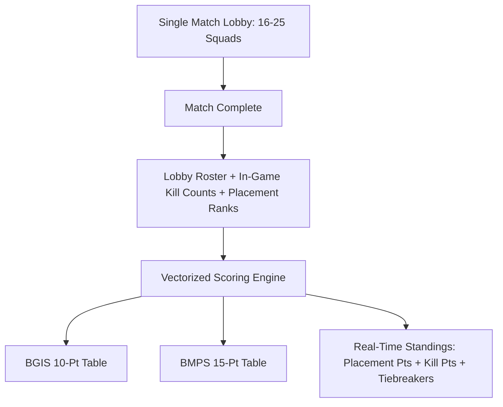

# Case Study: BGMI Tournament Control Center (TCC)

> Track: Project Case Studies (Realtime Operations & Esports)  
> Prerequisite Knowledge: React / Next.js, CSV parsing, data normalization, matrix scoring  
> Estimated Build Time: 45 minutes  
> Target Project Outcome: Understanding multi-lobby Battle Royale scoring, real-time leaderboard aggregation, and automated bulk roster validation

---

## 1. The Hook: Why You Need This in Your Arsenal

Most tournament management software is built for 1v1 or team vs. team matches (Valorant, CS2, League of Legends).

**Battle Royale esports (Battlegrounds Mobile India / PUBG Mobile) operates under a completely different paradigm**:
- A single match does not have two teams; it drops **16 to 25+ squads simultaneously** into one lobby across vast maps (Erangel, Miramar, Sanhok).
- Scoring is not binary (Win/Loss). Every squad earns a combination of **Placement Points** (based on survival ranking) plus **Finish Points** (1 point per kill).
- Tournament admins typically scramble with ad-hoc Excel spreadsheets, copy-pasting kills under high match-day pressure, where a single formula typo alters prize money distribution and tournament standings.

**BGMI Tournament Control Center (TCC)** was built as an internal operations dashboard:
- It guides organizers through a 7-step wizard configuring official rule sets (BGIS 10-point, BMPS 15-point, PMCO 20-point).
- It processes bulk CSV/Excel roster uploads with automatic duplicate Character ID (UID) detection.
- It uses vectorized single-pass scoring to aggregate match results and break ties instantly.

---

## 2. The Mental Model: Intuitive Analogy & Visual Topology

### The 1v1 Tennis Match vs. The Formula 1 Grand Prix
- Standard bracket apps are like a tennis tournament: Player A plays Player B on Court 1.
- Battle Royale esports is like a **Formula 1 Grand Prix**: 20 cars race on the track at the exact same time. Drivers earn points based on their finishing position, plus bonus points for the fastest lap. Points from multiple Grand Prix weekends are aggregated into a season championship.



---

## 3. Deep Dive: Under the Hood

### Official Point Matrix Presets
In competitive BGMI, official tournaments follow standardized scoring tables:

| Placement Finish | Official BGIS (10-Point System) | Classic PMCO (20-Point System) |
| :--- | :--- | :--- |
| **#1 (Chicken Dinner)** | **10 Points** | **20 Points** |
| **#2** | **6 Points** | **14 Points** |
| **#3** | **5 Points** | **10 Points** |
| **#4** | **4 Points** | **8 Points** |
| **#5** | **3 Points** | **7 Points** |
| **#6** | **2 Points** | **6 Points** |
| **#7 - #8** | **1 Point** | **4 - 3 Points** |
| **#9 - #16** | **0 Points** | **2 - 0 Points** |
| **Each Kill / Finish** | **+1 Point** | **+1 Point** |

### Vectorized In-Memory Score Aggregation
Instead of looping over each team sequentially through database updates, scores for all 20 squads are aggregated in memory using a hash map lookup in $O(N)$ linear time.

---

## 4. Zero-to-One Interactive Playground: Build It From Scratch

Let us write a minimal, production-grade Battle Royale leaderboard calculation engine in TypeScript.

### Implementation (`bgmi-scoring.ts`)
```typescript
export interface SquadResult {
  squadId: string;
  squadName: string;
  placement: number; // 1 to 20
  kills: number;
}

export interface StandingsEntry {
  squadId: string;
  squadName: string;
  placementPoints: number;
  killPoints: number;
  totalPoints: number;
  chickenDinners: number;
}

// BGIS Official 10-Point System Table
const BGIS_10_POINT_SYSTEM: Record<number, number> = {
  1: 10,
  2: 6,
  3: 5,
  4: 4,
  5: 3,
  6: 2,
  7: 1,
  8: 1,
};

export class BattleRoyaleScoringEngine {
  public static calculateLeaderboard(matchHistory: SquadResult[][]): StandingsEntry[] {
    const standingsMap = new Map<string, StandingsEntry>();

    for (const match of matchHistory) {
      for (const result of match) {
        let entry = standingsMap.get(result.squadId);
        if (!entry) {
          entry = {
            squadId: result.squadId,
            squadName: result.squadName,
            placementPoints: 0,
            killPoints: 0,
            totalPoints: 0,
            chickenDinners: 0,
          };
          standingsMap.set(result.squadId, entry);
        }

        // 1. Calculate placement points from official lookup table
        const placementPts = BGIS_10_POINT_SYSTEM[result.placement] || 0;
        const killPts = result.kills * 1; // 1 pt per kill

        entry.placementPoints += placementPts;
        entry.killPoints += killPts;
        entry.totalPoints += placementPts + killPts;

        if (result.placement === 1) {
          entry.chickenDinners += 1;
        }
      }
    }

    // Sort by Total Points -> Placement Points -> Chicken Dinners
    return Array.from(standingsMap.values()).sort((a, b) => {
      if (b.totalPoints !== a.totalPoints) return b.totalPoints - a.totalPoints;
      if (b.placementPoints !== a.placementPoints) return b.placementPoints - a.placementPoints;
      return b.chickenDinners - a.chickenDinners;
    });
  }
}

// Test with 3 squads across 2 matches
const match1: SquadResult[] = [
  { squadId: 's1', squadName: 'GodLike Esports', placement: 1, kills: 8 }, // 10 + 8 = 18
  { squadId: 's2', squadName: 'Team Soul', placement: 2, kills: 4 },       // 6 + 4 = 10
  { squadId: 's3', squadName: 'Entity Gaming', placement: 3, kills: 2 },    // 5 + 2 = 7
];

const match2: SquadResult[] = [
  { squadId: 's2', squadName: 'Team Soul', placement: 1, kills: 11 },      // 10 + 11 = 21 (Total: 31)
  { squadId: 's1', squadName: 'GodLike Esports', placement: 4, kills: 3 }, // 4 + 3 = 7 (Total: 25)
  { squadId: 's3', squadName: 'Entity Gaming', placement: 2, kills: 1 },    // 6 + 1 = 7 (Total: 14)
];

const leaderboard = BattleRoyaleScoringEngine.calculateLeaderboard([match1, match2]);
console.log('--- Overall Tournament Standings ---');
leaderboard.forEach((team, index) => {
  console.log(
    `#${index + 1} ${team.squadName}: ${team.totalPoints} pts (${team.placementPoints} Place + ${team.killPoints} Kills | WWCD: ${team.chickenDinners})`
  );
});
```

---

## 5. Battle Scars: What Breaks in Production & How to Debug It

### Top 3 Hard-Won Lessons from BGMI TCC
1. **Duplicate Player Character IDs (UIDs)**: Players regularly register with different aliases across multiple teams. If an admin uploads a CSV without checking for unique numerical character IDs, one player can play on two teams. Always enforce unique database constraints on numeric UIDs.
2. **Missing Tiebreaker Definitions**: In high-stakes tournaments, Team A and Team B frequently tie on total points. Without programmatic tiebreaker logic (Total Points -> Placement Points -> Match Finishes -> Most recent match performance), disputes delay stream broadcasts.
3. **CSV Column Name Inconsistencies**: Users upload spreadsheets with headers like `"Player_1"`, `"player1"`, `"IGN"`, or `"UID"`. Always implement a flexible column mapping step during file ingestion to normalize data into a standard schema.

---

## 6. The Weekend Hackathon Challenge: Your Turn to Build

### Challenge: The Battle Royale Live Scorer
Build a web application for scoring multi-team battle royale tournaments.

- **Level 1 (Core)**: Allow organizers to input match results for 16 teams and calculate the leaderboard using the BGIS 10-point system.
- **Level 2 (Advanced)**: Add a CSV upload wizard with automated column detection and validation for duplicate player IDs.
- **Level 3 (Hardcore)**: Implement real-time export: render an esports-ready graphics card (using HTML Canvas or SVG) showing the top 5 teams and MVP player for broadcast display.

---

## 7. Knowledge Check & Next Steps

1. **Scenario**: How does Battle Royale tournament scoring differ from traditional single-elimination brackets?  
   *Answer*: Battle Royale matches involve 16–25 squads competing simultaneously, earning scores from a combination of survival placement multipliers and individual elimination points.
2. **Scenario**: Why must player character IDs (numeric UIDs) be verified during roster upload?  
   *Answer*: In-game names can change, but numeric account IDs are permanent. Checking UIDs prevents roster fraud and duplicate player registrations.
3. **Scenario**: What is the standard tiebreaker sequence in competitive Battle Royale?  
   *Answer*: Higher total points -> higher total placement points -> most match victories (Chicken Dinners) -> best single-match placement.

Next Case Study: [Parkly: Autonomous Smart Parking Marketplace](../../distributed-commerce-and-marketplaces/parkly-smart-parking-marketplace.md)
