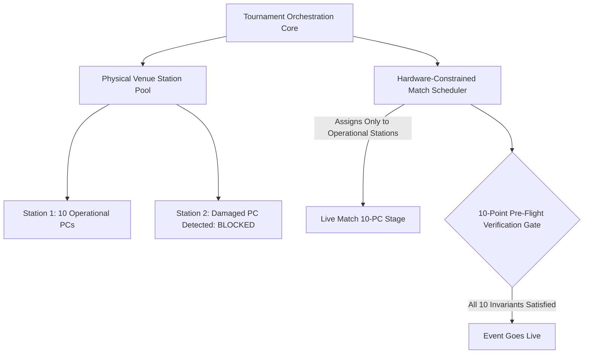

# Case Study: VALORANT Tournament Operations System (VTO)

> Track: Project Case Studies (Realtime Operations & Esports)  
> Prerequisite Knowledge: Relational data modeling, finite state machines, scheduling algorithms  
> Estimated Build Time: 60 minutes  
> Target Project Outcome: Understanding hardware-constrained tournament scheduling, Berger Round-Robin mathematics, and pre-flight validation gates

---

## 1. The Hook: Why You Need This in Your Arsenal

Running a competitive esports tournament at a physical LAN venue (university computer lab, gaming center, LAN arena) is high-stress operations:
- 32 teams are waiting to play. If a generic bracket app schedules a match to "Lab B, Station 4", and Station 4 has a broken monitor, two matches stall.
- The schedule slips by an hour. Teams complain, live streams run dry, and tournament admins scramble to manually reschedule on paper spreadsheets.
- In the confusion, an admin accidentally enters a score for the wrong match, advancing the wrong team and corrupting the entire bracket tree.

**The VALORANT Tournament Operations System (VTO)** was built specifically to solve this:
- It treats physical hardware assets (10-PC stations, network subnets, power) as **first-class scheduling constraints**.
- It enforces a **10-Point Pre-Flight Validation Gate** that prevents tournaments from starting until every physical station and team roster is mathematically verified.
- It calculates pairings using the deterministic **Berger Round-Robin Algorithm** and strict Single Elimination state machines.

---

## 2. The Mental Model: Intuitive Analogy & Visual Topology

### Air Traffic Control vs. A Generic Calendar
- A generic calendar app lets you create a meeting called "Flight 402 lands at 2:00 PM" without checking if the physical runway is clear.
- **Air Traffic Control (VTO)** knows that an airplane cannot land unless Runway 3L is unoccupied, emergency crews are standing by, and ground crews are ready.

VTO acts as Air Traffic Control for physical esports venues.



---

## 3. Deep Dive: Under the Hood

### The Berger Round-Robin Pairing Algorithm
In competitive round-robin tournaments, every team must play every other team exactly once without anyone playing two games in the same round.

The **Berger Algorithm** (the mathematical engine used in official chess, football, and esports leagues) guarantees this deterministically:
1. Fix Team 1 in position.
2. Rotate all other teams clockwise around the table for each round:

$$\text{For } N \text{ teams and round } r: \quad \text{Rotate positions } 2 \text{ through } N$$

If $N$ is odd, a dummy "bye" team is added. Every round has exactly $N/2$ simultaneous matches, with zero double-booking and zero scheduling bias.

---

## 4. Zero-to-One Interactive Playground: Build It From Scratch

Let us write a minimal, working implementation of the Berger Round-Robin pairing algorithm in TypeScript.

### Implementation (`berger-scheduler.ts`)
```typescript
export interface Team {
  id: string;
  name: string;
}

export interface MatchPairing {
  round: number;
  homeTeam: Team;
  awayTeam: Team;
}

export class BergerScheduler {
  /**
   * Generates a balanced round-robin fixture list where every team plays
   * every other team exactly once without scheduling conflicts.
   */
  public static generateSchedule(teams: Team[]): MatchPairing[] {
    const list = [...teams];
    
    // If odd number of teams, add a dummy BYE team
    if (list.length % 2 !== 0) {
      list.push({ id: 'BYE', name: 'BYE' });
    }

    const n = list.length;
    const totalRounds = n - 1;
    const matchesPerRound = n / 2;
    const schedule: MatchPairing[] = [];

    for (let round = 1; round <= totalRounds; round++) {
      for (let i = 0; i < matchesPerRound; i++) {
        const home = list[i];
        const away = list[n - 1 - i];

        // Skip matches involving the BYE team
        if (home.id !== 'BYE' && away.id !== 'BYE') {
          schedule.push({
            round,
            homeTeam: home,
            awayTeam: away,
          });
        }
      }

      // Rotate array: keep index 0 fixed, rotate the rest clockwise
      const last = list.pop()!;
      list.splice(1, 0, last);
    }

    return schedule;
  }
}

// Test with 4 esports teams
const teams: Team[] = [
  { id: '1', name: 'Cloud9' },
  { id: '2', name: 'Paper Rex' },
  { id: '3', name: 'DRX' },
  { id: '4', name: 'LOUD' },
];

const fixtures = BergerScheduler.generateSchedule(teams);
console.log(`Generated ${fixtures.length} matches across 3 rounds:\n`);
fixtures.forEach((f) => {
  console.log(`Round ${f.round}: ${f.homeTeam.name} vs ${f.awayTeam.name}`);
});
```

---

## 5. Battle Scars: What Breaks in Production & How to Debug It

### Top 3 Hard-Won Lessons from VTO
1. **Station Double-Booking during Delays**: If Match A goes to triple-overtime (lasting 90 minutes instead of 45), the scheduler will attempt to start Match B on that same physical station unless station availability is checked dynamically against real-time match state.
2. **Missing Tiebreaker Invariants in Group Stages**: Round-robin tournaments regularly end with three teams tied at 2-1. If your software does not define clear tiebreaker criteria (head-to-head -> round differential -> head-to-head round differential), admins face disputes on-site.
3. **Database Concurrency during Score Reporting**: Two lobby marshals reporting match scores simultaneously can trigger race conditions that advance duplicate teams into the bracket. Always wrap score submissions in database transactions with optimistic locking.

---

## 6. The Weekend Hackathon Challenge: Your Turn to Build

### Challenge: The LAN Tournament Dispatcher
Build an operations dashboard for LAN tournaments.

- **Level 1 (Core)**: Implement the Berger Round-Robin algorithm and display fixtures organized by round.
- **Level 2 (Advanced)**: Create a Physical Station manager (Stations 1 through 4) that assigns upcoming matches only to idle stations.
- **Level 3 (Hardcore)**: Implement a 5-point Pre-Flight Gate check that verifies: all team rosters have 5 active players, stations are verified, and no team is double-booked across simultaneous matches.

---

## 7. Knowledge Check & Next Steps

1. **Scenario**: Why must physical stations be modeled directly in tournament software?  
   *Answer*: Because matches cannot execute without functioning hardware. Modeling stations in code prevents scheduling games to broken or occupied computers.
2. **Scenario**: How does the Berger Algorithm prevent team scheduling conflicts?  
   *Answer*: It fixes one team position and systematically rotates the remaining teams across rounds, guaranteeing each team plays once per round.
3. **Scenario**: What is the purpose of a Pre-Flight Validation Gate?  
   *Answer*: It executes automated sanity checks before launch, preventing bracket corruption or station over-allocation before matches begin.

Next Case Study: [BGMI Tournament Control Center](./bgmi-tournament-control-center.md)
