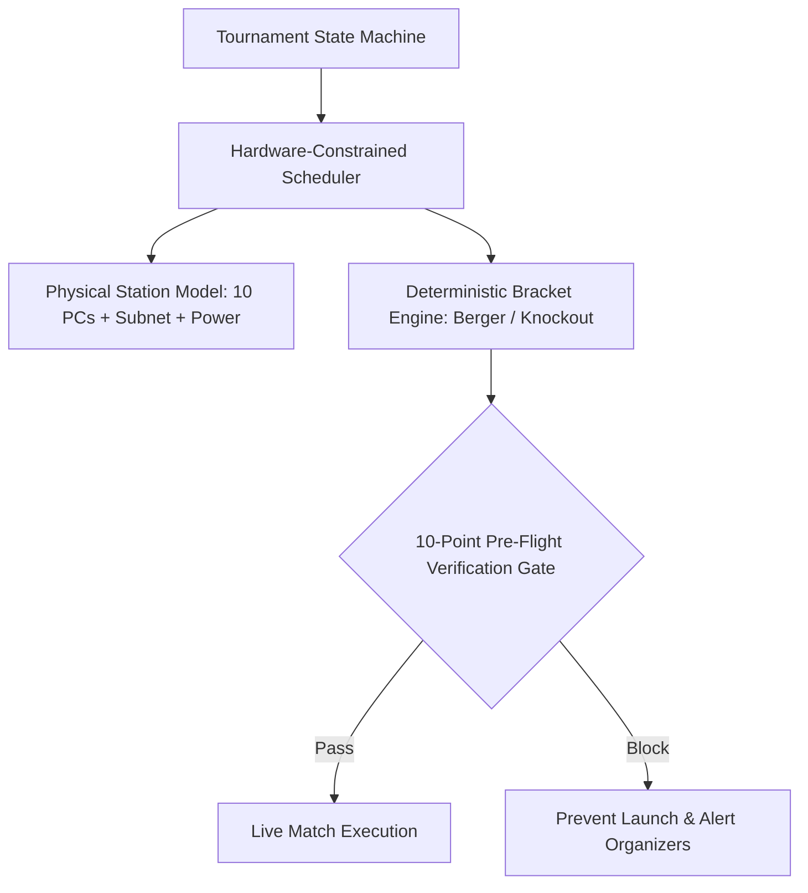

# Case Study: VALORANT Tournament Operations System (VTO)

> **Platform**: Web / Local LAN Deployment  
> **Tech Stack**: Next.js, React 19, TypeScript, Prisma ORM, PostgreSQL, Tailwind CSS

---

## 1. System Overview

VTO is a LAN tournament management platform engineered for competitive esports environments (university labs, gaming arenas). It prevents match delays and bracket corruption by coupling tournament algorithms directly with physical computer stations.

---

## 2. Key Architectural Decisions

- **Physical Station Model**: Matches are scheduled only when physical 10-PC stations clear operational status checks (power, network, machine count).
- **10-Point Pre-Flight Validation Gate**: Catches double-booked teams, unassigned stations, and roster discrepancies before tournament launch.
- **Deterministic Berger Round-Robin Engine**: Generates mathematically sound tournament pairings, eliminating scheduling bias.

---

## 3. What Was Learned

- **Software Cannot Ignore Physical Reality**: Abstract bracket software often schedules matches to broken hardware. Modeling physical equipment constraints in code eliminates on-site event friction.
- **Strict State Machines Over Flexible Flags**: Enforcing formal match lifecycle stages (Pending -> Station Assigned -> Warmup -> In-Progress -> Completed -> Verified) prevents score corruption.
