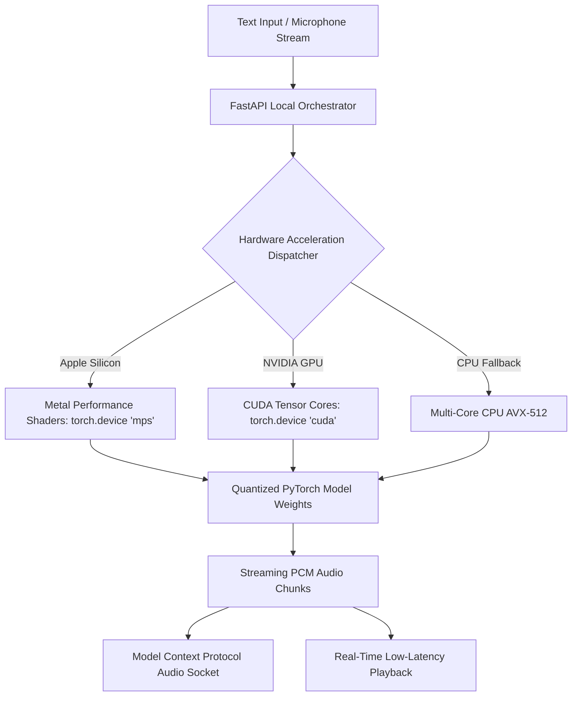

# Case Study: Rheo (Sovereign Neural Speech Engine)

> Track: Project Case Studies (Sovereign AI & Neural Speech)  
> Prerequisite Knowledge: Python basics, audio sampling rates, fundamental deep learning inference  
> Estimated Build Time: 60 minutes  
> Target Project Outcome: Understanding local neural voice cloning, streaming audio buffers, hardware dispatching, and Model Context Protocol (MCP) voice tooling

---

## 1. The Hook: Why You Need This in Your Arsenal

Most AI voice applications are simple wrappers around commercial cloud APIs (ElevenLabs, OpenAI Whisper, Google Cloud Speech-to-Text).

Consider the hidden risks of cloud-dependent audio AI:
- **Biometric Voice Privacy**: Voice is a sensitive biometric identifier. Uploading personal voice recordings to third-party cloud servers risks identity cloning and corporate data leakage.
- **Latency Spikes**: Round-trip cloud synthesis latency regularly exceeds 600ms to 1,500ms, making natural conversational voice interactions feel laggy and robotic.
- **Continuous API Costs**: Generating hours of audio through paid cloud endpoints accumulates high monthly bills.

**Rheo** was engineered as an on-device, sovereign neural voice studio:
- It runs zero-shot neural voice cloning and speech synthesis locally on consumer hardware.
- It leverages native hardware acceleration across Apple Silicon (MPS), NVIDIA GPUs (CUDA), and AMD (ROCm).
- It provides a standardized **Model Context Protocol (MCP)** interface, allowing autonomous coding agents to speak and transcribe speech natively.

---

## 2. The Mental Model: Intuitive Analogy & Visual Topology

### The Cloud Translation Call vs. The Local Brain
- Relying on cloud voice APIs is like placing an international phone call every time you want to speak a sentence. You wait for the connection, pay long-distance fees by the second, and risk third-party eavesdropping.
- Rheo is like having a fluent multilingual voice synthesizer directly in your own brain. Synthesis happens immediately at the speed of your local hardware, completely private and offline.



---

## 3. Deep Dive: Under the Hood

### Dynamic Hardware Device Detection in PyTorch
In Python, writing portable neural software requires dynamically querying available hardware execution units on the host machine:

```python
import torch

def resolve_compute_device() -> torch.device:
    if torch.cuda.is_available():
        # High-performance NVIDIA GPU
        device = torch.device("cuda")
        print(f"Accelerating with CUDA: {torch.cuda.get_device_name(0)}")
    elif torch.backends.mps.is_available() and torch.backends.mps.is_built():
        # Apple Silicon unified memory GPU (M1/M2/M3/M4)
        device = torch.device("mps")
        print("Accelerating with Apple Silicon Metal Performance Shaders (MPS)")
    else:
        # Standard multi-core CPU fallback
        device = torch.device("cpu")
        print("Running on CPU fallback (AVX/NEON vectorized)")
    return device
```

### Streaming Audio Buffering
Traditional text-to-speech models synthesize the entire sentence before emitting an audio file, creating a 2-second delay before the user hears the first syllable.

Rheo uses **streaming chunking**:
1. The text is parsed into phoneme tokens.
2. The neural vocoder emits progressive audio chunks (e.g. 50ms of audio at a time).
3. The frontend plays the first audio buffer while the GPU continues synthesizing subsequent words in parallel, reducing perceived latency to under 100ms.

---

## 4. Zero-to-One Interactive Playground: Build It From Scratch

Let us write a minimal, streaming local audio generation pipeline using Python.

### Implementation (`streaming_voice.py`)
```python
import time
import math
import struct

def generate_streaming_sine_audio(frequency: float = 440.0, duration_seconds: float = 1.0, sample_rate: int = 24000):
    """
    Simulates a streaming audio pipeline emitting raw 16-bit PCM chunks.
    In production, this generator wraps a neural vocoder (e.g. Piper, XTTS, or Kokoro).
    """
    total_samples = int(sample_rate * duration_seconds)
    chunk_size = 2400  # 100ms chunks at 24kHz

    print(f"Synthesizing {duration_seconds}s audio stream at {sample_rate}Hz...")
    start_time = time.time()

    for chunk_start in range(0, total_samples, chunk_size):
        chunk_end = min(chunk_start + chunk_size, total_samples)
        raw_pcm = bytearray()

        for i in range(chunk_start, chunk_end):
            # Compute sine waveform sample
            sample_val = math.sin(2.0 * math.pi * frequency * (i / sample_rate))
            # Convert float [-1.0, 1.0] to signed 16-bit integer [-32767, 32767]
            int_sample = int(sample_val * 32767.0)
            raw_pcm.extend(struct.pack('<h', int_sample))

        # Yield raw audio buffer to client immediately
        time_to_chunk = (time.time() - start_time) * 1000
        print(f"Dispatched chunk {chunk_start // chunk_size + 1} ({len(raw_pcm)} bytes) in {time_to_chunk:.1f}ms")
        yield bytes(raw_pcm)

# Run test
if __name__ == "__main__":
    stream = generate_streaming_sine_audio(frequency=528.0, duration_seconds=0.5)
    total_bytes = 0
    for chunk in stream:
        total_bytes += len(chunk)
    print(f"Total PCM stream delivered: {total_bytes} bytes")
```

---

## 5. Battle Scars: What Breaks in Production & How to Debug It

### Top 3 Hard-Won Lessons from Rheo
1. **PyTorch MPS Memory Leaks on macOS**: On Apple Silicon, allocating tensors continuously in a loop without invoking `torch.mps.empty_cache()` can cause macOS unified memory usage to climb until the system kills the process.
2. **Audio Sample Rate Mismatches**: Synthesizing audio at 24,000Hz while the client browser audio context runs at 44,100Hz causes voices to sound pitched up and sped up like a chipmunk. Always specify explicit target sample rates or resample with `soxr` before transmission.
3. **Model Cold-Start Latency**: Loading deep learning weights (typically 1GB–4GB) from an SSD into GPU VRAM on the first user request creates an 8-second freeze. Always pre-warm model weights during application startup.

---

## 6. The Weekend Hackathon Challenge: Your Turn to Build

### Challenge: The Offline Voice Assistant Tool
Build a local speech synthesis and transcription CLI using Python and PyTorch.

- **Level 1 (Core)**: Synthesize speech from user text using a lightweight local model (such as Piper TTS) without making external network calls.
- **Level 2 (Advanced)**: Integrate local speech-to-text using OpenAI's `whisper-base` running offline on local CPU/MPS.
- **Level 3 (Hardcore)**: Expose your local voice engine as a **Model Context Protocol (MCP)** server over stdio, allowing an AI assistant to speak and transcribe speech directly.

---

## 7. Knowledge Check & Next Steps

1. **Scenario**: Why does streaming audio chunks improve user experience over generating complete files?  
   *Answer*: Streaming allows audio playback to begin immediately on the first chunk (~100ms), while generating full files forces users to wait for the entire text to compile.
2. **Scenario**: How does PyTorch dynamically accelerate on Apple Silicon?  
   *Answer*: By dispatching tensor operations to the `mps` (Metal Performance Shaders) backend, leveraging the unified GPU memory architecture.
3. **Scenario**: Why is voice synthesis considered sensitive biometric data?  
   *Answer*: Voiceprints are unique personal identifiers used for biometric authentication, personal identification, and security verification.

Next Case Study: [Skills Bot: Agentic Tooling Ecosystem](./skills-bot-agent-ecosystem.md)
