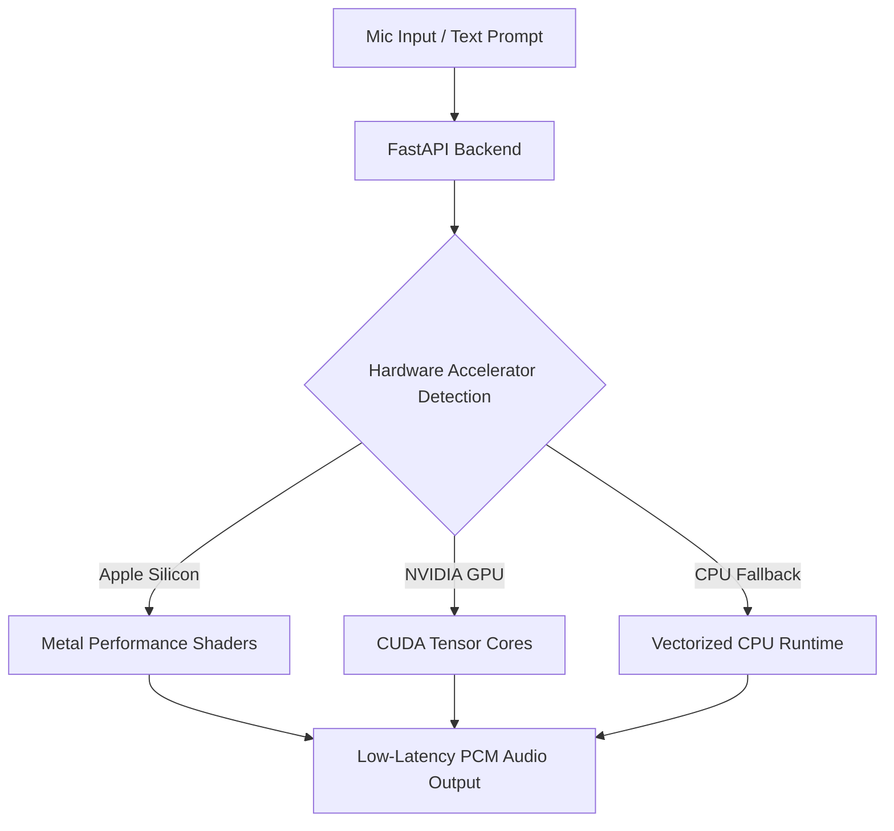

# Case Study: Rheo (Sovereign Neural Speech Engine)

> **Platform**: macOS, Windows, Linux  
> **Tech Stack**: FastAPI, PyTorch, CUDA / Metal / ROCm, SQLAlchemy, Biome, Model Context Protocol (MCP)

---

## 1. System Overview

Rheo is a sovereign AI voice studio and neural speech engine running entirely on local consumer hardware. It delivers zero-shot voice cloning, zero-latency system-wide dictation, and voice synthesis integrated with the Model Context Protocol.

---

## 2. Key Architectural Decisions

- **Local Hardware Acceleration**: Dynamically targets Apple Silicon (MPS), NVIDIA (CUDA), or AMD (ROCm), providing sub-50ms synthesis latency without cloud costs.
- **Model Context Protocol Integration**: Enables external AI coding agents to discover and utilize local text-to-speech and speech-to-text tools cleanly.
- **Streaming Audio Buffering**: Generates and plays audio in progressive chunks rather than waiting for the entire response to compile.

---

## 3. What Was Learned

- **Avoiding Cloud Wrapper Fragility**: Cloud speech APIs create recurring costs, latency spikes, and severe privacy issues when handling sensitive voice data. Local neural execution resolves all three problems.
- **Managing Audio Buffer Under-Runs**: Consistent streaming output requires balancing worker chunk sizes against hardware inference speeds to prevent playback stutter.
