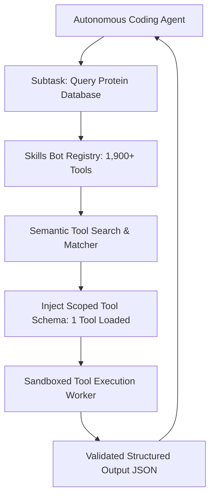

# Case Study: Skills Bot (Agentic Tooling Ecosystem)

> Track: Project Case Studies (Sovereign AI & Neural Speech)  
> Prerequisite Knowledge: JSON Schema, tool calling protocols, API rate limiting  
> Estimated Build Time: 45 minutes  
> Target Project Outcome: Understanding declarative tool protocols, agentic tool discovery, and managing a 1,900+ skill ecosystem

---

## 1. The Hook: Why You Need This in Your Arsenal

Large Language Models (LLMs) on their own are text predictors. They cannot read your local disk, query a database, deploy a Docker container, or interact with external APIs unless you equip them with **Agentic Tools**.

When developers build tool-calling pipelines for AI agents, they frequently encounter major hurdles:
- If you pass 100 tool definitions into an LLM's system prompt, the context window fills with tool definitions, drastically inflating token costs and causing the model to confuse parameters.
- Tools written without strict schema validation fail unpredictably when models pass strings instead of numbers.
- Unsandboxed tools can accidentally run destructive commands (like `rm -rf` or dropping database tables) if the agent hallucinates.

**Skills Bot** was built as a declarative agentic execution engine:
- It maintains an ecosystem of **over 1,900 standardized tool definitions**.
- Tools are structured with strict input/output contracts, parameter validations, and rate-limiting safeguards.
- A dynamic search and discovery mechanism loads only the specific tools relevant to the active subtask.

---

## 2. The Mental Model: Intuitive Analogy & Visual Topology

### The Unorganized Toolbox vs. The Precision Tool Registry
- Passing hundreds of tools into an LLM prompt is like dumping 1,900 loose wrenches, screwdrivers, and saws onto a workbench all at once. The worker spends all their energy sorting through the pile to find the right tool.
- Skills Bot functions like an automated aerospace tool registry: each tool lives in an indexed drawer with a clear label, calibrated specifications, and a safety latch. The technician requests the exact tool needed for the current step, uses it with safety limits, and returns it.



---

## 3. Deep Dive: Under the Hood

### Declarative Tool Definition Standard
In Skills Bot, every tool is defined using a standardized declarative schema that separates documentation from runtime logic:

```typescript
export interface ToolDefinition<TInput = Record<string, unknown>, TOutput = unknown> {
  name: string;
  description: string;
  parameters: {
    type: 'object';
    properties: Record<string, { type: string; description: string; required?: boolean }>;
    required: string[];
  };
  execute: (args: TInput) => Promise<TOutput>;
}
```

By decoupling tool schemas from model providers, tools can be exposed interchangeably across OpenAI Function Calling, Anthropic Tool Use, and the open Model Context Protocol (MCP).

---

## 4. Zero-to-One Interactive Playground: Build It From Scratch

Let us write a minimal, type-safe tool registry that dynamically matches and executes tools for an agent.

### Implementation (`tool-registry.ts`)
```typescript
export interface ToolSchema {
  name: string;
  description: string;
  execute: (params: Record<string, unknown>) => Promise<unknown>;
}

export class ToolRegistry {
  private tools = new Map<string, ToolSchema>();

  public register(tool: ToolSchema): void {
    this.tools.set(tool.name, tool);
  }

  public getTool(name: string): ToolSchema | undefined {
    return this.tools.get(name);
  }

  public listToolDescriptions(): Array<{ name: string; description: string }> {
    return Array.from(this.tools.values()).map((t) => ({
      name: t.name,
      description: t.description,
    }));
  }

  public async executeTool(name: string, params: Record<string, unknown>): Promise<unknown> {
    const tool = this.tools.get(name);
    if (!tool) {
      throw new Error(`Tool Execution Error: '${name}' not found in registry.`);
    }
    return await tool.execute(params);
  }
}

// Example Tool: System Status Checker
const registry = new ToolRegistry();

registry.register({
  name: 'check_service_health',
  description: 'Checks the availability and latency of a target web service',
  execute: async (params) => {
    const url = params.url as string;
    return { url, status: 'HEALTHY', latency_ms: 24 };
  },
});

// Test execution
async function run() {
  console.log('Available Tools:', registry.listToolDescriptions());
  const output = await registry.executeTool('check_service_health', { url: 'https://api.example.com' });
  console.log('Tool Result:', output);
}

run();
```

---

## 5. Battle Scars: What Breaks in Production & How to Debug It

### Top 3 Hard-Won Lessons from Skills Bot
1. **Schema Mismatch Hallucinations**: When an agent passes `{ port: "8080" }` (string) to a tool expecting an integer, unsanitized tools crash. Always use runtime validators like **Zod** inside the tool execution handler to coerce and validate types safely.
2. **Missing Timeouts**: If a third-party tool makes an un-timeouted HTTP request to an unresponsive API, the agent thread hangs indefinitely. Enforce strict 10-second `AbortController` timeouts on all tool invocations.
3. **Prompt Bloat from Verbose Tool Descriptions**: Tool descriptions that include entire pages of documentation consume excessive tokens. Descriptions must be concise: 1–2 sentences explaining *what* it does and *when* to call it.

---

## 6. The Weekend Hackathon Challenge: Your Turn to Build

### Challenge: The Multi-Tool System Utility Agent
Build an extensible tool registry for an autonomous terminal assistant.

- **Level 1 (Core)**: Register 3 core developer tools: `list_files`, `read_file_content`, and `execute_safe_command`.
- **Level 2 (Advanced)**: Add parameter validation using Zod to reject destructive commands (such as `rm -rf`, `format`, or `del`).
- **Level 3 (Hardcore)**: Implement a semantic tool searcher using local embeddings (`all-MiniLM-L6-v2`) that dynamically selects the top 3 relevant tools from a library of 50+ definitions based on user queries.

---

## 7. Knowledge Check & Next Steps

1. **Scenario**: Why should you avoid injecting 1,000 tool schemas into an AI agent's initial prompt?  
   *Answer*: Large tool sets inflate token costs, exceed context limits, and cause attention dilution, leading the model to hallucinate or select incorrect tools.
2. **Scenario**: How does a declarative schema bridge different model providers?  
   *Answer*: A declarative schema defines tools in standard JSON Schema, which can be dynamically converted into OpenAI, Anthropic, or MCP tool formats.
3. **Scenario**: Why must tool execution handlers enforce parameter validation?  
   *Answer*: LLMs are probabilistic text generators and may pass parameters with invalid types or missing required fields.

Next Track: [Project Case Studies: Realtime Operations & Esports](../../realtime-operations-and-esports/README.md)
