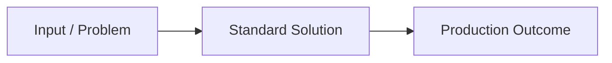

# Guide Title: Concise, Outcome-Driven Name

> **Difficulty**: Beginner / Intermediate / Advanced  
> **Estimated Reading Time**: X minutes  
> **Prerequisites**: [Prerequisite tool or concept with link]  
> **Maintainer / Contributor**: @your-github-username

---

## What You Will Master

A concise summary defining the architectural or practical takeaways:
- Master X to eliminate manual overhead.
- Learn industry standard configuration patterns for Z.
- Understand production trade-offs and anti-patterns.

---

## Quick Reference / TL;DR

Provide the primary command or configuration immediately for experienced engineers:

```bash
# Production command or configuration snippet
example-cli install --flag production
```

---

## Step-by-Step Implementation

### Step 1: Conceptual Foundation
Explain the technical motivation and architectural rationale.



### Step 2: Practical Setup and Configuration
Provide clean, reproducible instructions with commented configuration files.

```json
// Example: configuration file
{
  "settingName": true,
  "performanceOptimization": "aggressive"
}
```

### Step 3: High-Efficiency Workflows
Keybindings, aliases, or automation hooks that optimize operational throughput:
- **Optimization 1**: Shell alias definition.
- **Optimization 2**: Direct editor keybinding.

---

## Anti-Patterns and Common Pitfalls

| Suboptimal Practice | Standard Practice | Rationale |
| :--- | :--- | :--- |
| Hardcoding secrets in config | Utilizing Secret Managers or Environment Vaults | Prevents credential exposure |
| Copying unverified snippets | Analyzing underlying flags and parameters | Prevents runtime instability |

---

## Contributor Challenges / Future Extensions

Open extension tasks for subsequent contributors:
- [ ] Add platform-specific instructions for macOS / Windows WSL.
- [ ] Provide benchmark comparison against alternative tooling.

---

## References & Documentation

- [Official Documentation](https://example.com)
- [RFC or Technical Specification](https://example.com)
